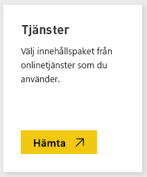
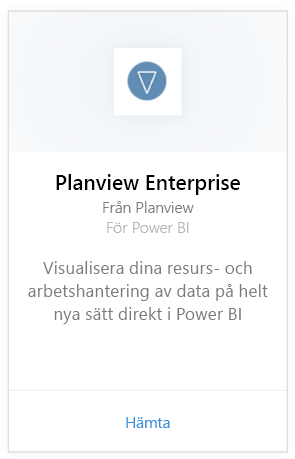
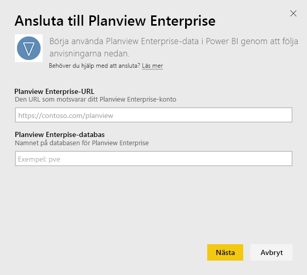
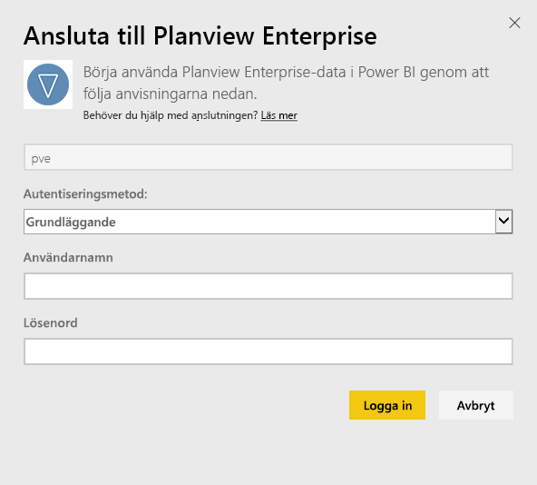
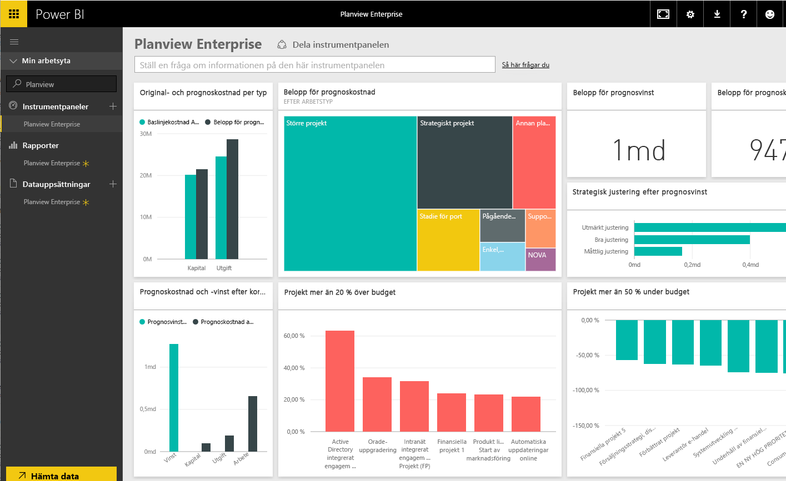

# Anslut till Planview Enterprise med Power BI
Med innehållspaketet Planview Enterprise för Power BI kan du visualisera dina resurs- och arbetshanteringsdata på ett helt nytt sätt direkt i Power BI. Använd autentiseringsuppgifterna för Planview Enterprise för att se utgifter i din investeringsportfölj interaktivt, förstå var du överstiger och understiger din budget och veta hur dina projekt överensstämmer med företagets strategiska prioriteringar. Du kan också utöka den ursprungliga instrumentpanelen och rapporterna för att skaffa dig de insikter som är viktigast för dig.

[Anslut till Planview Enterprise-innehållspaketet i Power BI](https://app.powerbi.com/getdata/services/planview-enterprise)

>[!NOTE]
>Du måste vara en Planview Enterprise-användare med funktionen Reporting Portal Viewer aktiverad på din roll om du vill importera dina Planview Enterprise-data till Power BI. Se ytterligare krav nedan.

## Så här ansluter du
1. Välj **Hämta data** längst ned i det vänstra navigeringsfönstret.
   
    
2. I rutan **Tjänster** väljer du **Hämta**.
   
    
3. På Power BI-sidan väljer du **Planview Enterprise**och väljer sedan **Hämta**:  
    
4. Ange Planview Enterprise-URL:en i textrutan för den Planview Enterprise-server som du vill använda. I textrutan för Planview Enterprise-databas anger du namnet på din databas för Planview Enterprise och sedan Nästa.  
    
5. I listan över autentiseringsmetoder, väljer du **Basic** om det inte redan är valt. Ange **Användarnamn** och **Lösenord** för ditt konto och välj **Logga In**.  
   
6. I den vänstra rutan, väljer du Planview Enterprise från listan över instrumentpaneler.  
     Power BI importerar Planview Enterprise-data till instrumentpanelen. Observera att data kan ta lite tid att läsa in.  
    

**Och sedan?**

* Prova att [ställa en fråga i rutan Frågor och svar](power-bi-q-and-a.md) överst på instrumentpanelen
* [Ändra panelerna](service-dashboard-edit-tile.md) på instrumentpanelen.
* [Välj en panel](service-dashboard-tiles.md) för att öppna den underliggande rapporten.
* Även om din datauppsättning är schemalagd för att uppdateras dagligen, kan du ändra uppdateringsschemat eller försöka uppdatera den på begäran med **Uppdatera nu**.

## Systemkrav
Du måste vara en Planview Enterprise-användare med funktionen Reporting Portal Viewer aktiverad på din roll om du vill importera dina Planview Enterprise-data till Power BI. Se ytterligare krav nedan.

Den här proceduren förutsätter att du redan har loggat in på startsidan för Microsoft Power BI med ett Power BI-konto. Om du inte har ett Power BI-konto kan du gå till [powerbi.com](https://powerbi.microsoft.com/get-started/) och under **Power BI – Samarbete och delning i molnet** väljer du sedan **Testa kostnadsfritt**. Klicka sedan på **Hämta data**.

## Nästa steg:

[Vad är Power BI?](power-bi-overview.md)

[Hämta data för Power BI](service-get-data.md)