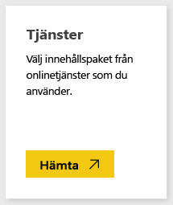
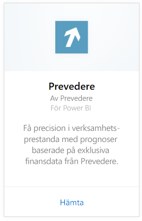
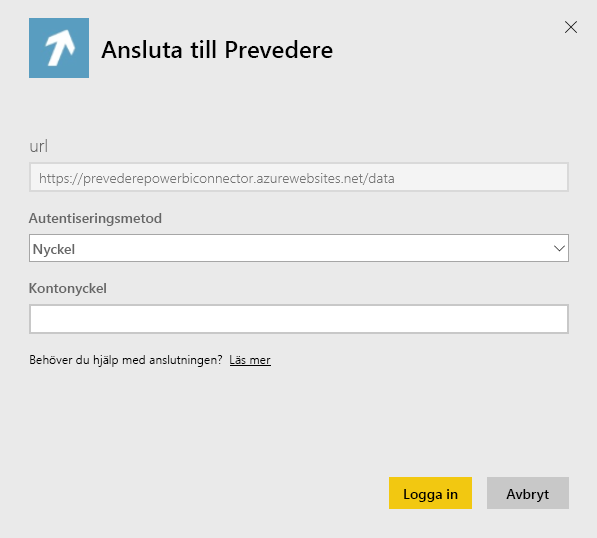
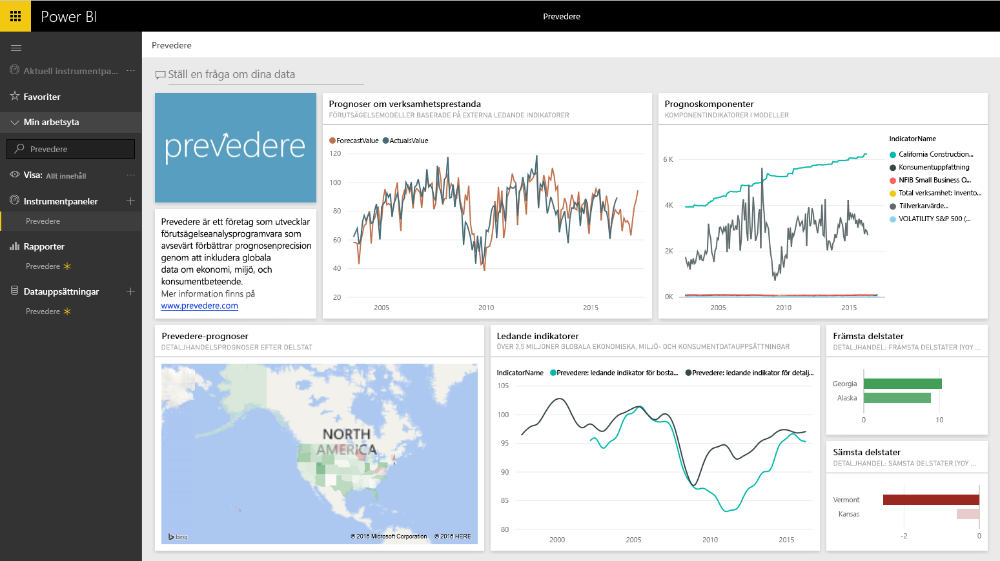

# Anslut till Prevedere med Power BI
Få åtkomst till exklusiv och viktig ekonomisk information för driva din verksamhet framåt konfidentiellt och proaktivt.

Anslut till [Prevedere-innehållspaketet](https://app.powerbi.com/getdata/services/prevedere) för Power BI.

>[!NOTE]
>Om du inte är en befintlig Prevedere-användare, kan du använda [exempelnyckeln](https://prevederepowerbiconnector.azurewebsites.net/static/learnmore.html) för att testa.

## Så här ansluter du
1. Välj **Hämta data** längst ned i det vänstra navigeringsfönstret.
   
   
2. I rutan **tjänster** väljer du **Hämta**.
   
   
3. Välj **Prevedere** och sedan **hämta**.
   
   
4. Som **autentiseringsmetod**, väljer du **nyckel** och anger din Prevedere API-nyckel.
   
    
5. Välj **logga in** för att starta importen. När den är klar visas en ny instrumentpanel, rapport och modell i navigeringsfönstret. Välj instrumentpanelen för att visa dina importerade data.
   
     

**Och sedan?**

* Prova att [ställa en fråga i rutan Frågor och svar](consumer/end-user-q-and-a.md) överst på instrumentpanelen
* [Ändra panelerna](service-dashboard-edit-tile.md) på instrumentpanelen.
* [Välj en panel](consumer/end-user-tiles.md) för att öppna den underliggande rapporten.
* Medan din datauppsättning schemaläggs att uppdateras dagligen så kan du ändra uppdateringsfrekvensen eller testa att uppdatera den på begäran med **Uppdatera nu**

## Det här ingår
Innehållspaketet får insikter om dina detaljhandelsprognoser, prognosmodeller, ledande indikatorer och mycket mer.

## Systemkrav
Det här innehållspaketet kräver åtkomst till en Prevedere API-nyckel eller en exempelnyckel (se nedan).

## Hitta parametrar

Befintliga kunder kan komma åt sina data med sin API-nyckel. Om du inte ännu är en kund, kan du se ett exempel på data och analyser med hjälp av [exempelnyckeln](https://prevederepowerbiconnector.azurewebsites.net/static/learnmore.html).

## Felsökning
Det kan ta en stund att läsa in alla data beroende på hur stor instans du har.

## Nästa steg
[Kom igång i Power BI](service-get-started.md)

[Hämta data i Power BI](service-get-data.md)

