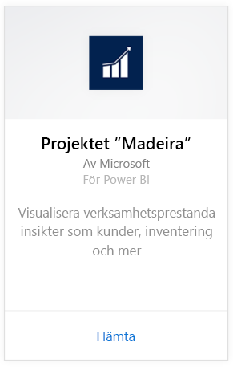
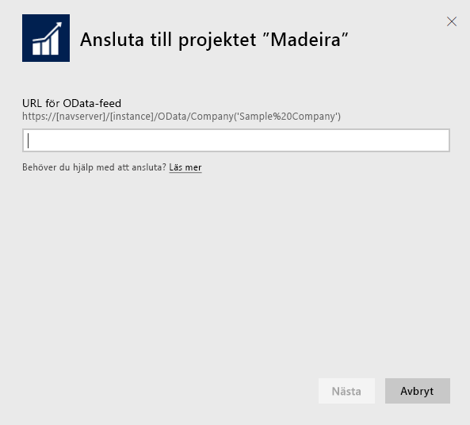
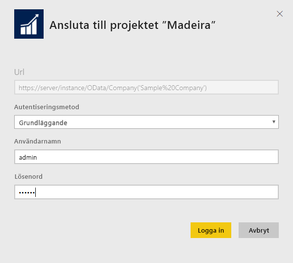
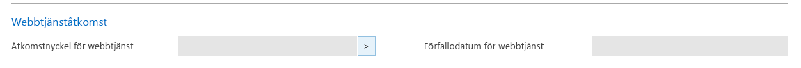
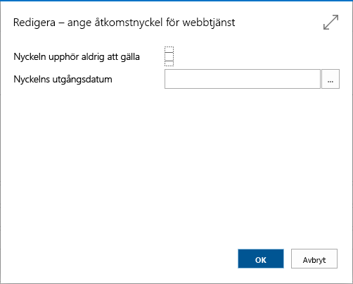

# Anslut till Project ”Madeira” med Power BI
Det är enkelt att hämta insikter i dina Project ”Madeira”-data med Power BI och Project ”Madeira”-innehållspaketet. Power BI hämtar dina data, både försäljning och ekonomi, och skapar sedan en instrumentpanel och rapporter baserade på dessa data.
Anslut till Project ”Madeira” för Power BI eller läs mer om Project ”Madeira”-integrering med Power BI.

>[!NOTE]
>Innehållspaketet behöver dina behörigheter till de tabeller data hämtas från, i det här fallet försäljnings- och ekonomirelaterade data. Mer information om [kraven](#Requirements) finns nedan.

Anslut till [innehållspaketet Project ”Madeira” Analytics](https://app.powerbi.com/getdata/services/project-madeira) för Power BI.

## Så här ansluter du
1. Välj **Hämta data** längst ned i det vänstra navigeringsfönstret.  
    
2. I rutan **Tjänster** väljer du **Hämta**.  
    
3. Välj **Project ”Madeira”**och välj **Hämta**.  
    
4. När du uppmanas, anger du URL:en för Project ”Madeira”. URL: en måste följa följande mönster exakt https://mycronusus.projectmadeira.com:7048/NAV/OData/Company('CRONUS%20US') med Project ”Madeira”-företagsnamnet. Det finns inget avslutande snedstreck i slutet och anslutningen måste vara i formatet https. Mer information om hur du hittar den här URL:en finns [nedan](#FindingParams).  
   
    
5. När du uppmanas, väljer du Basic som autentiseringsmetod. Ange din e-postadress för Project ”Madeira” som användarnamn och ange sedan web service-åtkomstnyckeln för ditt Project ”Madeira”-konto som lösenord. Om du redan är inloggad på Project ”Madeira” i webbläsaren, behöver du kanske inte ange några autentiseringsuppgifter. Visa information om att skapa den här åtkomstnyckeln [nedan](#FindingParams).  
   
    >[!NOTE]
    >Du måste vara en superanvändare i projektet ”Madeira”.
   
    
6. När du är ansluten kommer en instrumentpanel, rapport och datauppsättning automatiskt att läsas in. När du är klar, uppdateras panelerna med data från ditt konto.  
   
    

**Och sedan?**

* Prova att [ställa en fråga i rutan Frågor och svar](service-q-and-a.md) överst på instrumentpanelen
* [Ändra panelerna](service-dashboard-edit-tile.md) på instrumentpanelen.
* [Välj en panel](service-dashboard-tiles.md) för att öppna den underliggande rapporten.
* Även om din datauppsättning är schemalagd för att uppdateras dagligen, kan du ändra uppdateringsschemat eller försöka uppdatera den på begäran med **Uppdatera nu**.

## Systemkrav
Om du vill importera dina Project ”Madeira”-data till Power BI, måste du ha behörighet till de försäljnings- och ekonomidatatabeller från vilka data hämtas. Alla tabeller (skiftlägeskänsligt) som krävs för innehållspaketet:  

    - ItemSalesAndProfit  
    - ItemSalesByCustomer  
    - powerbifinance  
    - SalesDashboard  
    - SalesOpportunities  
    - SalesOrdersBySalesPerson  
    - TopCustomerOverview  

## Hitta parametrar
**Hämta rätt URL** Ett enkelt sätt att hämta denna URL är att i Project ”Madeira” gå till webbtjänster, söka efter powerbifinance-webbtjänsten och kopiera OData-URL:en (använd högerklick och kopiera genväg), men utelämna ”/powerbifinance...” från URL-strängen.

**Web Service-åtkomstnycklar** För att kunna använda data från Project ”Madeira” måste du skapa en åtkomstnyckel för ditt konto. Sök sedan efter användarsidan i Project ”Madeira” och öppna kortet för ditt användarkonto. Här kan du skapa en ny åtkomstnyckel för webbtjänster och kopierar den till lösenordsfältet i Power BI-anslutningssidan.

När du börjar använda åtkomstnycklar för Web Service som d behöver du i framtiden väljer du OK för meddelandet som visas.
När du skapar nyckeln kan du välja om det går ut vid ett visst datum eller inte.

När du väljer OK skapas en nyckel, så kan du kopiera den till lösenordsfältet på Power BI-anslutningssidan.

## Felsökning
Power BI-instrumentpanelen är beroende av de publicerade webbtjänster som listas ovan och den visar data från demonstrationsföretaget eller ditt företag om du importerar data från ditt aktuella ekonomisystem. Om något går fel innehåller det här avsnittet lösningar för de flesta vanliga problemen.

** ”Parameterverifieringen misslyckades, kontrollera att alla parametrarna är giltiga” ** Om du ser det här felet när du anger en URL för Project ”Madeira” bör du kontrollera att följande krav är uppfyllda:  

    - URL:en följer exakt det här mönstret https://*mycronusus*.projectmadeira.com:7048/NAV/OData/Company ('*CRONUS % 20US*”)  
    - Ta bort all text efter företagets namn inom parentes  
    - Kontrollera att det inte finns något avslutande snedstreck i slutet av URL:en.  
    - Kontrollera att URL:en använder en säker anslutning som anges av att URL:en börjar med https.  

**”Inloggningen misslyckades”** Om du får felet ”Inloggningen misslyckades” när du loggar in på instrumentpanelen med autentiseringsuppgifter för Project ”Madeira” kan det bero på något av följande problem:  

    - Det konto som du använder har inte behörighet att läsa Project ”Madeira”-data från ditt konto. Verifiera ditt Project ”Madeira”-konto och kontrollera att du har använt rätt web service-åtkomstnyckel som lösenord och försök sedan igen.  
    - Project ”Madeira”-instansen som du försöker ansluta till har inte ett giltigt SSL-certifikat. I det här fallet visas ett mer detaljerat felmeddelande (”det går inte att upprätta betrodd relation med SSL”). Observera att självsignerade certifikat inte stöds.  

**”Oops”** Om du ser ett”Oops”-fel efter autentiseringsdialogrutan beror detta oftast på problem med att ansluta till data för innehållspaketet. Kontrollera att URL: en följer mönstret som angavs tidigare:  
    https://*mycronusus*.projectmadeira.com:7048/NAV/OData/Company('*CRONUS%20US*')

Ett vanligt fel är att ange hela IRL:en för en specifik webbtjänst:  
    https://*mycronusus*.projectmadeira.com:7048/NAV/OData/Company('*CRONUS%20US*')/powerbifinance

Eller också har du glömt att ange företagets namn:   
    https://*mycronusus*.projectmadeira.com:7048/NAV/OData/

## Nästa steg
[Kom igång med Power BI](service-get-started.md)

[Power BI – grundläggande begrepp](service-basic-concepts.md)

