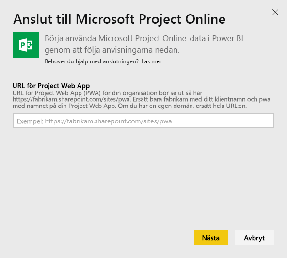
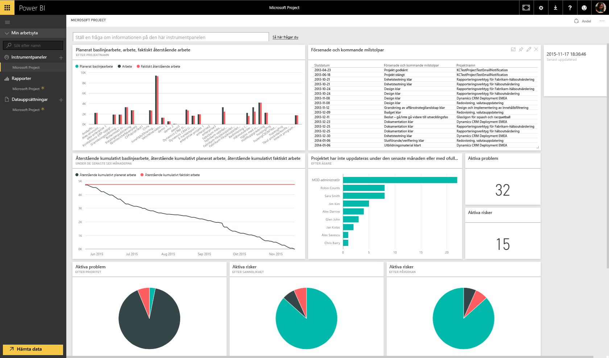

# Anslut till Project Online med Power BI
Microsoft Project Online är en flexibel lösning för hantering av projektportföljer (PPM) och dagligt arbete. Project Online låter organisationer komma igång, prioritera investeringar i projektportföljer och leverera det avsedda verksamhetsvärdet. Project Online-innehållspaketet för Power BI låter dig utforska dina projektdata, med mått som portföljstatus och projektefterlevnad.

Anslut till [Project Online-innehållspaketet](https://app.powerbi.com/getdata/services/project-online) för Power BI.

## Så här ansluter du
1. Välj **Hämta data** längst ned i det vänstra navigeringsfönstret.
   
    
2. I rutan **tjänster** väljer du **Hämta**.
   
   
3. Välj **Microsoft Project Online** \> **hämta**.
   
   
4. I textrutan **Project Web App-URL**, anger du URL:en för den PWA (Project Web Add) som du vill ansluta till och klicka på **nästa**. Observera att det här kan skilja sig från exemplet om du har en anpassad domän.
   
    
5. Som Autentiseringsmetod väljer du **oAuth2** \> **Logga in**. När du uppmanas till det anger du dina autentiseringsuppgifter för Project Online och följer autentiseringsprocessen.
   
    
6. Du ser ett meddelande som visar att dina data läses in. Det kan ta en stund att läsa in datan beroende på hur stort ditt konto är. När Power BI har importerat dessa data, visas en ny instrumentpanel, rapport och datauppsättning i det vänstra navigeringsfönstret. Det här är standardinstrumentpanelen som Power BI skapade för att visa dina data. Du kan ändra den här instrumentpanelen för att visa dina data på det sätt som du vill.
   
   

**Och sedan?**

* Prova att [ställa en fråga i rutan Frågor och svar](service-q-and-a.md) överst på instrumentpanelen
* [Ändra panelerna](service-dashboard-edit-tile.md) på instrumentpanelen.
* [Välj en panel](service-dashboard-tiles.md) för att öppna den underliggande rapporten.
* Även om din datauppsättning kommer att vara schemalagd att uppdateras dagligen, kan du ändra uppdateringsschemat eller uppdatera på begäran med **Uppdatera nu**

## Nästa steg
[Kom igång i Power BI](service-get-started.md)

[Hämta data i Power BI](service-get-data.md)

