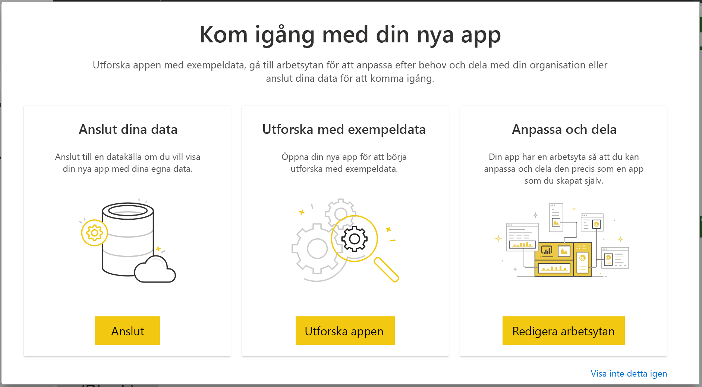

# Anslut till Project Web App med Power BI
Microsoft Project Web App är en flexibel lösning för hantering av projektportföljer (PPM) och dagligt arbete. Med Project Web App kan organisationer komma igång, prioritera investeringar i projektportföljer och leverera det avsedda verksamhetsvärdet. Med Project Web App-mallappen för Power BI får du tillgång till information från Project Web App som hjälper dig att hantera projekt, portföljer och resurser.

Anslut till [Project Web App-mallappen](https://appsource.microsoft.com/product/power-bi/pbi_msprojectonline.pbi-microsoftprojectwebapp) för Power BI.

## Så här ansluter du

1. Välj **Appar** i navigeringsfönstret > välj **Hämta appar** i det övre högra hörnet.

    

2. I rutan **tjänster** väljer du **Hämta**.
   
   
3. I AppSource väljer du fliken **Appar** och söker efter och väljer **Microsoft Project Web App**.
   
4. Du får ett meddelande där det står **Installera den här Power BI-appen?** välj **Installera**. 

   
5. I fönstret **Appar** väljer du panelen **Microsoft Project Web App**. 
   
   
6. I **Kom igång med din nya app** väljer du **Anslut data**.
   
   
7. I textrutan **Project Web App-URL** anger du URL:en för den PWA (Project Web App) som du vill ansluta till.  Observera att det här kan skilja sig från exemplet om du har en anpassad domän. I textrutan **PWA Site Language** (PWA-webbplatsspråk) anger du rätt siffra för ditt PWA-webbplatsspråk. Ange ”1” för engelska, ”2” för franska, ”3” för tyska, ”4” för portugisiska (Brasilien), ”5” för portugisiska (Portugal) och ”6” för spanska. 
   
   
8. Som autentiseringsmetod väljer du **oAuth2** \> **Logga in**. När du uppmanas till det anger du dina autentiseringsuppgifter för Project Web App och följer autentiseringsprocessen.

    > [!NOTE]
    > Du behöver ha behörighet för portföljvy, portföljansvarig eller administratör för den Project Web App som du ansluter till.

9. Du ser ett meddelande som visar att dina data läses in. Det kan ta en stund att läsa in datan beroende på hur stort ditt konto är. När Power BI har importerat data ser du innehållet på din nya arbetsyta. Du kan behöva uppdatera datamängden för att få de senaste uppdateringarna. 

    När Power BI har importerat dessa data visas rapporten med 13 sidor och datamängden i navigeringsfönstret. 

10. När rapporterna är redo kan du börja utforska dina Project Web App-data. Mallappen innehåller 13 omfattande och detaljerade rapporter för portföljvyn (6 rapportsidor), resursvyn (5 rapportsidor) och projektstatus (2 rapportsidor). 

    
   
    
   
    

**Och sedan?**

* Din datamängd schemaläggs att uppdateras dagligen, men du kan ändra uppdateringsschemat eller prova att uppdatera den på begäran via **Uppdatera nu**.

**Expandera mallappen**

Ladda ned [GitHub PBIT-filen](https://github.com/OfficeDev/Project-Power-BI-Content-Packs) för att ytterligare anpassa och uppdatera innehållspaketet.

## Nästa steg
[Kom igång i Power BI](service-get-started.md)

[Hämta data i Power BI](service-get-data.md)

