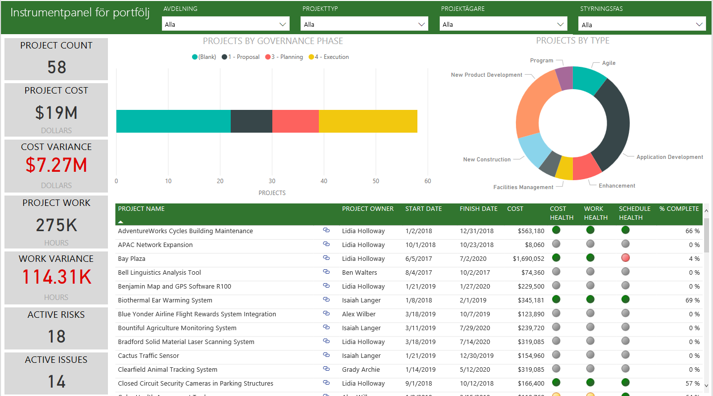
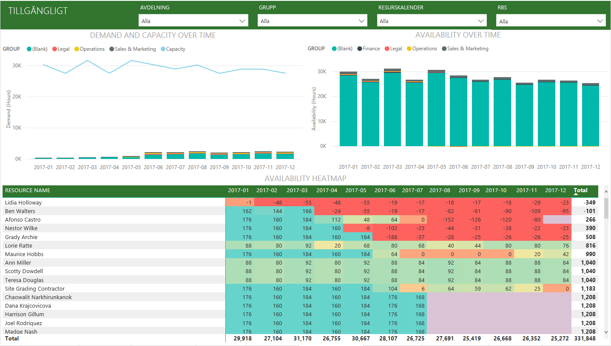

# Anslut till Project Online med Power BI
Microsoft Project Online är en flexibel lösning för hantering av projektportföljer (PPM) och dagligt arbete. Project Online låter organisationer komma igång, prioritera investeringar i projektportföljer och leverera det avsedda verksamhetsvärdet. Med Project Online-innehållspaketet för Power BI får du tillgång till information från Project Online som hjälper dig att hantera projekt, portföljer och resurser.

Anslut till [Project Online-innehållspaketet](https://app.powerbi.com/getdata/services/project-online) för Power BI.

## Så här ansluter du
1. Välj **Hämta data** längst ned i det vänstra navigeringsfönstret.
   
    
2. I rutan **tjänster** väljer du **Hämta**.
   
   
3. Välj **Microsoft Project Online** \> **hämta**.
   
   
4. I textrutan **Project Web App-URL**, anger du URL:en för den PWA (Project Web Add) som du vill ansluta till och klicka på **nästa**. Observera att det här kan skilja sig från exemplet om du har en anpassad domän. I textrutan **PWA Site Language** (PWA-webbplatsspråk) anger du rätt siffra för ditt PWA-webbplatsspråk. Ange ”1” för engelska, ”2” för franska, ”3” för tyska, ”4” för portugisiska (Brasilien), ”5” för portugisiska (Portugal) och ”6” för spanska. 
   
    
5. Som Autentiseringsmetod väljer du **oAuth2** \> **Logga in**. När du uppmanas till det anger du dina autentiseringsuppgifter för Project Online och följer autentiseringsprocessen.
   
    
    
Observera att du måste ha behörighet för portföljvy, portföljansvarig eller administratör för den Project Web App som du ansluter till.

6. Du ser ett meddelande som visar att dina data läses in. Det kan ta en stund att läsa in datan beroende på hur stort ditt konto är. När Power BI har importerat dessa data visas en ny instrumentpanel, datauppsättning och 13 rapporter i det vänstra navigeringsfönstret. Det här är standardinstrumentpanelen som Power BI skapade för att visa dina data. Du kan modifiera den här instrumentpanelen för att visa dina data på det sätt som du vill.

   

7. När instrumentpanelen och rapporterna är klara kan du börja utforska dina Project Online-data. Innehållspaketet innehåller 13 omfattande och detaljerade rapporter för portföljvyn (6 rapportsidor), resursvyn (5 rapportsidor) och projektstatus (2 rapportsidor). 

   
   
   
   
   

**Och sedan?**

* Prova att [ställa en fråga i rutan Frågor och svar](consumer/end-user-q-and-a.md) överst på instrumentpanelen
* [Ändra panelerna](service-dashboard-edit-tile.md) på instrumentpanelen.
* [Välj en panel](consumer/end-user-tiles.md) för att öppna den underliggande rapporten.
* Medan din datauppsättning schemaläggs att uppdateras dagligen så kan du ändra uppdateringsfrekvensen eller testa att uppdatera den på begäran med **Uppdatera nu**

**Expandera innehållspaketet**

Ladda ned [GitHub PBIT-filen](https://github.com/OfficeDev/Project-Power-BI-Content-Packs) för att ytterligare anpassa och uppdatera innehållspaketet

## Nästa steg
[Kom igång i Power BI](service-get-started.md)

[Hämta data i Power BI](service-get-data.md)

