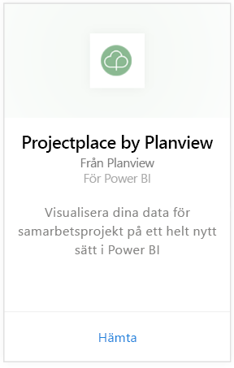
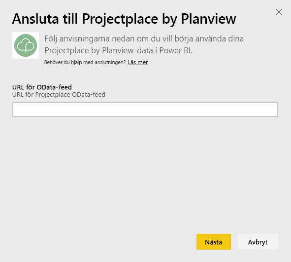
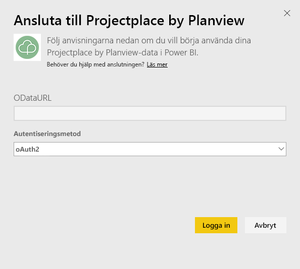
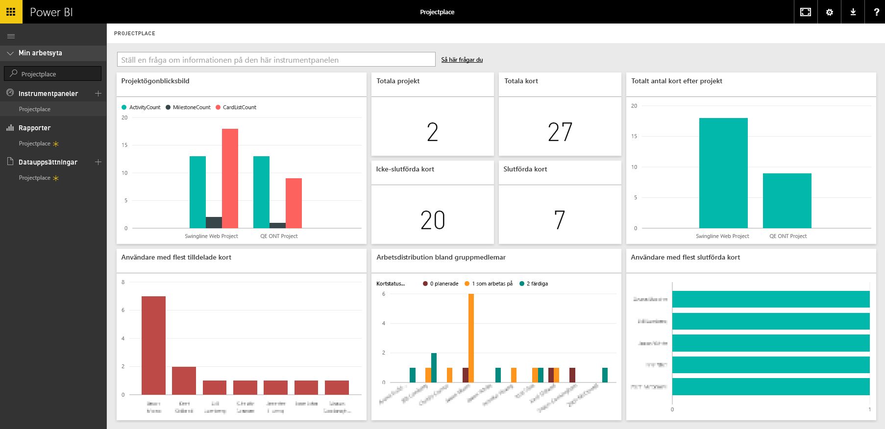

# Anslut till Projectplace av Planview med Power BI
Med innehållspaketet Projectplace av Planview, kan du visualisera data från dina samarbetsprojekt på helt nya sätt direkt i Power BI. Använd dina Projectplace-inloggningsuppgifter för att interaktivt visa viktig projektstatistik, ta reda på vilka dina mest aktiva och produktiva gruppmedlemmar är och identifiera kort och aktiviteter för projekt i ditt Projectplace-konto som är i risk. Du kan också utöka den ursprungliga instrumentpanelen och rapporterna för att skaffa dig de insikter som är viktigast för dig.

[!INCLUDE [include-short-name](./includes/service-deprecate-content-packs.md)]

[Anslut till Projectplace-innehållspaketet i Power BI](https://app.powerbi.com/getdata/services/projectplace)

>[!NOTE]
>Du måste vara en Projectplace-användare om du vill importera dina Projectplace-data till Power BI. Se ytterligare krav nedan.

## Så här ansluter du
1. Välj **Hämta data** längst ned i det vänstra navigeringsfönstret.
   
    
2. I rutan **tjänster** väljer du **Hämta**.
   
    
3. På Power BI-sidan väljer du **Projectplace av Planview**och väljer sedan **hämta**:  
   
    
4. I textrutan för OData-flödets URL, anger du URL:en för det Projectplace OData-flöde som du vill använda, enligt följande bild:
   
    
5. I listan över autentiseringsmetoder, väljer du **OAuth** om det inte redan är valt. Klicka på **logga in** och följ inloggningsflödet.  
   
   
6. I den vänstra rutan, väljer du **Projectplace** från listan över instrumentpaneler. Power BI importerar Projectplace-data till instrumentpanelen. Observera att data kan ta lite tid att läsa in.  
   
    Instrumentpanelen innehåller rutor som visar data från din Projectplace-databas. Följande bild visar ett exempel på en Projectplace-standardinstrumentpanel i Power BI.
   
    

**Och sedan?**

* Prova att [ställa en fråga i rutan Frågor och svar](consumer/end-user-q-and-a.md) överst på instrumentpanelen
* [Ändra panelerna](service-dashboard-edit-tile.md) på instrumentpanelen.
* [Välj en panel](consumer/end-user-tiles.md) för att öppna den underliggande rapporten.
* Medan din datauppsättning schemaläggs att uppdateras dagligen så kan du ändra uppdateringsfrekvensen eller testa att uppdatera den på begäran med **Uppdatera nu**

## Systemkrav
Du måste vara en Projectplace-användare om du vill importera dina Projectplace-data till Power BI. Den här proceduren förutsätter att du redan har loggat in på startsidan för Microsoft Power BI med ett Power BI-konto. Om du inte har ett Power BI-konto kan du gå till [powerbi.com](https://powerbi.microsoft.com/get-started/) och under **Power BI – Samarbete och delning i molnet** väljer du sedan **Testa kostnadsfritt**. Klicka sedan på **Hämta data**.

## Nästa steg
[Vad är Power BI?](power-bi-overview.md)

[Grundläggande begrepp för designers i Power BI-tjänsten](service-basic-concepts.md)

