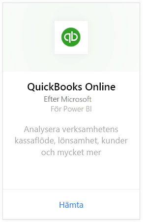
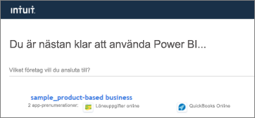
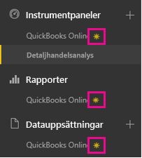
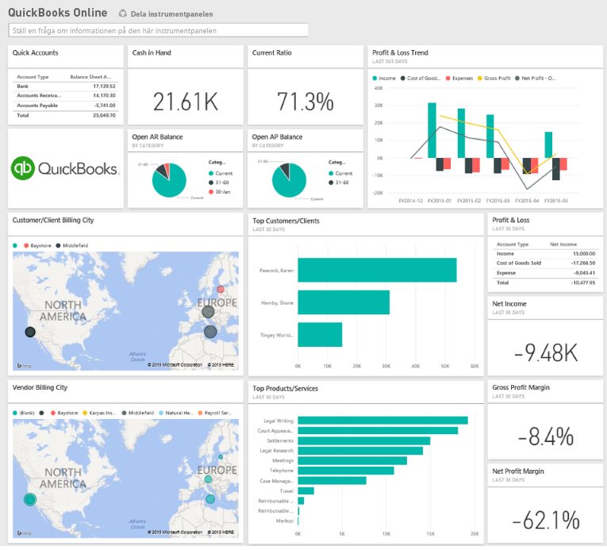
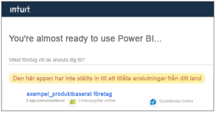

# Ansluta till QuickBooks Online med Power BI
När du ansluter till dina QuickBooks Online-data från Power BI får du omedelbart en Power BI-instrumentpanel och Power BI-rapporter som tillhandahåller insikter om verksamhetens kassaflöde, lönsamhet, kunder med mera. Använd instrumentpanelen och rapporterna som de är eller anpassa dem för att fokusera på den information du är mest intresserad av. Data uppdateras automatiskt en gång per dag.

Anslut till [QuickBooks Online-innehållspaketet](https://dxt.powerbi.com/getdata/services/quickbooks-online) för Power BI.

>[!NOTE]
>Om du vill importera dina QuickBooks Online-data till Power BI, måste du vara administratör för ditt QuickBooks Online-konto och logga in med dina autentiseringsuppgifter som administratör för kontot.

## Så här ansluter du
1. Välj **Hämta data** längst ned i det vänstra navigeringsfönstret.
   
    
2. I rutan **tjänster** väljer du **Hämta**.
   
    
3. Välj **QuickBooks Online**och välj **Hämta**.
   
   
4. Välj **oAuth2** för autentiseringsmetod och välj **Logga in**. 
5. Ange dina autentiseringsuppgifter för QuickBooks Online när du uppmanas om detta och följ autentiseringsprocessen för QuickBooks Online. Om du redan är inloggad på QuickBooks Online i webbläsaren, behöver du inte ange några autentiseringsuppgifter.
   >[!NOTE]
   >Du måste ha autentiseringsuppgifter som administratör för ditt QuickBooks Online-konto.
6. Välj det företag som du vill ansluta till Power BI på nästa skärm.
   
   
7. Välj **Auktorisera** på nästa skärm för att starta importen. Det kan ta några minuter beroende på storleken på företagets data. 
   
   
   
   När Power BI har importerat dessa data, visas en ny instrumentpanel, rapport och datauppsättning i det vänstra navigeringsfönstret. Nya objekt markeras med en gul asterisk \*.
   
   
8. Välj instrumentpanelen QuickBooks Online. Det här är instrumentpanelen som Power BI skapade automatiskt för att visa dina importerade data. Du kan ändra den här instrumentpanelen till att visa dina data på det sätt som du vill. 
   
   

**Och sedan?**

* Prova att [ställa en fråga i rutan Frågor och svar](service-q-and-a.md) överst på instrumentpanelen
* [Ändra panelerna](service-dashboard-edit-tile.md) på instrumentpanelen.
* [Välj en panel](service-dashboard-tiles.md) för att öppna den underliggande rapporten.
* Även om din datauppsättning kommer att vara schemalagd att uppdateras dagligen, kan du ändra uppdateringsschemat eller uppdatera på begäran med **Uppdatera nu**

## Felsökning
**”Hoppsan! Det har uppstått ett fel”**

Om du får det här meddelandet när du har valt **Auktorisera**:

”Hoppsan! Det har uppstått ett fel.” Stäng det här fönstret och försök igen.

En annan användare prenumererar redan på programmet för det här företaget. Kontakta [e-post admin] om du vill göra ändringar i prenumerationen.”

... det innebär att en annan administratör i ditt företag redan har anslutit till företagets data med Power BI. Be administratören att dela instrumentpanelen med dig. För närvarande kan bara en administratör ansluta ett visst QuickBooks Online-företags datauppsättning till Power BI. Efter att Power BI har skapar instrumentpanelen, kan administratören dela den med flera kollegor på samma Power BI-klienter.

**”Den här appen har inte ställts in till att tillåta anslutningar från ditt land”**

Power BI stöder för närvarande endast USA-utgåvor av QuickBooks Online. 

## Nästa steg
[Kom igång med Power BI](service-get-started.md)

[Power BI – grundläggande begrepp](service-basic-concepts.md)

