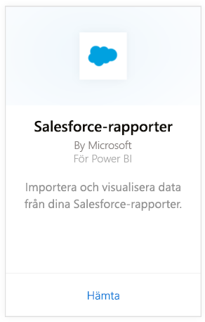
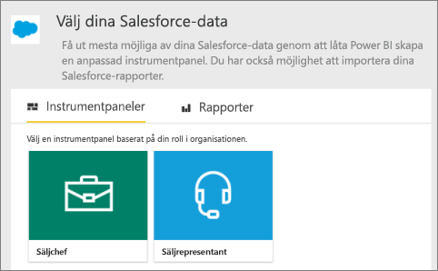
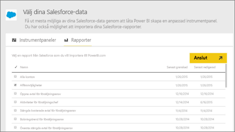

# Anslut till Salesforce med Power BI
Med Power BI kan du enkelt ansluta till ditt Salesforce.com-konto. Med den här anslutningen kan du hämta dina Salesforce-data och få en instrumentpanel och rapporter automatiskt.

Läs mer om [Salesforce-integrering](https://powerbi.microsoft.com/integrations/salesforce) med Power BI.

## Så här ansluter du
1. Välj **Hämta data** längst ned i det vänstra navigeringsfönstret i Power BI.
   
    
2. I rutan **Tjänster** väljer du **Hämta**.
   
    
3. Välj **Analys för Salesforce** och välj **Hämta**.  
   
   
4. Välj **Logga in** för att starta inloggningsflödet.
   
    
5. När du uppmanas till det anger du dina Salesforce-autentiseringsuppgifter. Välj **Tillåt** så att Power BI kan komma åt grundläggande Salesforce-information och data.
   
   
6. Konfigurera vad du vill importera till Power BI med listrutan:
   
   * **Instrumentpanel**
     
     Välj en fördefinierad instrumentpanel baserat på en person (som **försäljningschef**). De här instrumentpanelerna hämtar en specifik uppsättning standarddata från Salesforce och inkluderar inte anpassade fält.
     
     
   * **Rapporter**
     
     Välj en eller flera anpassade rapporter från ditt Salesforce-konto. De här rapporterna matchar dina vyer i Salesforce och kan innehålla data från anpassade fält eller objekt.
     
     
     
     Om du inte ser några rapporter, lägger du till eller skapar dem i ditt Salesforce-konto och försöker ansluta igen.

7. Välj **Anslut** för att starta importen. Under importen ser du ett meddelande om att importen pågår. När importen är klar ser du en instrumentpanel, rapport och datamängd för dina Salesforce-data i navigeringsfönstret till vänster.
   
   

Du kan ändra instrumentpanelen så att den visar data på det sätt du vill. Du kan köra frågor med Q&A eller [välja en panel](consumer/end-user-tiles.md) för att öppna den underliggande rapporten och [redigera eller ta bort paneler på instrumentpanelen](service-dashboard-edit-tile.md).

**Och sedan?**

* Prova att [ställa en fråga i rutan Frågor och svar](consumer/end-user-q-and-a.md) överst på instrumentpanelen
* [Redigera eller ta bort en panel](service-dashboard-edit-tile.md) på instrumentpanelen
* [Välj en panel](service-dashboard-tiles.md) för att öppna den underliggande rapporten
* Medan din datamängd är schemalagd att uppdateras dagligen så kan du ändra uppdateringsschemat eller prova att uppdatera den på begäran med **Uppdatera nu**

## Systemkrav och aspekter

- Ansluten med ett Salesforce-konto för produktion som har API-åtkomst aktiverat

- Behörighet ges till Power BI-appen under inloggningen

- Kontot har tillräckligt med API-anrop tillgängliga för att hämta och uppdatera data

- En giltig autentiseringstoken krävs för uppdatering. Salesforce har en gräns på fem autentiseringstoken per app, så se till att du importerar fem eller färre Salesforce-datamängder.

- API för Salesforce-rapporter har en begränsning som ger stöd för upp till 2 000 rader med data.

## Felsökning

Granska kraven ovan om du stöter på några fel. 

Du kan för närvarande inte logga in på en anpassad domän eller sandboxdomän.

### Meddelandet ”Det går inte att ansluta till fjärrservern”

Om du ser meddelandet ”Det går inte att ansluta till fjärrservern” när du försöker ansluta till ditt Salesforce-konto rekommenderar vi att du tittar på den här lösningen på följande forum: [Salesforce Connector sign in Error Message: Unable to connect to the remote server](https://www.outsystems.com/forums/Forum_TopicView.aspx?TopicId=17674&TopicName=log-in-error-message-unable-to-connect-to-the-remote-server&) (Felmeddelande vid inloggning i Salesforce-anslutningsappen: Det går inte att ansluta till fjärrservern)

## Nästa steg
[Vad är Power BI?](power-bi-overview.md)

[Datakällor för Power BI-tjänsten](service-get-data.md)

