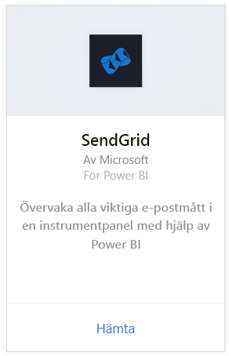
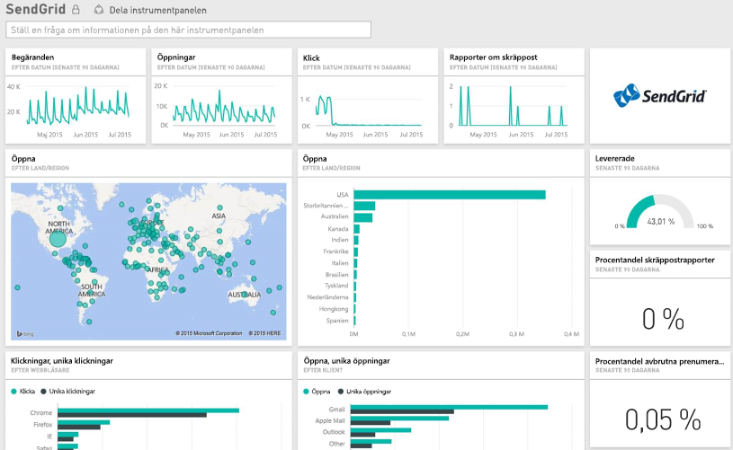

# Ansluta till SendGrid med Power BI
Med Power BI-innehållspaketet för SendGrid kan du extrahera insikter och statistik från ditt SendGrid-konto. Med SendGrid-innehållspaketet kan du visualisera din SendGrid-statistik på en instrumentpanel.

Ansluta till [SendGrid-innehållspaketet](https://app.powerbi.com/getdata/services/sendgrid) för Power BI.

## Så här ansluter du
1. Välj **Hämta data** längst ned i det vänstra navigeringsfönstret.
   
    
2. I rutan **Tjänster** väljer du **Hämta**.
   
    
3. Välj **SendGrid**-innehållspaketet och klicka på **Hämta**.
   
    
4. När du uppmanas till det anger du ditt SendGrid-användarnamn och lösenord. Välj **Logga in**.
   
   
5. När Power BI har importerat datan visas en ny instrumentpanel, rapport och datauppsättning i det vänstra navigeringsfönstret, ifyllt med din e-poststatistik för de senaste 90 dagarna. Nya objekt markeras med en gul asterisk \*.
   
   

**Och sedan?**

* Prova att [ställa en fråga i rutan Frågor och svar](power-bi-q-and-a.md) överst på instrumentpanelen
* [Ändra panelerna](service-dashboard-edit-tile.md) på instrumentpanelen.
* [Välj en panel](service-dashboard-tiles.md) för att öppna den underliggande rapporten.
* Även om din datauppsättning är schemalagd för att uppdateras dagligen, kan du ändra uppdateringsschemat eller försöka uppdatera den på begäran med **Uppdatera nu**.

## Vad ingår
I SendGrid-instrumentpanelen finns följande mått:

* Övergripande e-poststatistik – förfrågningar, levererade, studsade, blockerad skräppost, skräppostrapport etc.
* E-poststatistik efter kategori
* E-poststatistik efter geografi
* E-poststatistik efter Internetleverantör
* E-poststatistik efter enhet, klient, webbläsare

## Nästa steg
[Kom igång med Power BI](service-get-started.md)

[Hämta data](service-get-data.md)

