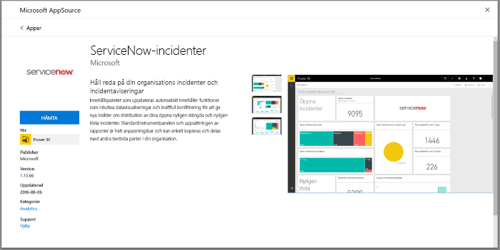
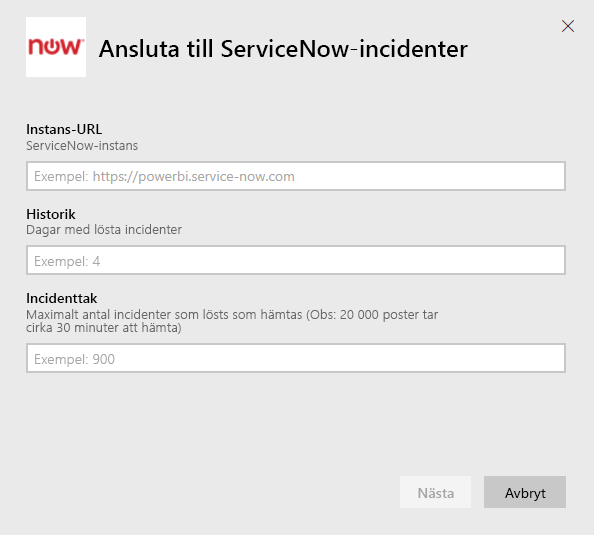
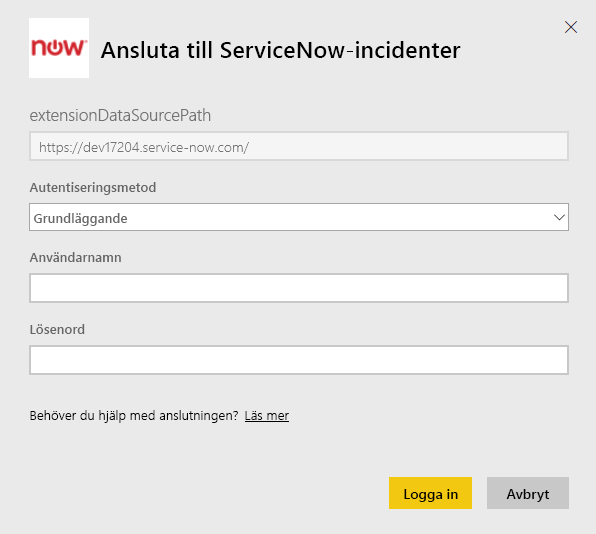
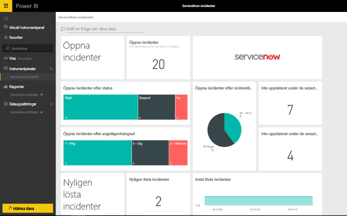

# Anslut till ServiceNow med Power BI för rapportering av incidenter
ServiceNow erbjuder flera produkter och lösningar inklusive företag, åtgärder och IT-hantering för att förbättra din verksamhet. Det här innehållspaketet innehåller flera rapporter och insikter om dina öppna, nyligen lösta och nyligen stängda incidenter.  

Anslut till Power BI-innehållspaketet för [ServiceNow Incidents](https://app.powerbi.com/getdata/services/servicenow).

## Så här ansluter du
1. Välj **Hämta data** längst ned i det vänstra navigeringsfönstret.
   
    
2. I rutan **Tjänster** väljer du **Hämta**.
   
    
3. Välj **ServiceNow Incidents** \> **Hämta**.
   
   
4. Ange URL:en för din ServiceNow-instans och antalet dagar/poster att hämta in. Observera att så fort du uppnår en gräns så stoppas importen.
   
   
5. När du uppmanas till det, anger du dina autentiseringsuppgifter för ServiceNow **Basic**. Observera att enkel inloggning inte stöds idag, mer information om systemkraven nedan.
   
   
6. När inloggningsflödet har slutförts startar importprocessen. När den är klar visas en ny instrumentpanel, rapport och modell i navigeringsfönstret. Välj instrumentpanelen för att visa dina importerade data.
   
    

**Och sedan?**

* Prova att [ställa en fråga i rutan Frågor och svar](power-bi-q-and-a.md) överst på instrumentpanelen
* [Ändra panelerna](service-dashboard-edit-tile.md) på instrumentpanelen.
* [Välj en panel](service-dashboard-tiles.md) för att öppna den underliggande rapporten.
* Även om din datauppsättning är schemalagd för att uppdateras dagligen, kan du ändra uppdateringsschemat eller försöka uppdatera den på begäran med **Uppdatera nu**.

## Systemkrav
För att ansluta behöver du:  

* Ett konto som kan komma åt yourorganization.service-now.com med Basic-autentisering (enkel inloggning stöds inte i den här versionen)  
* Kontot måste ha rest_service-rollen och läsbehörighet till incidenttabellen  

## Felsökning
Om du påträffar ett autentiseringsfel vid inläsningen, granska åtkomstkraven ovan. Om du har rätt behörigheter och fortfarande stöter på problem, kan du prata med din ServiceNow-administratör för att kontrollera att du har de ytterligare behörigheter som krävs för din anpassade instans.

Om det uppstår långa laddningstider, kan du granska antalet incidenter och antalet dagar som du angav under anslutningen och överväga att minska dem.

## Nästa steg
[Kom igång med Power BI](service-get-started.md)

[Power BI – grundläggande begrepp](service-basic-concepts.md)

