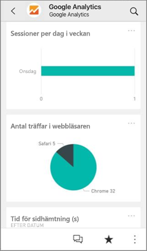
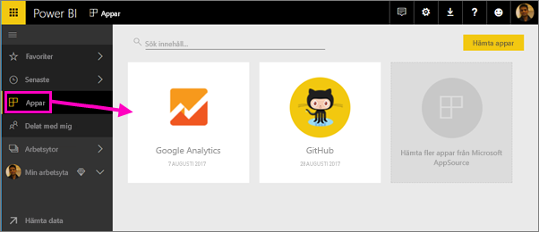

# Ansluta till de tjänster du använder med Power BI
Med Power BI kan du ansluta till många av de tjänster som du använder för att driva verksamheten, som Salesforce, Microsoft Dynamics och Google Analytics. Power BI börjar med att använda dina autentiseringsuppgifter för att ansluta till tjänsten. Därefter skapas en Power BI-*arbetsyta* med en instrumentpanel och en uppsättning Power BI-rapporter som automatiskt visar dina data och ger visuella insikter om verksamheten.

>[!IMPORTANT]
>Tjänstens innehållspaket ersätts av [Mallappar](https://docs.microsoft.com/power-bi/service-template-apps-overview). Från och med den 25 september 2019 har flera innehållspaket redan blivit inaktuella. De inaktuella innehållspaket som du har installerat finns kvar på ditt konto, men ingen dokumentation eller support kommer att tillhandahållas för dem och det är heller inte möjligt att installera dem igen.

Logga in på Power BI för att visa alla de [tjänster som du kan ansluta till](https://app.powerbi.com/getdata/services). 

När du har installerat appen kan du visa instrumentpanelen och rapporterna i appen och arbetsytan i Power BI-tjänsten ([https://app.powerbi.com](https://app.powerbi.com)). Du kan också visa dem i Power BI-mobilapparna. På arbetsytan kan du modifiera instrumentpaneler och rapporter enligt organisationens behov och sedan distribuera dem till dina kollegor som en *app*. 

## Kom igång
[!INCLUDE [powerbi-service-apps-get-more-apps](./includes/powerbi-service-apps-get-more-apps.md)]

## Redigera instrumentpanelen och rapporterna
När importen är klar visas den nya appen på sidan Appar.

1. Välj **Appar** i navigeringsfönstret > välj appen.
   
     
2. Du kan ställa en fråga genom att skriva i Frågor och svar eller klicka på en panel för att öppna den underliggande rapporten. 
   
    
   
    Ändra instrumentpanelen och rapporten så att de passar för behoven i din organisation. Sedan kan du [distribuera appen till dina kollegor](service-create-distribute-apps.md)

## Det här ingår
När du har anslutit till en tjänst, kan du se en nyligen skapad app och en arbetsyta med en instrumentpanel, rapporter och datauppsättning. Data från tjänsten fokuserar på ett specifikt scenario och det kan hända att inte all information från tjänsten finns med. Data uppdateras automatiskt en gång per dag. Du kan styra schemat genom att välja datauppsättningen.

Du kan också [ansluta till många tjänster i Power BI Desktop](desktop-data-sources.md), till exempel Google Analytics, och skapa egna anpassade instrumentpaneler och rapporter.  

Mer information om hur du ansluter till särskilda tjänster finns på de enskilda hjälpsidorna.

## Felsökning
**Tomma paneler**  
Medan Power BI först ansluter till tjänsten, kan du se en tom uppsättning paneler på instrumentpanelen. Om du fortfarande ser en tom instrumentpanel efter två timmar, har anslutningen sannolikt misslyckats. Öppna ett supportärende om du inte ser något felmeddelande med information om att korrigera problemet.

* Välj frågetecken-ikonen ( **?** ) i det övre högra hörnet > **Få hjälp**.
  
    

**Information som saknas**  
Instrumentpanelen och rapporterna består av innehåll från tjänsten som fokuserar på ett specifikt scenario. Letar du efter ett specifikt mätvärde i appen och inte hittar det kan du lägga till ett förslag på supportsidan för [Power BI](https://support.powerbi.com/forums/265200-power-bi).

## Föreslå tjänster
Använder du en tjänst som du vill föreslå för Power BI-appen? Gå till [Power BI-supportens sida](https://support.powerbi.com/forums/265200-power-bi) och berätta för oss.

Om du är intresserad av att skapa mallappar som du kan distribuera själv, kan du läsa [Skapa en mallapp i Power BI](service-template-apps-create.md). Power BI-partner kan skapa Power BI-appar nästan helt utan kodning och distribuera dem till Power BI-kunder. 

## Nästa steg
* [Distribuera appar till kollegor](service-create-distribute-apps.md)
* [Skapa de nya arbetsytorna i Power BI](service-create-the-new-workspaces.md)
* Har du några frågor? [Fråga Power BI Community](https://community.powerbi.com/)
* Har du fler frågor? [Fråga Power BI Community](https://community.powerbi.com/)

