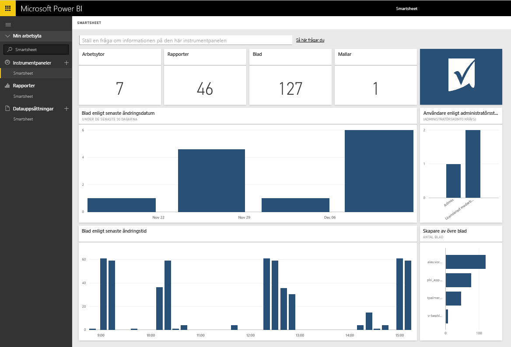

# Anslut till Smartsheet med Power BI
Smartsheet erbjuder en enkel plattform för samarbete och fildelning. Smartsheet-Innehållspaketet för Power BI erbjuder en instrumentpanel, rapporter och datauppsättningar som visar en översikt över ditt Smartsheet-konto. Du kan också använda [Power BI Desktop](desktop-connect-to-data.md) för att ansluta direkt till enskilda blad i ditt konto. 

Anslut till [Smartsheet-innehållspaketet](https://app.powerbi.com/groups/me/getdata/services/smartsheet) för Power BI.

>[!NOTE]
>Smartsheet-administratörskontot rekommenderas för att ansluta till och läsa in Power BI-innehållspaketet eftersom det har ytterligare åtkomst.

## Så här ansluter du
1. Välj **Hämta data** längst ned i det vänstra navigeringsfönstret.
   
   
2. I rutan **tjänster** väljer du **Hämta**.
   
    
3. Välj **Smartsheet \> hämta**.
   
   
4. Som autentiseringsmetod väljer du **oAuth2 \> logga in**.
   
   När du uppmanas till det anger du dina autentiseringsuppgifter för Smartsheet och följer autentiseringsprocessen.
   
   
   
   
5. När Power BI har importerat dessa data, visas en ny instrumentpanel, rapport och datauppsättning i det vänstra navigeringsfönstret. Nya objekt markeras med en gul asterisk \*, välj Smartsheet-posten.
   
   

**Och sedan?**

* Prova att [ställa en fråga i rutan Frågor och svar](consumer/end-user-q-and-a.md) överst på instrumentpanelen
* [Ändra panelerna](service-dashboard-edit-tile.md) på instrumentpanelen.
* [Välj en panel](consumer/end-user-tiles.md) för att öppna den underliggande rapporten.
* Medan din datauppsättning schemaläggs att uppdateras dagligen så kan du ändra uppdateringsfrekvensen eller testa att uppdatera den på begäran med **Uppdatera nu**

## Det här ingår
Smartsheet-innehållspaketet för Power BI inkluderar en översikt över ditt Smartsheet-konto, till exempel hur många arbetsytor, rapporter och ark du har, när de har ändrats och så vidare. Administratörer kan även se information om användarna i sina system, till exempel de som skapat flest ark.  

Om du vill ansluta direkt till enskilda ark i ditt konto, kan du använda Smartsheet-anslutningsprogrammet för [Power BI Desktop](desktop-connect-to-data.md).  

## Nästa steg:

[Vad är Power BI?](power-bi-overview.md)

[Hämta data för Power BI](service-get-data.md)