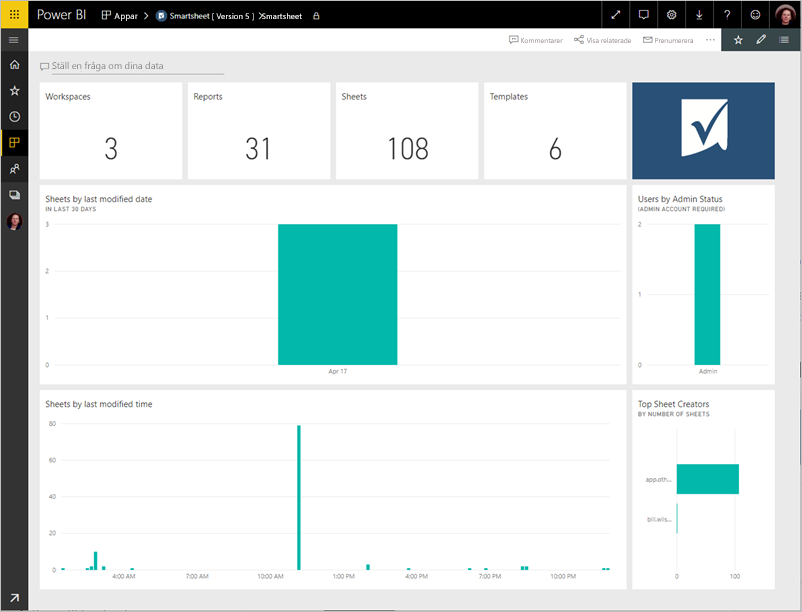

# Anslut till Smartsheet med Power BI
Den här artikeln beskriver hur du hämtar data från ditt Smartsheet-konto med en mall för Power BI-appen. Smartsheet erbjuder en enkel plattform för samarbete och fildelning. Mallapp Smartsheet för Power BI innehåller en instrumentpanel, rapporter och datauppsättningar som visar en översikt över ditt Smartsheet-konto. Du kan också använda [Power BI Desktop](desktop-connect-to-data.md) att ansluta direkt till enskilda ark i ditt konto. 

När du har installerat appen mall, kan du ändra instrumentpanelen och rapporterna. Du kan sedan distribuera den som en app till kollegor i din organisation.

Ansluta till den [Smartsheet mallapp](https://app.powerbi.com/groups/me/getdata/services/smartsheet) för Power BI.

>[!NOTE]
>Ett Smartsheet-administratörskontot rekommenderas för att ansluta och läsa in mallen Power BI-appen eftersom den har ytterligare åtkomst.

## Så här ansluter du

[!INCLUDE [powerbi-service-apps-get-more-apps](./includes/powerbi-service-apps-get-more-apps.md)]

3. Välj **Smartsheet** \> **Hämta nu**.
4. I **installera den här Power BI-appen?** Välj **installera**.
4. I den **appar** väljer den **Smartsheet** panelen.

    

6. I **Kom igång med din nya app**väljer **Anslut data**.

    

4. Som autentiseringsmetod väljer du **oAuth2 \> logga in**.
   
   När du uppmanas till det anger du dina autentiseringsuppgifter för Smartsheet och följer autentiseringsprocessen.
   
   
   
   

5. När Power BI har importerat data, öppnas Smartsheet-instrumentpanelen.
   
   

## Ändra och distribuera din app

Du har installerat appen Smartsheet-mall. Det innebär att du har också skapat Smartsheet app-arbetsytan. I arbetsytan kan du ändra rapporten och instrumentpanelen och sedan distribuera den som en *app* till kollegor i din organisation. 

1. Om du vill visa hela innehållet i den nya Smartsheet-arbetsytan i det vänstra navigeringsfältet, väljer **arbetsytor** > **Smartsheet**. 

    

    Den här vyn är listan med innehåll för arbetsytan. I det övre högra hörnet ser du **uppdatera app**. När du är redo att distribuera appen till dina kollegor, är det där du börjar. 

    

2. Välj **rapporter** och **datauppsättningar** så att andra element på arbetsytan.

    Läs mer om [distribuera appar](service-create-distribute-apps.md) till dina kollegor.

## Det här ingår
Smartsheet mallapp för Power BI innehåller en översikt över ditt Smartsheet-konto, till exempel hur många arbetsytor, rapporter och ark du har, när de har ändrats osv. Administratörer kan du även se information om användarna i sina system, till exempel skapare av övre blad.  

Om du vill ansluta direkt till enskilda ark i ditt konto, kan du använda Smartsheet-anslutningsprogrammet för [Power BI Desktop](desktop-connect-to-data.md).  

## Nästa steg

* [Skapa nya arbetsytor i Power BI](service-create-the-new-workspaces.md)
* [Installera och använda appar i Power BI](consumer/end-user-apps.md)
* [Ansluta till Power BI-appar för externa tjänster](service-connect-to-services.md)
* Har du några frågor? [Fråga Power BI Community](http://community.powerbi.com/)