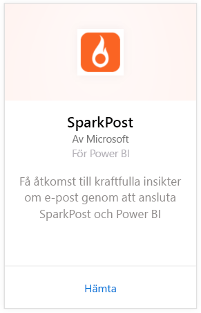
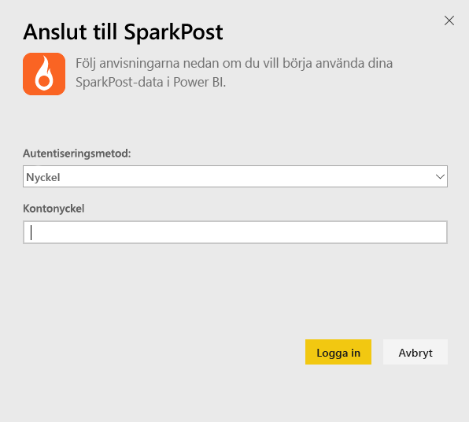
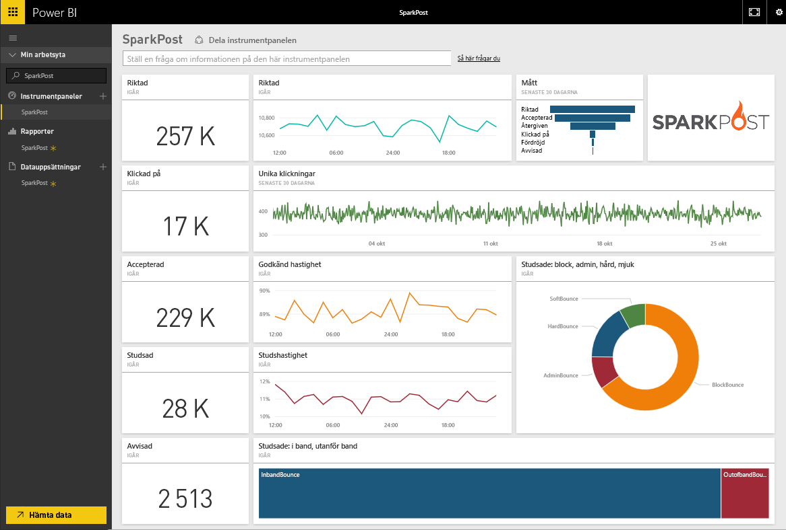
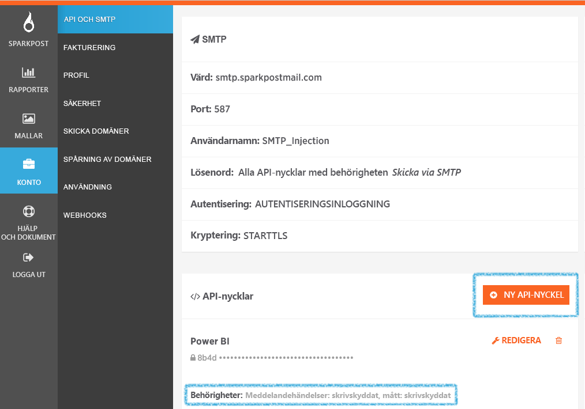

# Anslut till SparkPost med Power BI
Power BI-innehållspaketet för SparkPost låter dig extrahera värdefulla datauppsättningar från ditt SparkPost-konto i en insiktsfull instrumentpanelen. Med SparkPost-innehållspaketet kan du visualisera din totala e-poststatistik, inklusive domäner, kampanjer och engagemang efter Internetleverantör.

Anslut till [SparkPost-innehållspaketet](https://app.powerbi.com/getdata/services/spark-post) för Power BI.

## Så här ansluter du
1. Välj **Hämta data** längst ned i det vänstra navigeringsfönstret.
   
   
2. I rutan **tjänster** väljer du **Hämta**.
   
   
3. Välj **SparkPost**-innehållspaketet och klicka på **hämta**. 
   
   
4. Ange din SparkPost API-nyckel och välj logga in när du ombeds. Visa information om [hitta de här parametrarna](#FindingParams) nedan.
   
   
5. Dina data börjar läsa in beroende på storleken på kontot, detta kan ta en stund. När Power BI har importerat data visas en ny instrumentpanel, rapport och datauppsättning i det vänstra navigeringsfönstret, ifyllt med din e-poststatistik för de senaste 90 dagarna. Nya objekt markeras med en gul asterisk \*.
   
   

**Och sedan?**

* Prova att [ställa en fråga i rutan Frågor och svar](consumer/end-user-q-and-a.md) överst på instrumentpanelen
* [Ändra panelerna](service-dashboard-edit-tile.md) på instrumentpanelen.
* [Välj en panel](consumer/end-user-tiles.md) för att öppna den underliggande rapporten.
* Medan din datauppsättning schemaläggs att uppdateras dagligen så kan du ändra uppdateringsfrekvensen eller testa att uppdatera den på begäran med **Uppdatera nu**

## Det här ingår
SparkPost-innehållspaketet för Power BI innehåller information, bland annat unika klick, godkända priser, acceptansfrekvens, fördröjningsfrekvens, avvisningsfrekvens och mycket mer.

## Hitta parametrar
Innehållspaketet använder en API-nyckel för att ansluta ditt SparkPost-konto till Power BI. Du hittar din API-nyckel i ditt konto under konto \> API & SMTP (mer information [här](https://support.sparkpost.com/customer/portal/articles/1933377-create-api-keys)). Vi föreslår att du använder en API-nyckel med behörigheter för `Message Events: Read-only `och `Metrics: Read-only`

