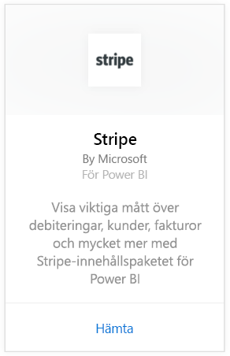
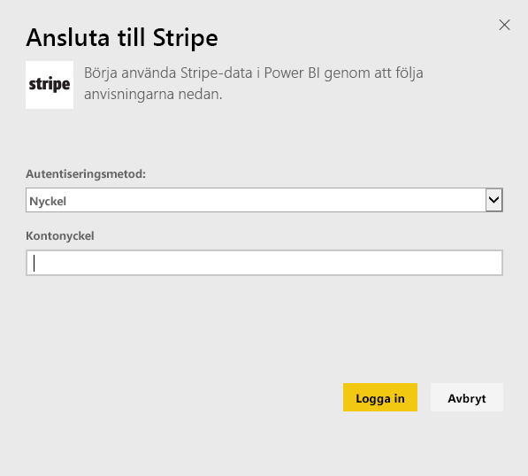
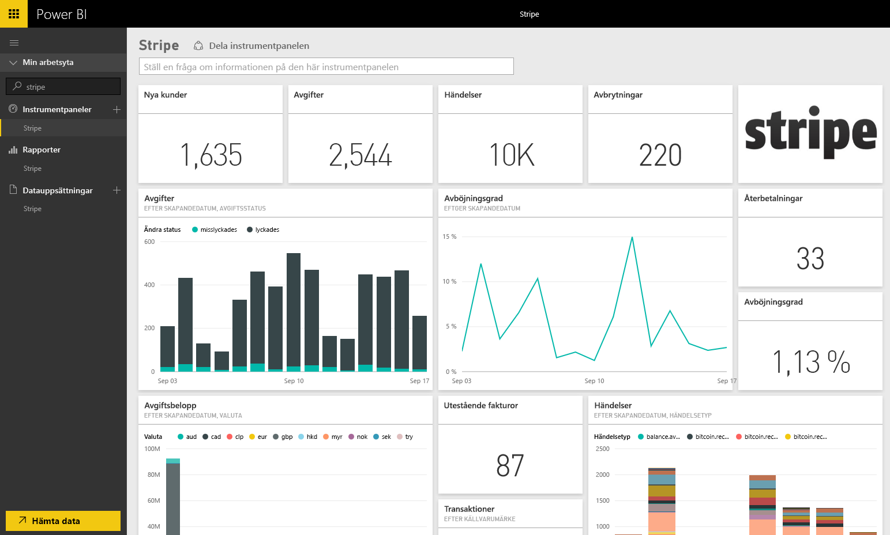

# Anslut till Stripe med Power BI
Visualisera och utforska dina Stripe-data med Power BI-innehållspaket. Power BI Stripe-innehållspaketet tar in data om dina kunder, avgifter, händelser och fakturor. Datan omfattar de senaste tiotusen händelserna och femtusen utgifterna under de senaste 30 dagarna. Innehållet uppdateras automatiskt en gång per dag enligt ett schema som du bestämmer. 

[!INCLUDE [include-short-name](./includes/service-deprecate-content-packs.md)]

Anslut till [Stripe-innehållspaketet](https://app.powerbi.com/getdata/services/stripe) för Power BI.

## Så här ansluter du
1. Välj Hämta data längst ned i det vänstra navigeringsfönstret.  
   
    
2. I rutan **tjänster** väljer du **Hämta**.  
   
      
3. Välj **Stripe** &gt; **hämta**.  
   
      
4. Ange din Stripe [API-nyckel](https://dashboard.stripe.com/account/apikeys) för att ansluta.  
   
    
5. Importen startar automatiskt. När den är klar, visas en ny instrumentpanel och modell i navigeringsfönstret markerade med en asterisk. Välj instrumentpanelen för att se dina importerade data.
   
    

**Och sedan?**

* Prova att [ställa en fråga i rutan Frågor och svar](consumer/end-user-q-and-a.md) överst på instrumentpanelen
* [Ändra panelerna](service-dashboard-edit-tile.md) på instrumentpanelen.
* [Välj en panel](consumer/end-user-tiles.md) för att öppna den underliggande rapporten.
* Medan din datauppsättning schemaläggs att uppdateras dagligen så kan du ändra uppdateringsfrekvensen eller testa att uppdatera den på begäran med **Uppdatera nu**

## Nästa steg
[Vad är Power BI?](power-bi-overview.md)

[Hämta data för Power BI](service-get-data.md)

