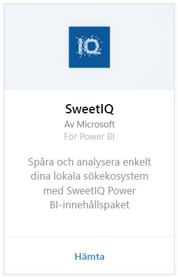
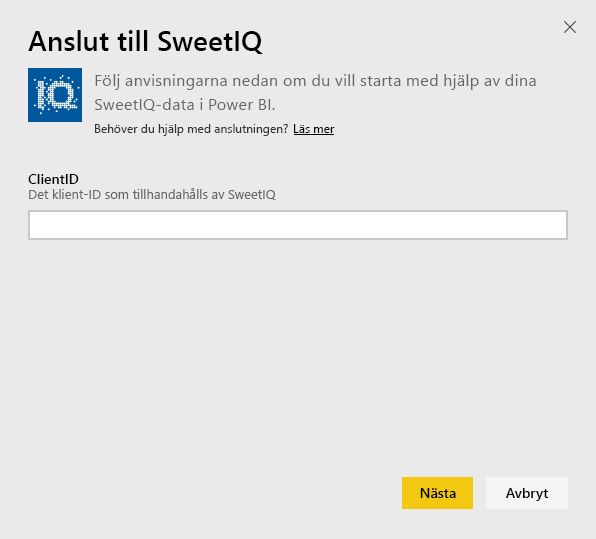
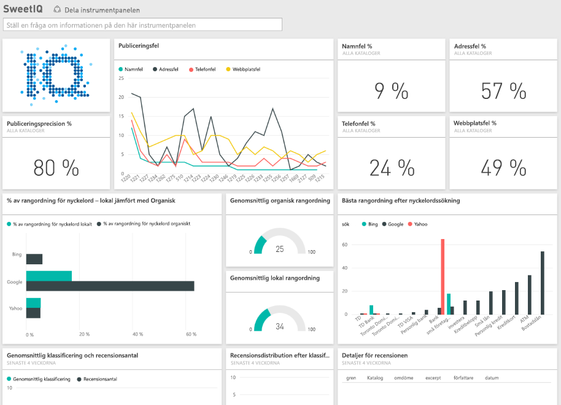

# Anslut till SweetIQ med Power BI
Power BI-innehållspaketet hämtar data från ditt SweetIQ-konto och skapar specifikt innehåll så att du enkelt kan utforska dina data. Använd SweetIQ-innehållspaketet om du vill analysera data om dina platser, listplaceringar, betyg och recensioner. Data har ställts in att uppdateras varje dag för att säkerställa att de data som du övervakar är uppdaterade.

Anslut till [SweetIQ-innehållspaketet](https://app.powerbi.com/groups/me/getdata/services/sweetiq) för Power BI.

## Så här ansluter du
1. I navigeringsfönstret till vänster, klickar du på **hämta data.**
   
    
2. Välj **SweetIQ** och klicka på **hämta.**
   
    
3. Ange ditt SweetIQ-klient-ID. Det är vanligtvis ett alfanumeriskt värde. Mer information om att hitta det här värdet finns nedan.
   
    
4. Välj autentiseringstypen **nyckel** och ange din SweetIQ API-nyckel. Det är vanligtvis ett alfanumeriskt värde. Mer information om att hitta det här värdet finns nedan.
   
    
5. Power BI börjar läsa in dina data, vilket kan ta lite tid beroende på storleken för data i ditt konto. När inläsningen är klar, kommer du att se en ny instrumentpanel, rapport och datauppsättning i det vänstra navigeringsfönstret.
   
    

**Och sedan?**

* Prova att [ställa en fråga i rutan Frågor och svar](consumer/end-user-q-and-a.md) överst på instrumentpanelen
* [Ändra panelerna](service-dashboard-edit-tile.md) på instrumentpanelen.
* [Välj en panel](consumer/end-user-tiles.md) för att öppna den underliggande rapporten.
* Medan din datauppsättning schemaläggs att uppdateras dagligen så kan du ändra uppdateringsfrekvensen eller testa att uppdatera den på begäran med **Uppdatera nu**

## Hitta parametrar
Klient-ID och API-nyckeln för det här innehållspaketet är inte samma som ditt användarnamn och lösenord för SweetIQ.

Välj ett klient-ID för en av klienterna som ditt konto har åtkomst till. Du hittar listan över klienter under klienthantering i ditt SweetIQ-konto.

Kontakta administratören för din API-nyckel för att få tillgång till data för en specifika klient.

## Nästa steg
[Vad är Power BI?](power-bi-overview.md)

[Hämta data för Power BI](service-get-data.md)

