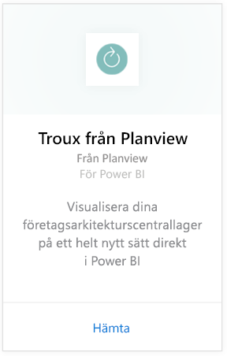
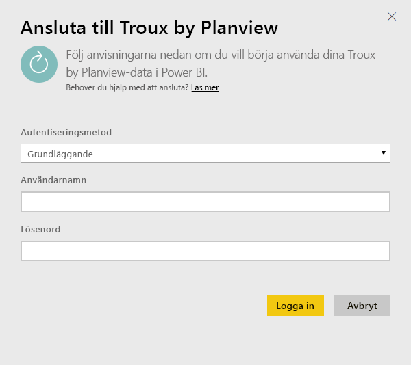
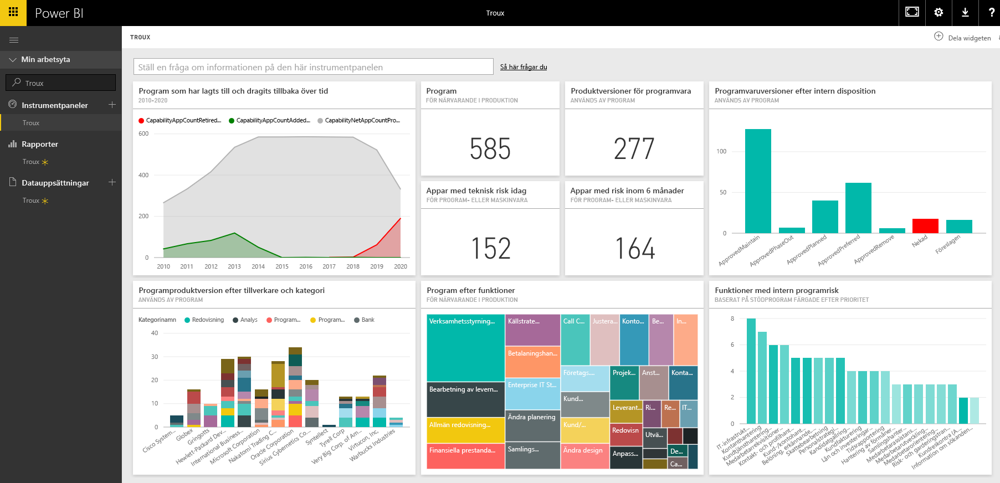

# Ansluta till Troux för Power BI
Med Troux-innehållspaketet kan du visualisera dina företagsarkitekturscentrallager på ett helt nytt sätt direkt i Power BI. Innehållspaketet ger dig flera insikter om dina företagsfunktioner, de program som innehåller dessa funktioner och de tekniker som stöder program som kan anpassas helt med hjälp av Power BI.

Anslut till [Troux-innehållspaketet](https://app.powerbi.com/getdata/services/troux) för Power BI.

## Så här ansluter du
1. Välj **Hämta data** längst ned i det vänstra navigeringsfönstret.
   
   
2. I rutan **Tjänster** väljer du **Hämta**.
   
   
3. Välj **Troux** \>  **Hämta**.
   
   
4. Ange din Troux OData-URL. Se information om att [söka efter de här parametrarna](#FindingParams) nedan.
   
   
5. Som **Autentiseringsmetod** väljer du **Grundläggande** och anger sedan ditt användarnamn och lösenord (skiftlägeskänsliga). Välj sedan **Logga in**.
   
    
6. Efter att du har godkänt startar importen automatiskt. När den är klar visas en ny instrumentpanel, rapport och modell i navigeringsfönstret. Välj instrumentpanelen för att visa dina importerade data.
   
     

**Och sedan?**

* Prova att [ställa en fråga i rutan Frågor och svar](power-bi-q-and-a.md) överst på instrumentpanelen
* [Ändra panelerna](service-dashboard-edit-tile.md) på instrumentpanelen.
* [Välj en panel](service-dashboard-tiles.md) för att öppna den underliggande rapporten.
* Även om din datauppsättning är schemalagd för att uppdateras dagligen, kan du ändra uppdateringsschemat eller försöka uppdatera den på begäran med **Uppdatera nu**.

## Systemkrav
Åtkomst till Troux OData-flödet och Troux 9.5.1 eller högre krävs.

## Hitta parametrar
Kundvårdsteamet kan ge dig din unika URL för Troux-OData-flödet

## Felsökning
Om du får ett tidsgränsfel när du har angett autentiseringsuppgifterna kan du försöka ansluta igen.

## Nästa steg
[Kom igång i Power BI](service-get-started.md)

[Hämta data i Power BI](service-get-data.md)

