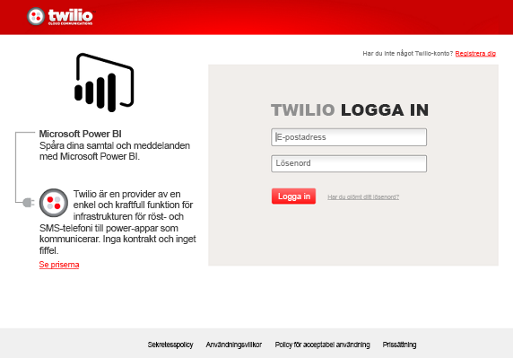
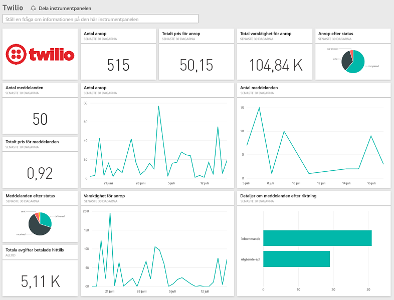

# Anslut till Twilio med Power BI
Med Microsoft Twilio-innehållspaketet för Power BI kan du hämta data till Power BI och skapa en [Twilio-instrumentpanel](https://powerbi.microsoft.com/integrations/twilio) och en rapport som visar insikter för dina data. Du kan också skapa dina anpassade rapporter och instrumentpanel på den datauppsättning som Power BI skapar. Data kommer att uppdateras en gång per dag så att du alltid ser den senaste informationen.

Ansluta till [Twilio-innehållspaketet](https://app.powerbi.com/getdata/services/twilio) för Power BI.

## Så här ansluter du
1. Välj **Hämta data** längst ned i det vänstra navigeringsfönstret.
   
    
2. I rutan **tjänster** väljer du **Hämta**.
   
    
3. Välj **Twilio** \> **Hämta**.
   
   
4. Som **Autentiseringsmetod** väljer du **oAuth2** \> Logga in. När du uppmanas ange dina Twilio-autentiseringsuppgifter och ge Power BI-programmet åtkomst till dina data.
   
   
5. Detta kommer att börja importera data från ditt Twilio-konto och din instrumentpanel fylls med dina samtal och meddelanden från de senaste 30 dagarna. 
   
   

**Och sedan?**

* Prova att [ställa en fråga i rutan Frågor och svar](power-bi-q-and-a.md) överst på instrumentpanelen
* [Ändra panelerna](service-dashboard-edit-tile.md) på instrumentpanelen.
* [Välj en panel](service-dashboard-tiles.md) för att öppna den underliggande rapporten.
* Även om din datauppsättning är schemalagd för att uppdateras dagligen, kan du ändra uppdateringsschemat eller försöka uppdatera den på begäran med **Uppdatera nu**.

## Vad ingår
Information om samtal och meddelanden för de senaste 30 dagarna. Du kan utföra alla typer av analyser och sammanställningar för dessa data.

En uppsättning redan sammanställd statistik som du kanske vill hålla koll på. Den här uppsättningen innehåller:

        All Time Calls Count  
        All Time Calls Duration  
        All Time Calls Price  
        All Time Messages Price  
        All Time Messages Count  
        All Time Count of Phone Numbers  
        All Time Price of Phone Numbers  
        All Time Twilio Client Calls Price  
        All Time Twilio Client Calls Duration  
        All Time Twilio Client Calls Count  
        All Time Total Price  
        All Time Inbound Calls Price  
        All Time Inbound Calls Duration  
        All Time Inbound Calls Count  
        All Time Outbound Calls Price  
        All Time Outbound Calls Duration  
        All Time Outbound Calls Count  
        This Month Calls Price  
        This Month Calls Duration  
        This Month Calls Count  
        This Month Messages Count  
        This Month Messages Price  
        This Month Count of Phone Numbers  
        This Month Price of Phone Numbers  
        This Month Twilio Client Calls Price  
        This Month Twilio Client Calls Duration  
        This Month Twilio Client Calls Count  
        This Month Total Price  
        This Month Inbound Calls Price  
        This Month Inbound Calls Duration  
        This Month Inbound Calls Count  
        This Month Outbound Calls Price  
        This Month Outbound Calls Duration  
        This Month Outbound Calls Count  
        This Month Inbound Messages Price  
        This Month Inbound Messages Count  
        This Month Outbound Messages Price  
        This Month Outbound Messages Count

## Felsökning
Om du har en mycket stor mängd data för de senaste 30 dagarna (hundratusentals transaktioner), kan steget för datahämtning misslyckas. Vi är medvetna om problemet och arbetar på hur det kan åtgärdas. Om du stöter på det här problemet använd gärna supportlänken längst upp på Power BI-sidan för att berätta för oss så kontaktar vi dig för ytterligare undersökningar.

## Nästa steg
[Kom igång i Power BI](service-get-started.md)

[Hämta data i Power BI](service-get-data.md)

