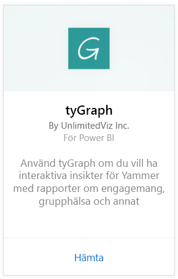
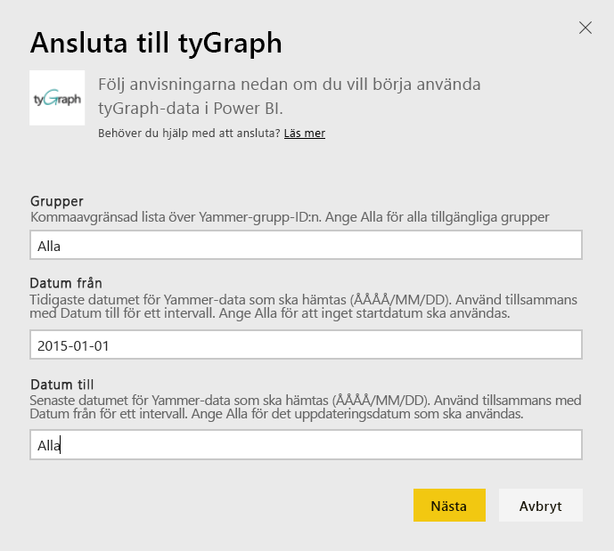
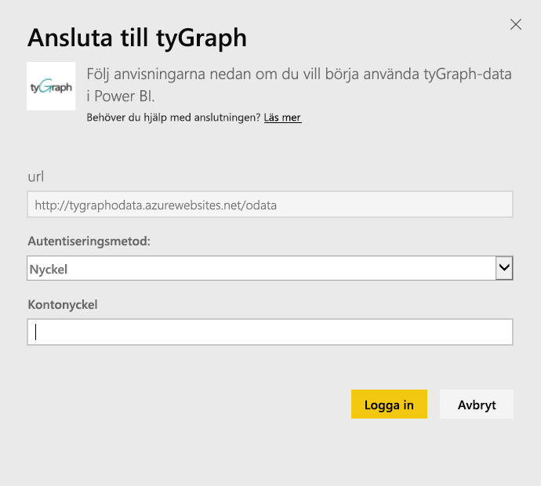
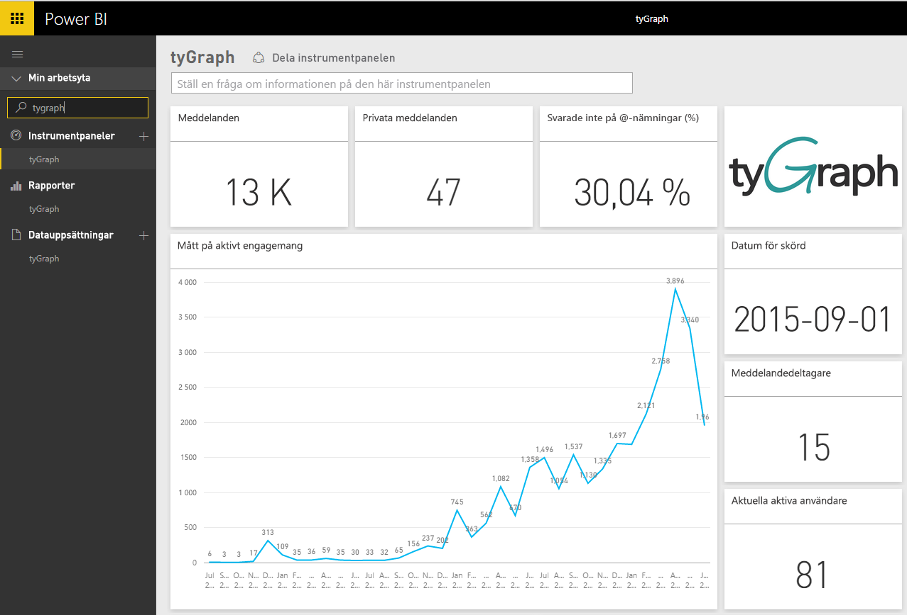
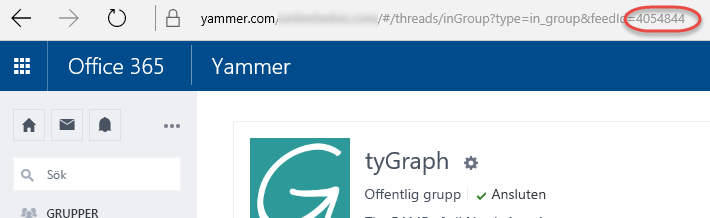

# Ansluta till tyGraph med Power BI
Visualisera och utforska dina data med tyGraph i Power BI med Power BI-innehållspaket. Starta genom att ansluta till ditt tyGraph-konto och läsa in instrumentpanelen, rapporter och datauppsättningar. Innehållet inkluderar insikter såsom mått för aktivt engagemang (MAE-poäng) och bästa deltagare. Anpassa det ytterligare för att fokusera på den information som du är mest intresserad av.  Data uppdateras automatiskt enligt ett schema som du anger.

Ansluta till [tyGraph för Power BI](https://app.powerbi.com/getdata/services/tygraph).

## Så här ansluter du
1. Välj **Hämta data** längst ned i det vänstra navigeringsfönstret.
   
   
2. I rutan **tjänster** väljer du **Hämta**.
   
   
3. Välj **tyGraph** \> **Hämta**.
   
   
4. Ange grupper och tidsintervall som du vill ansluta till, ange annars ”alla” för att hämta alla data. Observera det datumformat som förväntas (ÅÅÅÅ/MM/DD). Visa information om [söka efter parametrarna](#FindingParams) nedan.
   
   
5. Ange tyGraph-nyckeln för att ansluta. Mer information om att hitta det här värdet finns nedan.
   
    **Om du är en Yammer-verifierad administratör**  
    Skickas API-nyckeln till dig i ett e-postmeddelande när tyGraph-kontot har skapats. Om du inte hittar din nyckel, kan du begära en ny genom att skicka ett e-postmeddelande till support@unlimitedviz.com. Om du inte har ett tyGraph-konto kan du starta en utvärderingsversion på [http://www.tygraph.com/](http://www.tygraph.com/). 
   
    **Om du inte är en Yammer-verifierad administratör**
   
    TyGraph-innehållspaketet kräver ett tyGraph-konto med en Yammer-verifierad administratör. När det har skapats kan kompletterande nycklar utfärdas till användare inom samma organisation. Om den verifierade administratören ännu inte har skapat ett tyGraph-konto, kontakta administratören för att hen ska skapa ett. Om ett konto har skapats kan du begära en nyckel genom att skicka ett e-postmeddelande till <mailto:support@unlimitedviz.com>.
   
    
6. Efter en lyckad autentisering startar importen automatiskt. När den är klar visas en ny instrumentpanel, rapport och modell i navigeringsfönstret. Välj instrumentpanelen för att visa dina importerade data.
   
    

**Och sedan?**

* Prova att [ställa en fråga i rutan Frågor och svar](power-bi-q-and-a.md) överst på instrumentpanelen
* [Ändra panelerna](service-dashboard-edit-tile.md) på instrumentpanelen.
* [Välj en panel](service-dashboard-tiles.md) för att öppna den underliggande rapporten.
* Även om din datauppsättning kommer att vara schemalagd att uppdateras dagligen, kan du ändra uppdateringsschemat eller uppdatera på begäran med **Uppdatera nu**

## Hitta parametrar
Du kan hämta data för alla grupper som du har åtkomst till eller så kan du välja att specificera en delmängd. Du kan också skapa en delmängd av data efter datum. Du kan skapa flera tyGraph-instrumentpaneler för att övervaka specifika uppsättningar av grupper och/eller datum. Mer information om dessa parametrar finns nedan.

**Grupper**

TyGraph API kan filtrera data efter grupp-ID. Dessa levereras i innehållspaketet i en kommaavgränsad lista. 

    Example: 2427647,946595,1154464

Du kan identifiera grupp-ID för en viss grupp i Yammer genom att gå till flödet för gruppen och undersöka URL:en.

I exemplet ovan är grupp-ID för Yammer 4054844

**Datum från**

Med Datum från kan du begränsa det tidigaste värdet för de data som returneras. Endast data som skapats på eller efter detta datum kommer att läsas in i innehållspaketet. Formatet för Datum från är ÅÅÅÅ/MM/DD. 

    Example: 2013/10/29

I exemplet ovan läses alla data från eller efter den 29 oktober 2013 in i innehållspaketet. 

**Datum till** Med Datum till kan du begränsa det senaste värdet för de data som returneras. Det kan användas tillsammans med Datum från för att läsa in data från ett datumintervall. Endast data som skapats på eller innan detta datum kommer att läsas in i innehållspaketet. Formatet för Datum till är ÅÅÅÅ/MM/DD. 

    Example: 2014/10/20

I exemplet ovan läses alla data från eller innan den 20 oktober 2014 in i innehållspaketet. 

## Nästa steg
[Kom igång i Power BI](service-get-started.md)

[Hämta data i Power BI](service-get-data.md)

