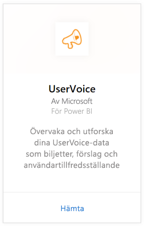
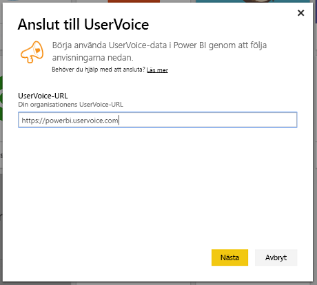
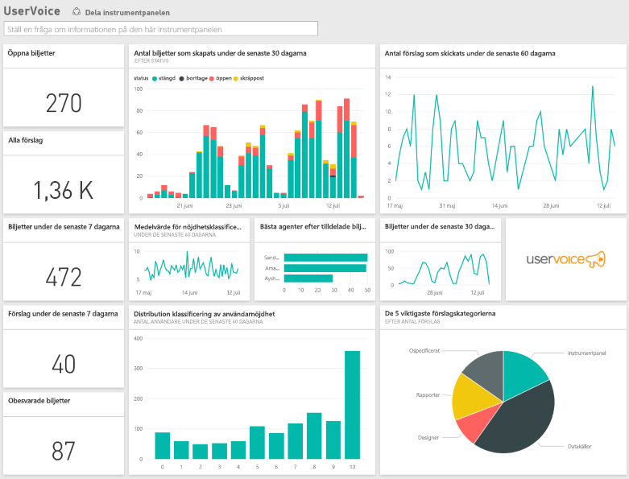

# Ansluta till UserVoice med Power BI
Det är enkelt att spåra och utforska dina UserVoice-data med Power BI och UserVoice-innehållspaketet. Power BI hämtar dina data, inklusive biljetter, förslag och nöjdhetsundersökningar och skapar sedan en anpassad instrumentpanel och rapporter baserade på dessa data.

Anslut till [UserVoice-innehållspaketet](https://app.powerbi.com/getdata/services/uservoice) för Power BI.

>[!NOTE]
>Du måste ha ett administratörskonto för att kunna ansluta till Power BI-innehållspaketet. Innehållspaketet utnyttjar också UserVoice-API:n med användning upp till UserVoice-gränserna. Mer information nedan.

## Så här ansluter du
1. Välj **Hämta data** längst ned i det vänstra navigeringsfönstret.
   
   
2. I rutan **Tjänster** väljer du **Hämta**.
   
    
3. Välj **UserVoice** och sedan **Hämta**.
   
   
4. När du uppmanas till det anger du din UserVoice-URL. URL:en måste följa följande mönster exakt: https://fabrikam.uservoice.com, där ”fabrikam” ersätts med namnet på din produkt eller tjänst.
   
   >[!NOTE]
   >Det finns inget avslutande snedstreck i slutet och anslutningen är i formatet http**s**.
   
   
5. När du uppmanas till det anger du dina autentiseringsuppgifter för UserVoice och följer UserVoice-autentiseringsprocessen. Om du redan är inloggad på UserVoice i webbläsaren, behöver du inte ange några autentiseringsuppgifter. Bevilja Power BI-programmet åtkomst till dina data genom att klicka på ”Tillåt åtkomst”.
   
   >[!NOTE]
   >Du måste ha autentiseringsuppgifter som administratör för ditt UserVoice-konto.
   
   
6. Power BI hämtar dina UserVoice-data och skapar en färdig instrumentpanel och rapport åt dig. Power BI hämtar följande data: Alla förslag, alla öppna biljetter, alla biljetter som skapats under de senaste 30 dagarna inklusive de som är stängda, samt alla kundnöjdhetsklassificeringar.
   
   

**Och sedan?**

* Prova att [ställa en fråga i rutan Frågor och svar](power-bi-q-and-a.md) överst på instrumentpanelen
* [Ändra panelerna](service-dashboard-edit-tile.md) på instrumentpanelen.
* [Välj en panel](service-dashboard-tiles.md) för att öppna den underliggande rapporten.
* Även om din datauppsättning kommer att vara schemalagd att uppdateras dagligen, kan du ändra uppdateringsschemat eller uppdatera på begäran med **Uppdatera nu**

## Felsökning
**”Parameterverifieringen misslyckades. Kontrollera att alla parametrarna är giltiga”**

Om du ser det här felet när du har skrivit din UserVoice-URL. Kontrollera att följande krav är uppfyllda:

* URL:en följer exakt det här mönstret: ”https://fabrikam.uservoice.com” där ”fabrikam” är ersatt med korrekt prefix för UserVoice-URL:en.
* Kontrollera att alla bokstäver är gemena.
* Kontrollera att URL:en är i formatet ”http**s**”.
* Kontrollera att det inte finns något avslutande snedstreck i slutet av URL:en.

**”Inloggningen misslyckades”**

Om du får felet ”Inloggningen misslyckades” när du använder dina UserVoice-autentiseringsuppgifter, har inte kontot du använder behörighet att hämta UserVoice-data från ditt konto. Kontrollera att det är ett administratörskonto och försök igen.

”**Hoppsan! Det har tyvärr uppstått ett fel**”

Om du får detta felmeddelande när datan läses in kontrollerar du att ditt UserVoice-konto inte har överskridit sin kvot för månatlig API-användning. Om allt ser bra ut kan du försöka ansluta igen. Om problemet kvarstår kontaktar du supporten för Power BI på [https://community.powerbi.com](https://community.powerbi.com/).

**Övrigt**  

UserVoice-innehållspaketet för Power BI använder UserVoices API:er till att hämta data. Var noga med att övervaka din API-användning så att du inte överskrider gränsen. Om du har stora mängder data i ditt UserVoice-konto kan du minimera effekten på din API-användning genom att ändra uppdateringsfrekvensen från aktuell standard, vilket är en gång per dag, till att endast uppdatera på vardagar eller varannan dag beroende på dina behov. Ett annat förslag är att en administratör skapar innehållspaketet och delar det med resten av gruppen i stället för att varje administratör i din organisation ska skapa sina egna, vilket innebär onödig belastning på API:erna

## Nästa steg
[Kom igång i Power BI](service-get-started.md)

[Hämta data i Power BI](service-get-data.md)

