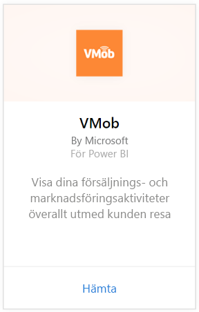
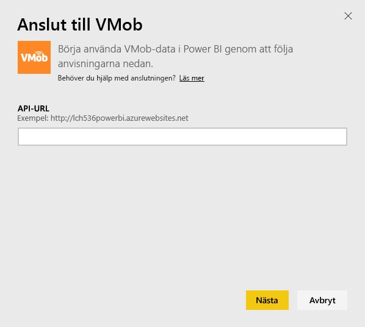
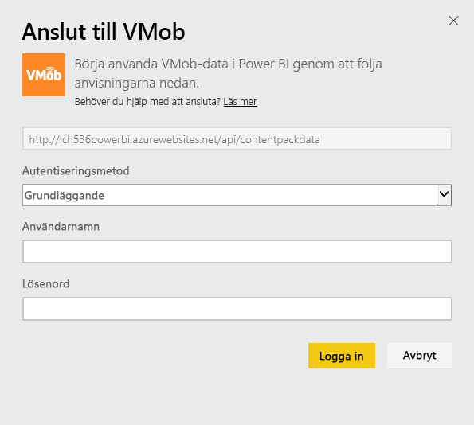
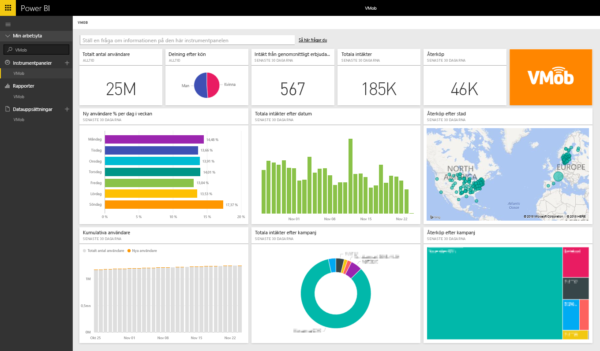

# Ansluta till VMob med Power BI
Det är enkelt att spåra och utforska dina VMob-data med Power BI och VMob-innehållspaketet. Power BI hämtar följande data: användarstatistik för hela tiden och de senaste 30 dagarna, detaljhandels-KPI för de senaste 30 dagarna och kampanjresultat för de senaste 30 dagarna.

Anslut till [VMob-innehållspaketet](https://app.powerbi.com/getdata/services/vmob) för Power BI.

## Så här ansluter du
1. Välj **Hämta data** längst ned i det vänstra navigeringsfönstret.
   
    
2. I rutan **tjänster** väljer du **Hämta**.
   
   
3. Välj **VMob** \> **Hämta**.
   
   
4. När du uppmanas till det anger du din VMob-URL och klickar på Nästa. Denna URL tillhandahålls av VMob separat.
   
    
5. Välj alternativet **Grundläggande** i listrutan för autentiseringsmetod, ange ditt VMob-användarnamn och -lösenord och klicka på knappen **Logga in**.
   
    
6. Importen startar automatiskt och Power BI hämtar dina VMob-data för att skapa en instrumentpanel och en rapport som är färdiga att använda.
   
   

**Och sedan?**

* Prova att [ställa en fråga i rutan Frågor och svar](consumer/end-user-q-and-a.md) överst på instrumentpanelen
* [Ändra panelerna](service-dashboard-edit-tile.md) på instrumentpanelen.
* [Välj en panel](consumer/end-user-tiles.md) för att öppna den underliggande rapporten.
* Medan din datauppsättning schemaläggs att uppdateras dagligen så kan du ändra uppdateringsfrekvensen eller testa att uppdatera den på begäran med **Uppdatera nu**

## Nästa steg
[Kom igång i Power BI](service-get-started.md)

[Hämta data i Power BI](service-get-data.md)

