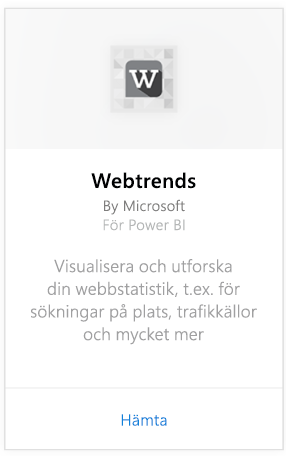
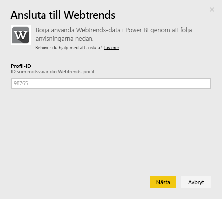
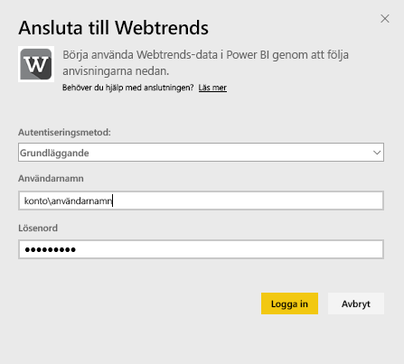
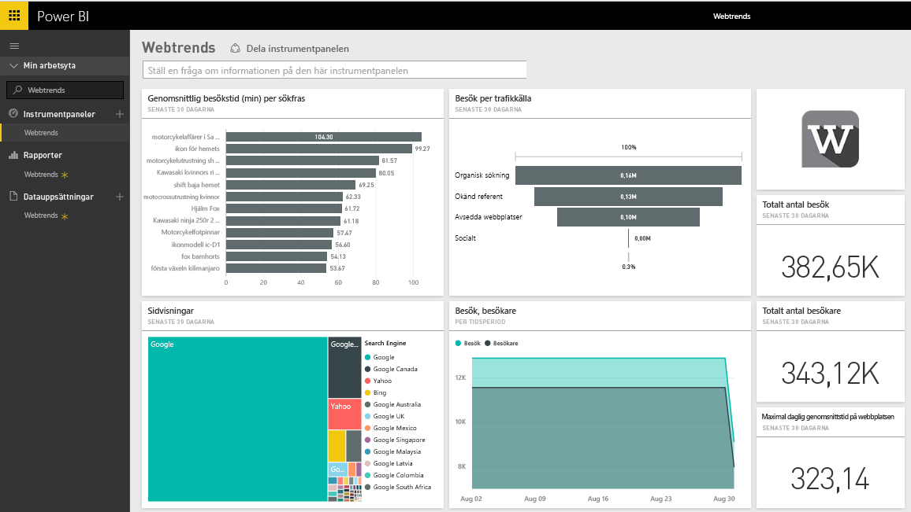
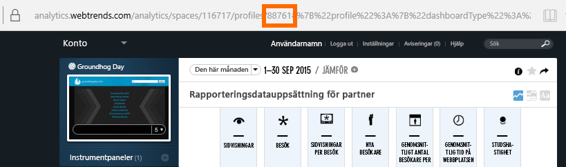
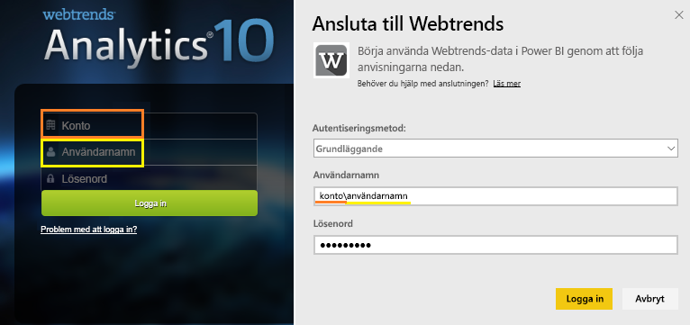

# Ansluta till Webtrends med Power BI
Innehållspaketet Webtrends för Power BI och innehåller en mängd out-of-box-mått, till exempel antal sidvisningar och besök enligt trafikkälla. Du kan visualisera dina Webtrends-data i Power BI genom att först ansluta till ditt Webtrends-konto. Du kan använda instrumentpanelen de rapporter som tillhandahålls, eller anpassa dem för att fokusera på den information som du är mest intresserad av.  Data uppdateras automatiskt en gång per dag.

Anslut till [Webtrends-innehållspaket för Power BI.](https://app.powerbi.com/getdata/services/webtrends)

## Så här ansluter du
1. Välj **Hämta data** längst ned i det vänstra navigeringsfönstret.
   
   
2. I rutan **Tjänster** väljer du **Hämta**.
   
   
3. Välj **Webtrends** \> **Hämta**.
   
   
4. Innehållspaketet ansluter till ett visst Webtrends profil-ID. Visa information om att [hitta de här parametrarna](#FindingParams) nedan.
   
   
5. Ange Webtrends-autentiseringsuppgifter för att ansluta. Observera att fältet användarnamn förväntar sig ditt konto och användarnamn. Se [information](#FindingParams) nedan.
   
   
6. Efter att du har godkänt startar importen automatiskt. När den är klar visas en ny instrumentpanel, rapport och modell i navigeringsfönstret. Välj instrumentpanelen för att visa dina importerade data.
   
   

**Och sedan?**

* Prova att [ställa en fråga i rutan Frågor och svar](power-bi-q-and-a.md) överst på instrumentpanelen
* [Ändra panelerna](service-dashboard-edit-tile.md) på instrumentpanelen.
* [Välj en panel](service-dashboard-tiles.md) för att öppna den underliggande rapporten.
* Även om din datauppsättning är schemalagd för att uppdateras dagligen, kan du ändra uppdateringsschemat eller försöka uppdatera den på begäran med **Uppdatera nu**.

## Det här ingår

Innehållspaketet Webtrends hämtar data från följande rapporter:  

| Rapportnamn | Rapport-ID |
| --- | --- |
| Nyckelmått | |
| Lokala sökningar |34awBVEP0P6 |
| Slutsidor |7FshY8eP0P6 |
| Nästa sidor |CTd5rpeP0P6 |
| Föregående sidor |aSdOeaUgnP6 |
| Webbplatssidor |oOEWQj3sUo6 |
| Klickningar på reklam på webbplatsen |41df19b6d9f |
| Orter |aUuHskcP0P6 |
| Länder |JHWXJNcP0P6 |
| Besökare |xPcmTDDP0P6 |
| Besökslängd |U5KAyqdP0P6 |
| Sökord |IKYEDxIP0P6 |
| Trafikkällor |JmttAoIP0P6 |
| Sökmotorer |yGz3gAGP0P6 |
| Startsidor |i6LrkNVRUo6 |

>[!NOTE]
>Tjänstmåttets namn kan vara lite annorlunda än vad som visas i Webtrends UI för SharePoint-profiler. Följande kartläggning görs för att vara konsekvent mellan SharePoint- och Webtrends-profiler:   

    - Sessioner = besök  
    - Nya användare = nya besökare  
    - Vyer per session = sidvisningar per besök  
    - Genomsn. daglig användningslängd = Genomsnittlig tid på plats per besökare  

## Systemkrav
Innehållspaketet kräver åtkomst till en Webtrends-profil med en [korrekt uppsättning rapporter](#Included) aktiverade.

## Hitta parametrar
Ditt profil-ID för Webtrends kan hittas i URL: en när du har valt en profil:

Dina autentiseringsuppgifter är samma som du anger när du loggar in på Webtrends, men vi förväntar oss ditt konto och ditt användarnamn på samma rad, avgränsade med ett omvänt snedstreck:

## Felsökning
Du kan stöta på problem när innehållspaketet läses in när du har angett dina autentiseringsuppgifter. Granska felsökningsförslagen nedan om du ser meddelandet ”Oops” under inläsningen. Om du fortfarande har problem kan du skicka ett supportärende på https://support.powerbi.com

1. Rätt profil-ID används, se [Hitta parametrar](#FindingParams) för mer information.
2. Användaren har åtkomst till de rapporter som anges i avsnittet [”Vad ingår”](#Included)

## Nästa steg
[Kom igång med Power BI](service-get-started.md)

[Power BI – grundläggande begrepp](service-basic-concepts.md)

