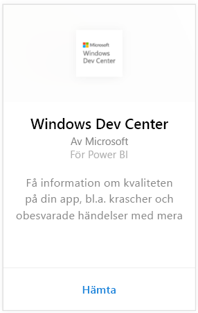
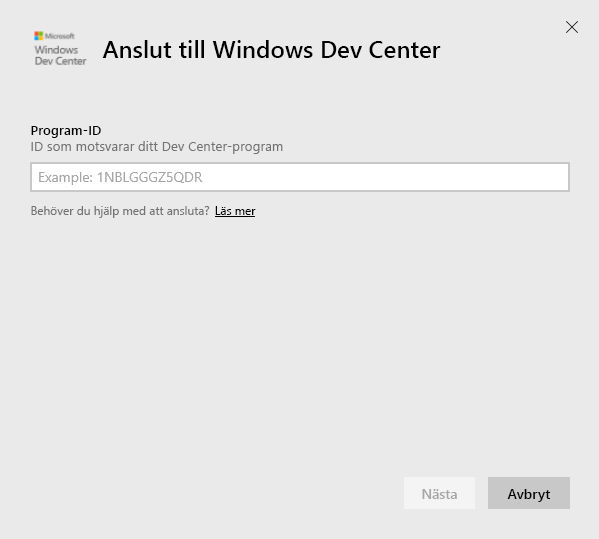
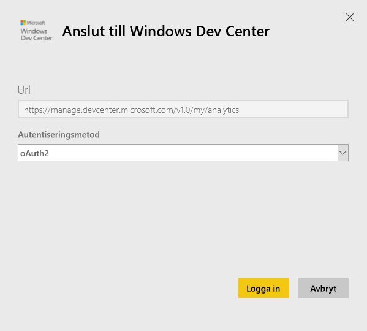
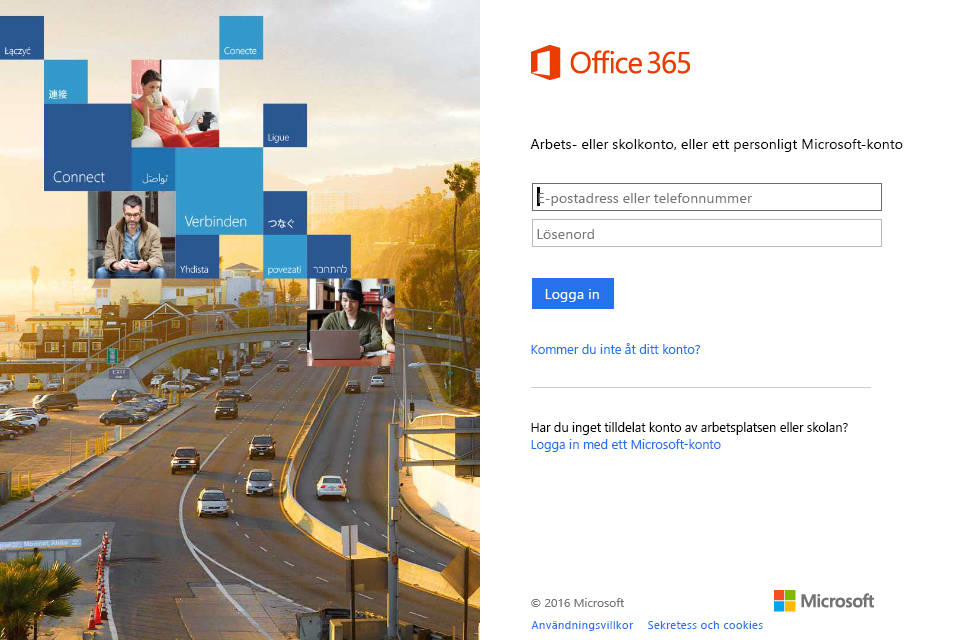
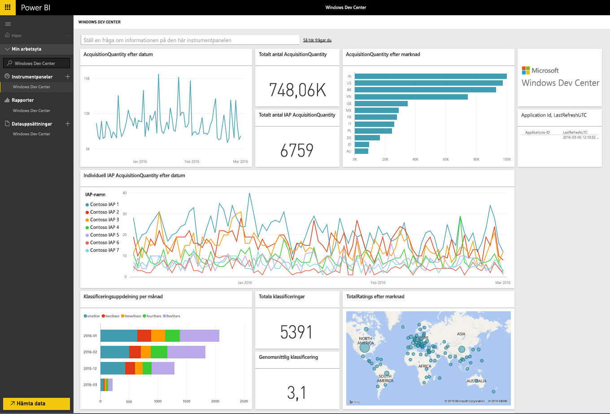
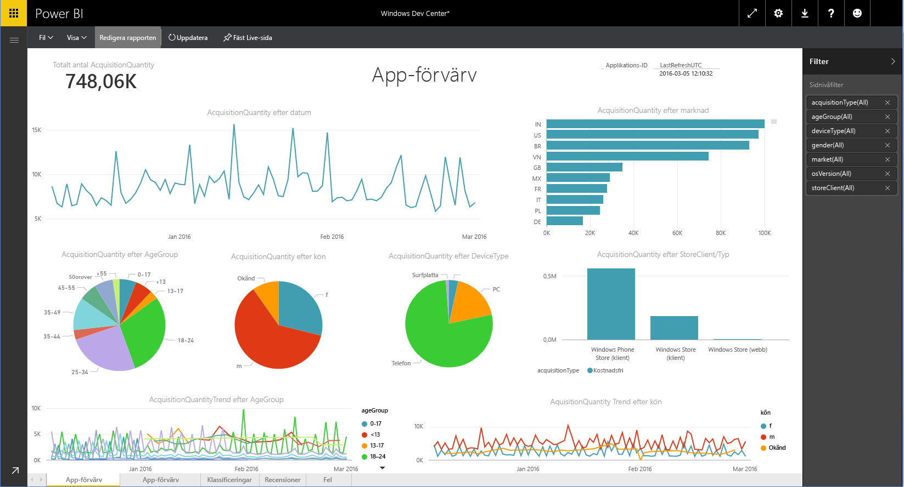

# Ansluta till Windows Dev Center med Power BI
Utforska och övervaka dina Windows Dev Center-appanalysdata i Power BI med Power BI-innehållspaketet. Data uppdateras automatiskt en gång per dag.

Anslut till [Windows Dev Center-innehållspaketet](https://app.powerbi.com/getdata/services/devcenter) för Power BI.

## Så här ansluter du
1. Välj **Hämta data** längst ned i det vänstra navigeringsfönstret.
   
   
2. I rutan **Tjänster** väljer du **Hämta**.
   
   
3. Välj **Windows Dev Center** \>  **Hämta**.
   
   
4. Ange program-ID för en app som du äger och klicka på Nästa. Se information om att [söka efter de här parametrarna](#FindingParams) nedan.
   
   
5. Som **Autentiseringsmetod** väljer du **oAuth2** \> **Logga in**. När du uppmanas till det anger du dina autentiseringsuppgifter för Azure Active Directory som är associerade med Windows Dev Center-kontot (mer information finns i [Systemkrav](#Requirements)).
   
    
   
    
6. Efter att du har godkänt startar importen automatiskt. När den är klar visas en ny instrumentpanel, rapport och modell i navigeringsfönstret. Välj instrumentpanelen för att se dina importerade data och välj en panel för att gå till de underliggande rapporterna.
   
    
   
    

**Och sedan?**

* Prova att [ställa en fråga i rutan Frågor och svar](consumer/end-user-q-and-a.md) överst på instrumentpanelen
* [Ändra panelerna](service-dashboard-edit-tile.md) på instrumentpanelen.
* [Välj en panel](consumer/end-user-tiles.md) för att öppna den underliggande rapporten.
* Medan din datauppsättning schemaläggs att uppdateras dagligen så kan du ändra uppdateringsfrekvensen eller testa att uppdatera den på begäran med **Uppdatera nu**

## Det här ingår
Dev Center Power BI-innehållspaketet innehåller analysdata för din app och IAP-förvärv, klassificeringar, omdömen och apphälsa. Datan är begränsad till de senaste 3 månaderna. och är ett rörligt fönster, så datumen som ingår uppdateras när datauppsättningen uppdateras.

## Systemkrav
Det här innehållspaketet kräver att minst en app publiceras till Windows Store och ett Windows Dev Center-konto (mer information finns [här](https://msdn.microsoft.com/windows/uwp/publish/manage-account-users)).

## Hitta parametrar
Du hittar program-ID:t för en app på sidan Appidentitet under Apphantering.

Program-ID:t finns i slutet av din URL för Windows 10 Store, https://www.microsoft.com/store/apps/  **{applicationId}**

## Nästa steg
[Kom igång i Power BI](service-get-started.md)

[Hämta data i Power BI](service-get-data.md)

