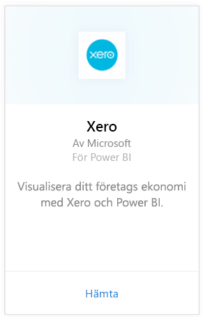
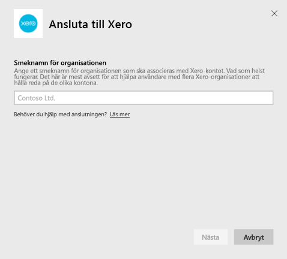
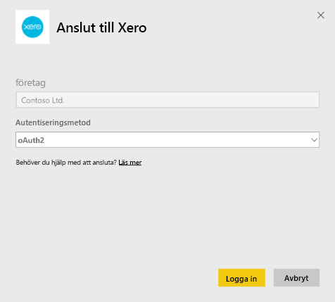

# Ansluta till Xero med Power BI
Xero är en lättanvänd redovisningsprogramvara online som har specialutformats för små företag. Du kan skapa övertygande visualiseringar utifrån dina Xero-siffror med det här Power BI-innehållspaketet. Standardinstrumentpanelen innehåller många mått för småföretag som kontantposition, inkomster och utgifter, vinst-/förlusttrend, gäldenärsdagar och räntabilitet.

Anslut till [Xero-innehållspaketet](https://app.powerbi.com/getdata/services/xero) för Power BI eller lär dig mer om [Xero- och Power BI-](https://help.xero.com/Power-BI)integrering.

## Så här ansluter du
1. Välj **Hämta data** längst ned i det vänstra navigeringsfönstret.
   
   
2. I rutan **tjänster** väljer du **Hämta**.
   
   
3. Välj **Xero** \> **Hämta**.
   
   
4. Ange ett smeknamn för organisation som ska associeras med Xero-kontot. Du kan fylla i vad som helst, namnet är mest avsett att hjälpa användare med flera Xero-organisationer att hålla redo på de olika kontona. Se information om detta [nedan](#FindingParams).
   
   
5. Välj **OAuth** som **Autentiseringsmetod** när du ombes att logga in till ditt Xero-konto och välj organisation att ansluta till. När inloggningen är klar väljer du **Logga in** för att starta inläsningen.
   
    
   
    
6. Efter att du har godkänt startar importen automatiskt. När den är klar visas en ny instrumentpanel, rapport och modell i navigeringsfönstret. Välj instrumentpanelen för att visa dina importerade data.
   
     

**Och sedan?**

* Prova att [ställa en fråga i rutan Frågor och svar](consumer/end-user-q-and-a.md) överst på instrumentpanelen
* [Ändra panelerna](service-dashboard-edit-tile.md) på instrumentpanelen.
* [Välj en panel](consumer/end-user-tiles.md) för att öppna den underliggande rapporten.
* Medan din datauppsättning schemaläggs att uppdateras dagligen så kan du ändra uppdateringsfrekvensen eller testa att uppdatera den på begäran med **Uppdatera nu**

## Det här ingår
Innehållspaketets instrumentpanel innehåller paneler och mått från en mängd olika områden med motsvarande rapporter där du kan lära dig mer om:  

| Område | Paneler på instrumentpanelen | Rapport |
| --- | --- | --- |
| Kontanter |Dagliga kassaflöde  Kontanter in  Kontanter ut  Utgående saldo per konto  Utgående saldo idag |Bankkonton |
| Kund |Fakturerad försäljning  Fakturerad försäljning per kund  Tillväxttrend för fakturerad försäljning  Förfallna fakturor  Utestående fodringar  Förfallna fodringar |Kund  Lager |
| Leverantör |Fakturerade inköp  Fakturerade inköp per leverantör  Tillväxttrend för fakturerade inköp   Förfallna räkningar  Utestående skulder  Förfallna skulder |Leverantörs-  Lager |
| Lager |Månatligt försäljningsbelopp per produkt |Lager |
| Vinst och förlust |Vinst och förlust per månad  Nettovinst detta räkenskapsår  Nettovinst denna månad  Största utgiftskontona |Vinst och förlust |
| Balansräkning |Tillgångar totalt  Skulder totalt  Kapital |Balansräkning |
| Hälsa |Likviditetskvot  Bruttomarginal procent   Avkastning på totala tillgångar  Förhållande mellan totala skulder och kapital |Hälsa  Ordlista och teknisk information |

Datauppsättningen innehåller också följande tabeller för att anpassa dina rapporter och instrumentpaneler:  

* Adresser  
* Aviseringar  
* Kontoutdrag dagsbalans  
* Kontoutdrag  
* Kontakter  
* Utgiftsanspråk  
* Fakturaradsposter  
* Fakturor  
* Poster  
* Månadsslut  
* Organisation  
* Råbalans  
* Xero-konton

## Systemkrav
Följande roller krävs för att få åtkomst till Xero-innehållspaketet: ”Standard + Rapporter” eller ”Advisor”.

## Hitta parametrar
Ange ett namn för din organisation som kan spåras i Power BI. På så sätt kan du ansluta till flera olika organisationer. Observera att du inte kan ansluta till samma organisation flera gånger, eftersom det påverkar den schemalagda uppdateringen.   

## Felsökning
* Xero-användare måste ha följande roller för att få åtkomst till Xero-innehållspaketet för Power BI: ”Standard + Rapporter” eller ”Advisor”. Innehållspaketet är beroende av användarbaserade behörigheter för åtkomst till rapportering av data via Power BI.  
* Om ett fel uppstår när inläsning pågått under en viss tid, kan du kontrollera hur lång tid det tog att visa felmeddelandet. Observera att den åtkomsttoken som tillhandahålls av Xero bara gäller i 30 minuter, så konton med mer data än vad som kan läsas in på den tiden misslyckas. Vi arbetar aktivt för att förbättra detta.
* Under inläsningen befinner sig panelerna på instrumentpanelen i ett allmänt inläsningstillstånd . Detta förväntas inte att förändras förrän hela inläsningen är avslutad. Om du får ett meddelande om att inläsningen har slutförts men panelerna fortfarande läses in, kan du prova att uppdatera instrumentpanelens paneler med hjälp av ... i övre högra hörnet på instrumentpanelen.
* Om det inte går att uppdatera innehållspaketet, kan du kontrollera om du har anslutit till samma organisation mer än en gång i Power BI. Xero tillåter endast en aktiv anslutning till en organisation och du kan se ett felmeddelande om att dina autentiseringsuppgifter är ogiltiga om du ansluter till samma mer än en gång.  
* Vid problem med att ansluta Xero-innehållspaketet för Power BI, som felmeddelanden eller mycket långsamma inläsningstider, kan du börja med att rensa cacheminnet/cookies, starta om webbläsaren och sedan återansluta till Power BI.  

För övriga problem kan du öppna ett supportärende på http://support.powerbi.com om problemet kvarstår.

## Nästa steg
[Kom igång i Power BI](service-get-started.md)

[Hämta data i Power BI](service-get-data.md)

