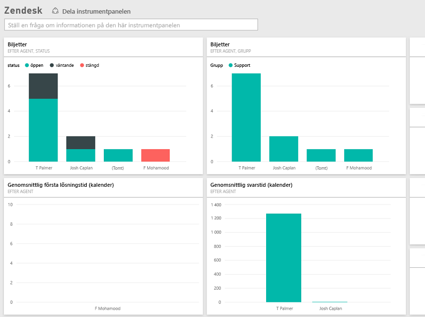

# Anslut till Zendesk med Power BI
Zendesk-innehållspaketet erbjuder en Power BI-instrumentpanel och en uppsättning Power BI-rapporter som ger inblick om dina biljettvolymer och prestanda för agenter. Du kan använda instrumentpanelen de rapporter som tillhandahålls, eller anpassa dem för att fokusera på den information som du är mest intresserad av.  Data uppdateras automatiskt en gång per dag. 

Anslut till [Zendesk-innehållspaketet](https://app.powerbi.com/getdata/services/zendesk) eller läs mer om [Zendesk-integrering](https://powerbi.microsoft.com/integrations/zendesk) med Power BI.

>[!NOTE]
>Ett Zendesk-administratörskonto krävs för att ansluta. Mer information om [kraven](#Requirements) finns nedan.

## Så här ansluter du
1. Välj **Hämta data** längst ned i det vänstra navigeringsfönstret.
   
   
2. I rutan **tjänster** väljer du **Hämta**.
   
    
3. Välj **Zendesk** \> **hämta.**
   
   
4. Ange den URL som är kopplad till ditt konto. Den är i formatet **https://company.zendesk.com**, visa information om [att hitta dessa parametrar](#FindingParams) nedan.
   
   
5. När du uppmanas till det anger du dina Zendesk-autentiseringsuppgifter.  Välj **oAuth 2** som autentiseringsmetod och klicka på **Logga in**. Följ Zendesk-autentiseringsflödet. (Om du redan är inloggad på Zendesk i webbläsaren, behöver du kanske inte ange några autentiseringsuppgifter.)
   
   > [!NOTE]
   > Det här innehållspaketet kräver att du ansluter med ett Zendesk-administratörskonto. 
   > 
   > 
   
   
6. Klicka på **Tillåt** för att låta Power BI komma åt dina Zendesk-data.
   
   
7. Klicka på **Anslut** för att starta importen. När Power BI har importerat dessa data, visas en ny instrumentpanel, rapport och datauppsättning i det vänstra navigeringsfönstret. Nya objekt markeras med en gul asterisk \*.
   
   

**Och sedan?**

* Prova att [ställa en fråga i rutan Frågor och svar](service-q-and-a.md) överst på instrumentpanelen
* [Ändra panelerna](service-dashboard-edit-tile.md) på instrumentpanelen.
* [Välj en panel](service-dashboard-tiles.md) för att öppna den underliggande rapporten.
* Även om din datauppsättning kommer att vara schemalagd att uppdateras dagligen, kan du ändra uppdateringsschemat eller uppdatera på begäran med **Uppdatera nu**

## Vad ingår
Power BI-innehållspaketet inkluderar data om följande:  

* Användare (slutanvändare och agenter)  
* Organisationer  
* Grupper  
* Biljetter  

Det finns också en uppsättning åtgärder som har beräknats, till exempel genomsnittlig väntetid och lösta biljetter under de senaste 7 dagarna. En fullständig lista finns i innehållspaketet.

## Systemkrav
Ett Zendesk-administratörskonto krävs för att komma åt Zendesk-innehållspaketet. Om du är en agent eller en slutanvändare och är intresserad av att visa dina Zendesk-data, lägg till ett förslag och granska Zendesk-anslutningsprogrammet i [Power BI Desktop](desktop-connect-to-data.md).

## Hitta parametrar
Din Zendesk URL kommer att vara samma som den URL som du använder för att logga in på ditt Zendesk-konto. Om du inte är säker på din Zendesk-URL, kan du använda Zendesk [inloggningshjälp](https://www.zendesk.com/login/).

## Felsökning
Om du har problem med att ansluta, kontrollera din Zendesk-URL och bekräfta att du använder ett Zendesk-administratörskonto.

## Nästa steg
* [Kom igång med Power BI](service-get-started.md)
* [Hämta data](service-get-data.md)

