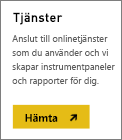
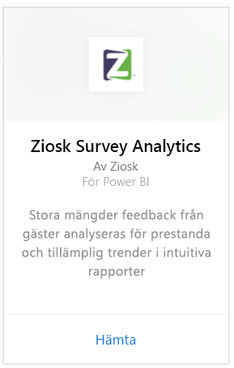
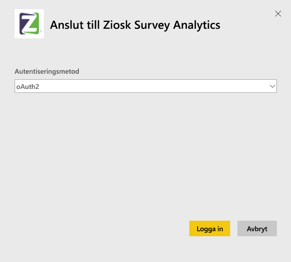
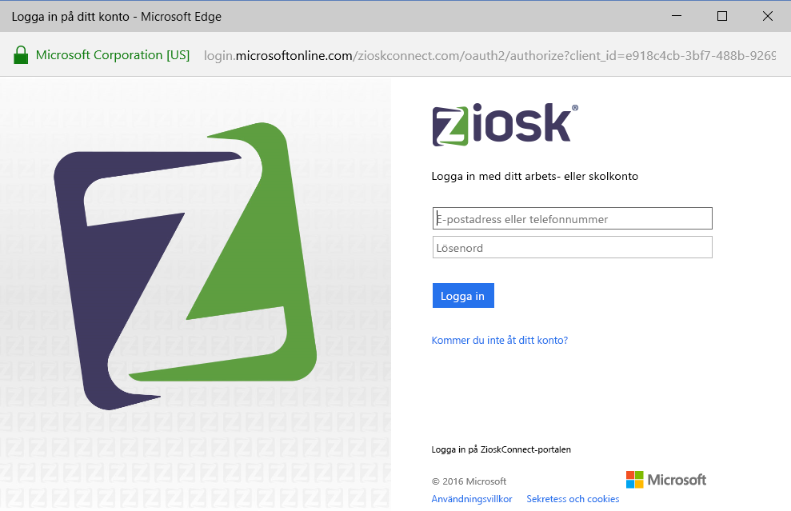
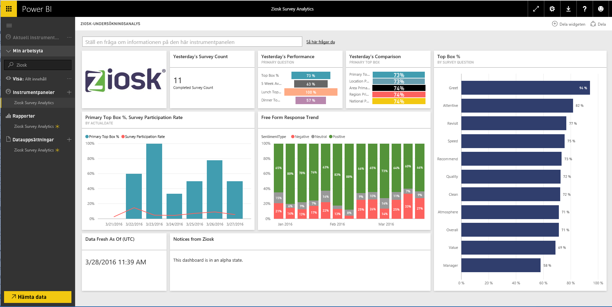

# Anslut till Ziosk Survey Analytics med Power BI
Innehållspaketet Ziosk Survey Analytics för Power BI erbjuder restauranger med Ziosk-surfplattor ojämförbar tillgång till insikter från Ziosk-undersökningsdata, inklusive segmentering efter dag, plats, medarbetare och mer.

Anslut till [innehållspaketet Ziosk Survey Analytics](https://app.powerbi.com/getdata/services/ziosk-survey-analytics) för Power BI.

## Så här ansluter du
1. Välj **Hämta data** längst ned i det vänstra navigeringsfönstret.  
   
    
2. I rutan **tjänster** väljer du **Hämta**.  
   
    
3. Välj **Ziosk Survey Analytics** och välj **hämta**.  
   
    
4. Välj **OAuth 2** och sedan **Logga in**. När du uppmanas, anger du dina autentiseringsuppgifter för Ziosk.
   
    
   
    
5. När du är ansluten kommer en instrumentpanel, rapport och datauppsättning automatiskt att läsas in. När du är klar, uppdateras panelerna med data från ditt Ziosk-konto.
   
    

**Och sedan?**

* Prova att [ställa en fråga i rutan Frågor och svar](service-q-and-a.md) överst på instrumentpanelen
* [Ändra panelerna](service-dashboard-edit-tile.md) på instrumentpanelen.
* [Välj en panel](service-dashboard-tiles.md) för att öppna den underliggande rapporten.
* Även om din datauppsättning kommer att vara schemalagd att uppdateras dagligen, kan du ändra uppdateringsschemat eller uppdatera på begäran med **Uppdatera nu**

## Vad ingår
Innehållspaketet inkluderar data från följande tabeller:  

    - Alkoholkategori  
    - Förrättskategori  
    - CommentKeywords  
    - Datum  
    - Del av dagen  
    - Efterrättskategori  
    - FreeForm  
    - Barnkategori  
    - Meddelanden  
    - Premium-innehållskategori  
    - Fråga  
    - Lager  
    - Undersökningar  
    - Veckodag  

## Systemkrav
Ett Ziosk-konto med behörigheter till ovanstående tabeller krävs för att skapa en instans av det här innehållspaketet.

## Nästa steg
[Kom igång med Power BI](service-get-started.md)

[Power BI – grundläggande begrepp](service-basic-concepts.md)

