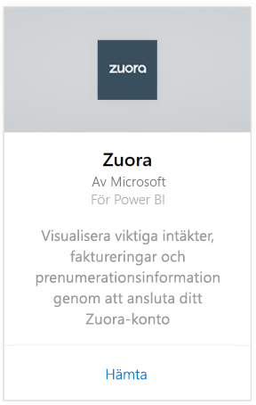
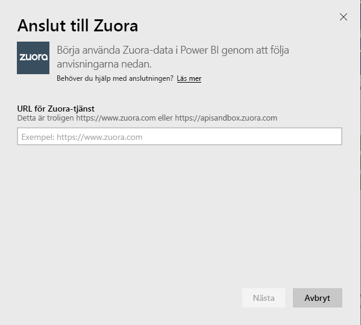
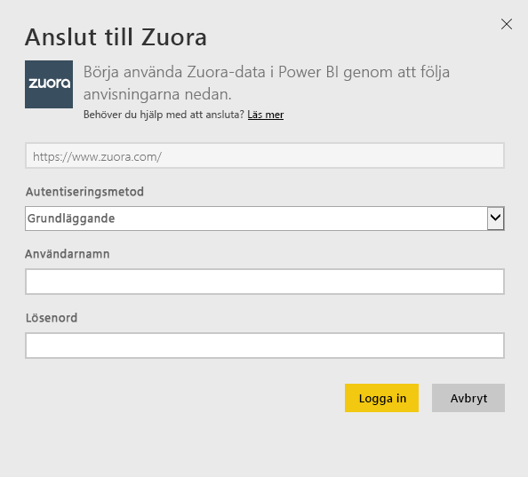
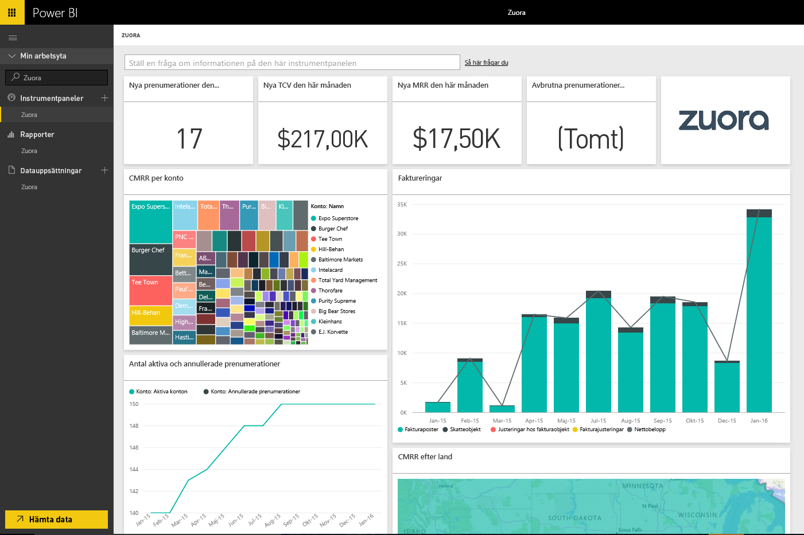

# Ansluta till Zuora med Power BI
Med Zuora för Power BI kan du visualisera viktiga intäkter, fakturering och prenumerationsdata. Använd standardinstrumentpanelen och rapporter för att analysera användningstrender, spåra fakturering och betalningar och övervaka återkomma intäkter eller anpassa dem för att uppfylla dina unika behov av instrumentpaneler och rapporter.

Ansluta till [Zuora](https://app.powerbi.com/getdata/services/Zuora) för Power BI.

## Så här ansluter du
1. Välj **Hämta data** längst ned i det vänstra navigeringsfönstret.

   
2. I rutan **tjänster** väljer du **Hämta**.

   
3. Välj **Zuora** \> **Hämta**.

   
4. Ange ditt Zuora-URL. URL:en är normalt ”<https://www.zuora.com>”. Information om hur du [söker efter dessa parametrar](#FindingParams) finns nedan.

   
5. Som **Autentiseringsmetod** väljer du **Grundläggande** och anger sedan ditt användarnamn och lösenord (skiftlägeskänsliga). Välj sedan **Logga in**.

    
6. Efter att du har godkänt startar importen automatiskt. När den är klar visas en ny instrumentpanel, rapport och modell i navigeringsfönstret. Välj instrumentpanelen för att visa dina importerade data.

     

**Och sedan?**

* Prova att [ställa en fråga i rutan Frågor och svar](consumer/end-user-q-and-a.md) överst på instrumentpanelen
* [Ändra panelerna](service-dashboard-edit-tile.md) på instrumentpanelen.
* [Välj en panel](consumer/end-user-tiles.md) för att öppna den underliggande rapporten.
* Medan din datauppsättning schemaläggs att uppdateras dagligen så kan du ändra uppdateringsfrekvensen eller testa att uppdatera den på begäran med **Uppdatera nu**

## Det här ingår
Innehållspaketet använder Zuora AQUA API för att hämta följande tabeller:

| Tables |  |  |
| --- | --- | --- |
| Konto |InvoiceItemAdjustment |Refund |
| AccountingCode |Payment |RevenueSchedule |
| AccountingPeriod |PaymentMethod |RevenueScheduleItem |
| BillTo |Produkt |Subscription |
| DateDim |ProductRatePlan |TaxationItem |
| Invoice |ProductRatePlanCharge |Usage |
| InvoiceAdjustment |RatePlan | |
| InvoiceItem |RatePlanCharge | |

Den inkluderar också dessa beräknade mått:

| Mått | Beskrivning | Halvberäkning |
| --- | --- | --- |
| Konto: betalningar |Totalt betalningsbelopp under en tidsperiod, baserat på betalningens förfallodatum. |SUM (Payment.Amount)  WHERE Payment.EffectiveDate =< TimePeriod.EndDate AND    Payment.EffectiveDate >= TimePeriod.StartDate |
| Konto: återbetalningar |Total återbetalning under en tidsperiod, baserat på återbetalningsdatumet. Mängden har rapporterats som ett negativt tal. |-1*SUM(Refund.Amount) WHERE Refund.RefundDate =< TimePeriod.EndDate AND    Refund.RefundDate >= TimePeriod.StartDate |
| Konto: nettobetalningar |Kontobetalningar plus återbetalningar under en tidsperiod. |Account.Payments + Account.Refunds |
| Konto: Aktiva konton |Antal konton som var aktiva under en tidsperiod. Prenumerationer måste har startat innan (eller under) tidsperiodens startdatum. |COUNT (Account.AccountNumber) WHERE     Subscription.Status != "Expired" AND    Subscription.Status != "Draft" AND    Subscription.SubscriptionStartDate <= TimePeriod.StartDate AND    (Subscription.SubscriptionEndDate > TimePeriod.StartDate OR Subscription.SubscriptionEndDate = null) –evergreen subscription |
| Konto: Genomsnittliga återkommande intäkter |Bruttomarginal MRR per aktivt konto under en tidsperiod. |Gross MRR / Account.ActiveAccounts |
| Konto: Annullerade prenumerationer |Antal konton som avbrutit en prenumeration under en tidsperiod. |COUNT (Account.AccountNumber) WHERE Subscription.Status = "Cancelled" AND    Subscription.SubscriptionStartDate <= TimePeriod.StartDate AND    Subscription.CancelledDate >= TimePeriod.StartDate |
| Konto: Betalningsfel |Summan av betalningsfel. |SUM (Payment.Amount) WHERE Payment.Status = "Error" |
| Objekt i intäktsschema: Identifierade intäkter |Totalt antal identifierade intäkter under en redovisningsperiod. |SUM (RevenueScheduleItem.Amount) WHERE AccountingPeriod.StartDate = TimePeriod.StartDate |
| Prenumerationen: Nya prenumerationer |Antal nya prenumerationer under en tidsperiod. |COUNT (Subscription.ID) WHERE Subscription.Version = "1" AND    Subscription.CreatedDate <= TimePeriod.EndDate AND    Subscription.CreatedDate >= TimePeriod.StartDate |
| Faktura: Fakturaposter |Totalt antal fakturaposter som har debiterats under en tidsperiod. |SUM (InvoiceItem.ChargeAmount) WHERE     Invoice.Status = "Posted" AND    Invoice.InvoiceDate <= TimePeriod.EndDate AND    Invoice.InvoiceDate >= TimePeriod.StartDate |
| Faktura: Skatteobjekt |Totalt antal skattebelopp under en tidsperiod. |SUM (TaxationItem.TaxAmount) WHERE Invoice.Status = "Posted" AND    Invoice.InvoiceDate <= TimePeriod.EndDate AND    Invoice.InvoiceDate >= TimePeriod.StartDate |
| Fakturera: Justeringar hos fakturaobjekt |Totalt antal fakturaposter som har justerats under en tidsperiod. |SUM (InvoiceItemAdjustment.Amount)  WHERE     Invoice.Status = "Posted" AND    InvoiceItemAdjustment.AdjustmentDate <= TimePeriod.EndDate AND    InvoiceItemAdjustment.AdjustmentDate >= TimePeriod.StartDate |
| Faktura: Justeringar hos fakturor |Totalt antal fakturajusteringar under en tidsperiod. |SUM (InvoiceAdjustment.Amount)  WHERE     Invoice.Status = "Posted" AND    InvoiceAdjustment.AdjustmentDate <= TimePeriod.EndDate AND    InvoiceAdjustment.AdjustmentDate >= TimePeriod.StartDate |
| Faktura: Nettobelopp |Summan av poster, skatteobjekt, fakturaobjektjusteringar och fakturajusteringar under en tidsperiod. |Invoice.InvoiceItems + Invoice.TaxationItems + Invoice.InvoiceItemAdjustments + Invoice.InvoiceAdjustments |
| Fakturera: Fakturans saldo |Summan av bokförda fakturasaldon. |SUM (Invoice.Balance)  WHERE     Invoice.Status = "Posted" |
| Faktura: Bruttofakturering |Summan av fakturaobjekt för bokförda fakturor under en tidsperiod. |SUM (InvoiceItem.ChargeAmount)  WHERE     Invoice.Status = "Posted" AND    Invoice.InvoiceDate <= TimePeriod.EndDate AND    Invoice.InvoiceDate >= TimePeriod.StartDate |
| Faktura: Totala justeringar |Summan av bearbetade fakturajusteringar och fakturaobjektjusteringar som är associerade med bokförda fakturor. |SUM (InvoiceAdjustment.Amount)  WHERE     Invoice.Status = "Posted" AND    InvoiceAdjustment.Status = "Processed" + SUM (InvoiceItemAdjustment.Amount)  WHERE     Invoice.Status = "Posted" AND    invoiceItemAdjustment.Status = "Processed" |
| Prenumerationsavgift: Brutto MMR |Summan av månatliga återkommande intäkter från prenumerationer under en tidsperiod. |SUM (RatePlanCharge.MRR)  WHERE     Subscription.Status != "Expired" AND    Subscription.Status != "Draft" AND    RatePlanCharge.EffectiveStartDate <= TimePeriod.StartDate AND        RatePlanCharge.EffectiveEndDate > TimePeriod.StartDate     OR RatePlanCharge.EffectiveEndDate = null --evergreen subscription |

## Systemkrav
Åtkomst till Zuora-API måste anges.

## Hitta parametrar
Ange en URL som du vanligtvis anger för att få åtkomst till dina Zuora-data. Giltiga alternativ är:  

* https://www.zuora.com  
* Den URL som motsvarar din instans av tjänsten  

## Felsökning
Innehållspaketet Zuora hämtar många olika aspekter av ditt Zuora-konto. Om du inte använder vissa funktioner kan motsvarande paneler/rapporter vara tomma. Kontakta supporten för Power BI om du har problem med att läsa in.

## Nästa steg
[Kom igång i Power BI](service-get-started.md)

[Hämta data i Power BI](service-get-data.md)
