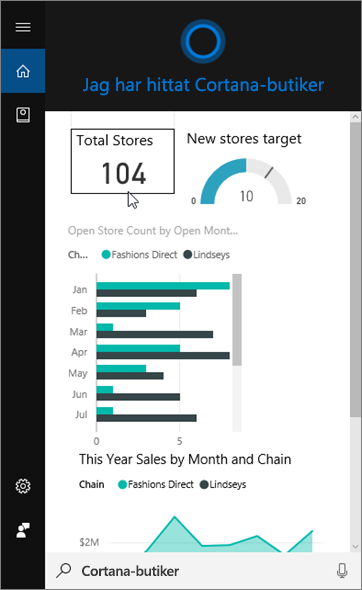
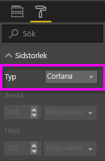
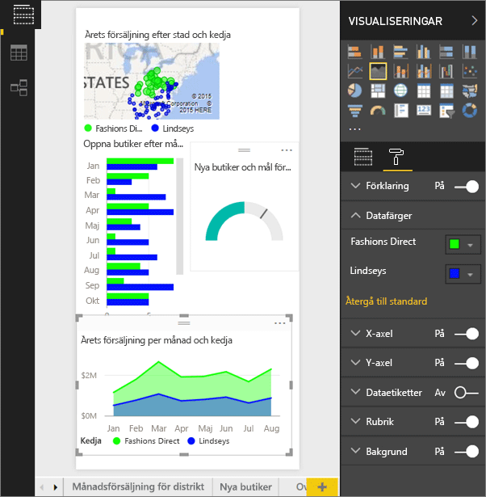
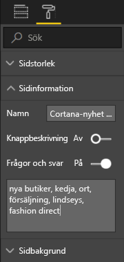
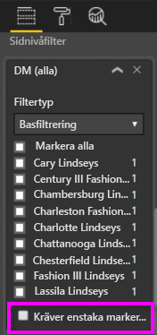

# Använda Power BI-tjänsten eller Power BI Desktop för att skapa en anpassad svarssida för Cortana
Du kan använda alla funktioner i Power BI för att skapa särskilda rapportsidor som kallas *Cortana-svarssidor* (och ibland ”Cortana-svarskort”) som utformats speciellt för att besvara Cortana-frågor.

> [!IMPORTANT]
> Om du provar på att använda förhandsgranskningen för Cortana- och Power BI-**instrumentpanelen**, kan du hoppa över resten av den här artikeln. Det finns inga krav på installation för att Cortana ska kunna söka i dina Power BI-instrumentpaneler.
> 
> 

## Innan du börjar
Det finns fyra dokument som hjälper dig att ställa in och använda Cortana för Power BI. Om du inte redan har gjort det, rekommenderar vi att du börjar med att läsa artikel 1. Artikel 2 är särskilt viktig eftersom den beskriver vissa åtgärder som du måste vidta innan du kan börja använda Cortana-svarssidor.

**Artikel 1** [Lär dig hur Cortana och Power BI fungerar tillsammans](service-cortana-intro.md)

**Artikel 2**: [För Power BI-rapportsökning:Aktivera Cortana – Power BI – Windows-integrering](service-cortana-enable.md)

**Artikel 3**: Den här artikeln

**Artikel 4**: [Felsöka problem](service-cortana-troubleshoot.md)

## Skapa en Cortana-svarssida som utformats speciellt för Cortana
En *Cortana-svarssida* i en rapport är storleksanpassad särskilt för Cortana så att Cortana kan visa den på skärmen vid svar på en fråga.  Skapa ett svarssida för Cortana:

1. Vi rekommenderar att du börjar med en [tom rapportsida](power-bi-report-add-page.md).
2. I fönstret **Visualiseringar** väljer du färgrollerikonen och sedan **Sidstorlek > Typ > Cortana**.
   
    
3. Skapa ett visuell objekt eller en uppsättning visuella objekt som du vill ska visas i Cortana som svar på en viss fråga (eller uppsättning frågor).
4. Se till att all visuella objekt ryms inom de angivna kantlinjerna.  Du kan också ändra visningsinställningar, dataetiketter, färger och bakgrunder.  
   
    
5. Namnge sidan och lägg till alternativa namn.  Cortana använder dessa namn vid sökning efter resultat. I fönstret **Visualiseringar** väljer du färgrollerikonen och sedan **Sidinformation**. Aktivera Frågor och svar för det visuella objektet genom att flytta skjutreglaget till **På**.
   
    
   
   > [!TIP]
   > Undvik att använda ord som också är kolumnnamn för att förbättra resultaten.
   > 
   > 
6. Om rapporten som alternativ har filter på sidnivå, kan du vilja ställa in **Kräver enstaka markering**. Cortana visar endast den här rapporten som ett svar om ett, och endast ett, av filterobjekten har angetts i frågan. **Kräver enstaka markering** finns längst ned i fönstret **Filter**.
   
   > [!NOTE]
   > Du behöver inte ställa in **Kräv enkelt val** för att be Cortana visa en rapport med filter på sidnivå.  Till exempel kommer ”visa försäljning för Charlotte Lindseys” att visa svarssidan utan hänsyn till inställningen för Kräv enkelt val.
   > 
   > 
   
     
   
      Om du till exempel frågar Cortana:
   
   * ”visa försäljning per butiksnamn”, visas inte denna svarssida eftersom du inte angav något av objekten i det obligatoriska filtret på sidnivå.
   * ”visa försäljning för Cary Lindseys och Charlotte Lindseys”, visas inte denna svarssida eftersom du har angett mer än ett objekt från det nödvändiga filtret på sidnivå.
   * ”visa försäljning för Charlotte Lindseys”, visas denna svarssida.
     
     = "visa försäljning”, visas inte denna svarssida eftersom du inte angav något av objekten i det obligatoriska filtret på sidnivå.

> [!IMPORTANT]
> Innan din Cortana-svarssida kan nås av Cortana, behöver du [Enable the dataset for Cortana (Aktivera datauppsättningen för Cortana)](service-cortana-enable.md).
> 
> 

## Hur ordnar Cortana resultaten?
Resultat med noggranna svar (som en fullständig matchning av ett angivet sidnamn) visas först som *den bästa matchningen* i Cortana. Flera bästa matchningar kan visas om det finns flera Cortana-svarssidor i Power BI. Resultat med medelnoggranna eller mindre noggranna svar, som svar som inte baseras på namnet på en svarssida eller en fråga med ord som inte kan tolkas av Power BI, listas som länkar nedanför de bästa matchningarna i Cortana.

> [!NOTE]
> När en ny datauppsättning eller en anpassad Cortana-svarssida läggs till i Power BI och aktiveras för Cortana, kan det ta upp till 30 minuter för resultaten att börja visas i Cortana. Om du logga in och ut ur Windows 10 eller på annat sätt startar om Cortana-processen i Windows 10, kan det nya innehållet visas direkt.
> 
> 

## Nästa steg
[Använda Cortana med Power BI](service-cortana-intro.md)

Kan du fortfarande inte få Cortana att fungera med Power BI?  Försök med [felsökning av Cortana](service-cortana-troubleshoot.md).

Har du fler frågor? [Prova Power BI Community](http://community.powerbi.com/)

