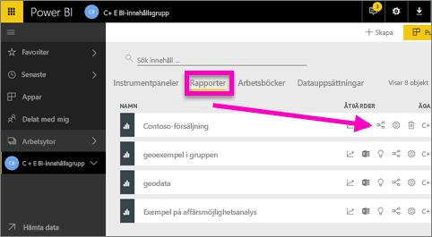
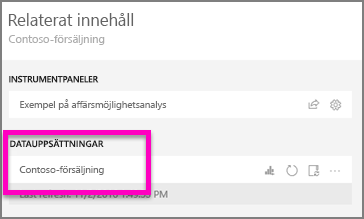
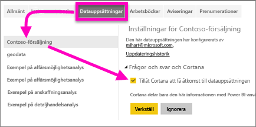
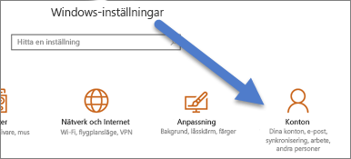
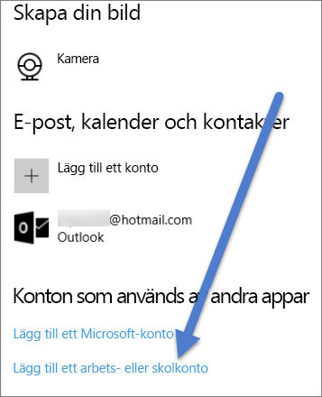

# Aktivera Cortana för åtkomst till Power BI-rapporter (och deras underliggande datauppsättningar)
Förmodligen har du läst artikeln [Introduktion till Cortana och Power BI](service-cortana-intro.md) redan. Om du inte har gjort det, så läs den först, och kom sedan tillbaka hit. Och nu kan du prova själv.  Innan du kan ställa frågor på naturligt språk i Cortana och få svar från data som lagras i Power BI-***rapporter***, så måste vissa krav uppfyllas. Du måste i synnerhet göra följande.

> [!NOTE]
> Om du provar på att använda förhandsgranskningen för Cortana- och Power BI-***instrumentpanelen***, kan du hoppa över resten av den här artikeln. Det finns inga krav på installation för att Cortana ska kunna söka i dina Power BI-instrumentpaneler.
> 
> 

I Power BI-tjänsten

* Aktivera en eller flera datauppsättningar för Cortana (rapporterna är byggda på datauppsättningar, så Cortana behöver åtkomst till dessa datauppsättningar)

I Microsoft Windows

* Kontrollera att du kör Windows 10 version 1511 eller senare
* Kontrollera att Power BI och Windows kan ”prata” med varandra. Det innebär att du ansluter ditt konto till Windows.

## Använd Power BI-tjänsten för att aktivera Cortana för rapportsidor i Power BI
Att aktivera rapporter i Power BI så att de kan nås av Cortana är en enkel process.  Allt du behöver göra är att aktivera rapportens underliggande datauppsättning genom att välja ”Aktivera Cortana för åtkomst till den här datauppsättningen”. Efter det kan varje användare som har åtkomst till datauppsättningen i Power BI, via vanlig Power BI-delning, appar eller innehållspaketsfunktioner, få svar från rapporten i Cortana i Windows 10.

Du måste logga in på Power BI-tjänsten (inte Power BI Desktop) och upprepa dessa steg för varje datauppsättning som du vill att Cortana ska ha åtkomst till.

1. Bestämma vilka datauppsättningar som ska aktiveras. Välj den rapport du vill att Cortana ska ha åtkomst till från rapportinnehållslistan och välj ikonen **Visa relaterade**  .
   
    
2. Den datauppsättning som är associerad med den här rapporten är **Contoso Sales**.
   
    
3. Välj kugghjulsikonen i det övre högra hörnet av Power BI och välj **Inställningar**.
   
    
4. Välj fliken **Datauppsättningar** och välj den datauppsättning som du vill aktivera för Cortana i listan till vänster.
5. Välj **Frågor och svar och Cortana** > **Ge Cortana åtkomst till den här datauppsättningen** > **Tillämpa**.
   
   
   
   I det här exemplet aktiverar vi Cortana för datauppsättningen Contoso Sales.
   
   > [!NOTE]
   > När en ny datauppsättning eller ett Cortana-svarskort läggs till i Power BI och aktiveras i Cortana för rapporter, kan det ta upp till 30 minuter innan resultaten visas. Om du logga in och ut ur Windows 10 eller på annat sätt startar om Cortana-processen i Windows 10, kan det nya innehållet visas direkt.
   > 
   > Om du aktiverar en datauppsättning för Cortana och den datauppsättningen är en del av ett innehållspaketet eller en app som du äger, så måste du publicera om för dina kollegor så att även de kan använda det med Cortana.
   > 
   > 

## Lägg till dina Power BI-autentiseringsuppgifter i Windows
Du måste köra Windows 10 version 1511 eller senare.

1. Bestämma vilken Windows 10-version du kör. Öppna **Inställningar** > **System** > **Om**.
   
   * Om du har Windows 10 version 1511 (Windows-uppdateringen från den 10 november 2015) fram till 1607, lägger du till ditt arbets- eller skolkonto och Microsoft-konto (slutför steg 2 och 3 nedan).
   * Om du har Windows 10 version 1607 (Windows-uppdateringen från den 10 juli 2016) eller senare, lägger du till ditt arbets- eller skolkonto (slutför endast steg 2 nedan).
2. Lägg till arbets-eller skolkonto för Cortana.
   
   * Öppna **Inställningar** > **Konton**.
     
       
   * Bläddra längst ned till botten och välj **Lägg till ett arbets- eller skolkonto**.
     
     

Cortana använder det här arbets- eller skolkontot för att söka efter potentiella svar på dina frågor i Power BI.

## Nästa steg
[Skapa Cortana*-svarskort* i Power BI](service-cortana-answer-cards.md)

[Felsökning av problem med Cortana och Power BI-integrering](service-cortana-troubleshoot.md)

Har du fler frågor? [Försök med att fråga Power BI Community](http://community.powerbi.com/)

