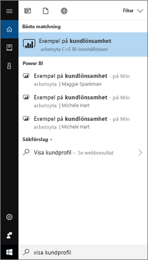
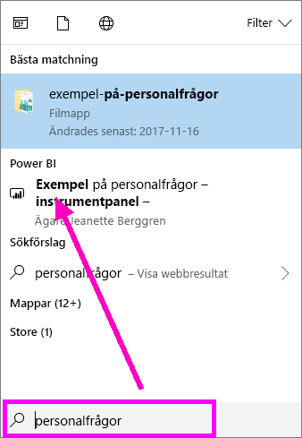
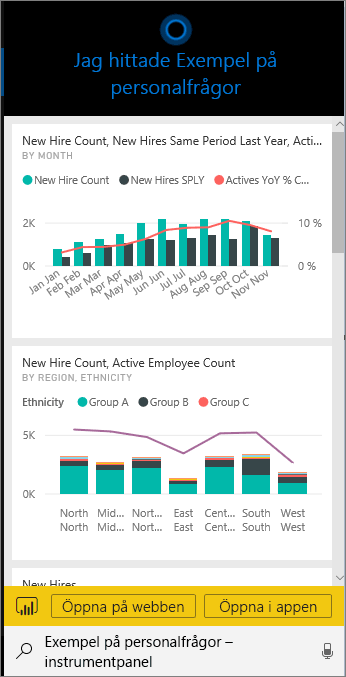
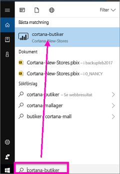
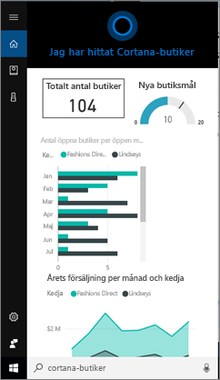
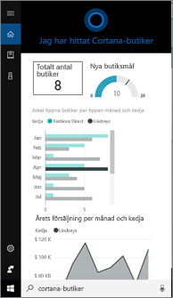
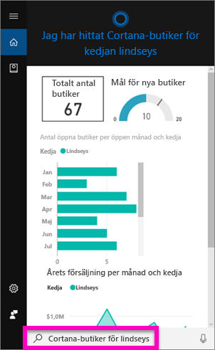
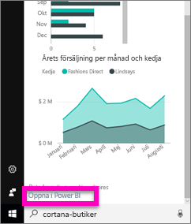
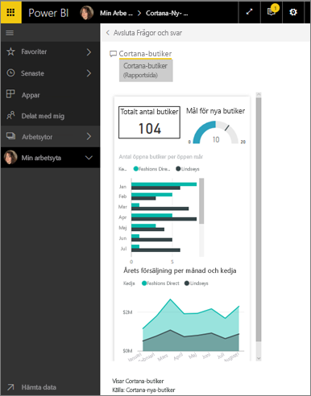

# Hitta och visa dina Power BI-data med Cortana för Power BI
Använd Cortana på alla dina Windows 10-enheter så att du för omedelbara svar på viktiga affärsfrågor. Genom att integrera med Power BI hämtar Cortana viktig information direkt från Power BI-instrumentpaneler och rapporter. Allt du behöver du bara 10 november 2015-versionen eller senare av Windows 10, Cortana, Power BI och åtkomst till minst en datauppsättning.

> [!IMPORTANT]
> Cortana-integrering är inaktuell i Power BI. Startar den 11 juni, fungerar Cortana inte längre för alla instrumentpaneler och rapporter.

## Förhandsgranska den nya sökfunktionen i Cortana-*instrumentpanelen* för Windows 10
Under ett tag nu har du kunnat [använda Cortana för att hämta vissa typer av rapportsidor](service-cortana-answer-cards.md). Nu har vi lagt till en **ny upplevelse** – möjligheten att även hämta instrumentpaneler. Prova och [skicka feedback till Power BI-idéer](https://ideas.powerbi.com/forums/265200-power-bi). Den *nya upplevelsen* kommer att utökas så att den inkluderar även Cortana-sökningar efter rapporter.  En av de främsta fördelarna med den nya miljön är att du behöver inte göra något speciellt för att konfigurera den. Du behöver inte aktivera Cortana eller konfigurera Windows 10. Det fungerar helt enkelt.

> [!NOTE]
> Om det inte fungerar som det ska, så gå till artikeln [Felsökning](service-cortana-troubleshoot.md).
> 
> 

Den underliggande tekniken använder [Microsoft Azure Search Service](https://docs.microsoft.com/azure/search/). Den här söktjänsten tillhandahåller extra funktioner, t.ex. smart rangordning, felkorrigering och automatisk komplettering.

Båda Cortana-upplevelserna kan finnas sida vid sida.

## Cortana för Power BI-dokumentation
Fyra dokument hjälper dig att konfigurera och använda Cortana för Power BI.

**Artikel 1** (den här artikeln): förstå hur Cortana och Power BI fungerar tillsammans

**Artikel 2**: [Sök Power BI-rapporter: Aktivera Cortana – Power BI – Windows-integrering](service-cortana-enable.md)

**Artikel 3**: [Söka efter Power BI-rapporter: skapa särskilda *Cortana-Svarskort*](service-cortana-answer-cards.md)

**Artikel 4**: [Felsöka problem](service-cortana-troubleshoot.md)

## Hur Cortana och Power BI fungerar tillsammans
När du använder Cortana för att ställa en fråga, så kan Power BI vara ett av de ställen där Cortana letar efter svar. I Power BI hittar Cortana omfattande datadrivna svar från Power BI-rapporter (som innehåller en särskild typ av rapportsidor som kallas *Cortana-svarskort*) och från Power BI-instrumentpaneler.

Om Cortana hittar en matchning visas namnet på instrumentpanelen eller rapportsidan direkt på Cortana-skärmen. Instrumentpanelen eller rapportsidan kan öppnas i Power BI. Rapportsidor kan också undersökas direkt i Cortana – de är interaktiva.

### Cortana och instrumentpaneler (den *nya upplevelsen*)
Cortana kan hitta svar på instrumentpaneler som du äger och instrumentpaneler som har delats med dig. Ställ frågor till Cortana med titlar, nyckelord, ägare namn, arbetsytenamn, appnamn och mycket mer.

Frågan måste innehålla minst två ord om Cortana ska kunna hitta något svar. Så om du söker på en instrumentpanel med ett ord i namnet (Marknadsföring), så lägg något annat ord, t.ex. ”visa”, ”Power BI” eller ägarens namn i din fråga som i ”visa marknadsföring” och ”michele hart exempel”. 

Om instrumentpanelens rubrik består av mer än ett ord returnerar Cortana endast den instrumentpanelen om din sökning matchar minst två av orden, eller ett av orden plus ägarens namn. För en instrumentpanel med namnet ”Kundlönsamhetsexempel”: 

* ”Visa mig kunden” *inte* returnera ett resultat för Power BI-instrumentpanel.   
* ”uttryck som” Visa Kundlönsamhet ”,” kund p ”,” kund s ”,” lönsamhet exempel ”,” michele hart exempel ”,” visa kundlönsamhetsexempel ”och” visa kund p ” *gör* returnera ett Power BI-resultat.
* Att lägga till ordet ”powerbi” räknas som ett av de två ord som krävs, så ”powerbi exempel” *har* returnera ett Power BI-resultat. 
  
    

### Cortana och rapporter
 Cortana hittar svar i rapporter som har [sidor som har utformats speciellt för visning av Cortana](service-cortana-answer-cards.md). Ställ helt enkelt frågor med hjälp av rubriken eller nyckelord från någon av dessa specialrapportsidor.  

Den underliggande tekniken för rapporter användning [Power BI Q & A](power-bi-tutorial-q-and-a.md).

När du ställa en fråga i Cortana svarar Power BI från rapportsidor som har utformats speciellt för Cortana. Potentiella svar bestäms av Cortana direkt från Cortanas *svarskort* som redan har skapats i Power BI.  Om du vill utforska ytterligare ett svar, så öppna helt enkelt ett resultat i Power BI.

> [!NOTE]
> Innan Cortana kan söka efter svar i Power BI-rapporter, måste du [aktivera den här funktionen med Power BI-tjänsten och konfigurera Windows för kommunikation med Power BI](service-cortana-enable.md).  
> 
> 

## Använd Cortana för att få svar från Power BI
1. Starta i Cortana. Det finns många olika sätt att *öppna* Cortana: välj Cortana-ikonen i Aktivitetsfältet (se bilden nedan), använd röstkommandon eller tryck på sökikonen på din mobila Windows-enhet.
   
     
2. När Cortana är klar, så skriv frågan i Cortanas sökfält eller uttala frågan muntligt. Cortana visar tillgängliga resultat. Om det finns en Power BI-instrumentpanel som matchar frågan, så visas den under **Bästa matchning** eller **Power BI**.
   
     
   
   > [!NOTE]
   > För tillfället stöds enbart engelska.
   > 
   > 
3. Välj instrumentpanelen för att öppna den i Cortana.

    

    Du kan ändra layouten genom att [redigera instrumentpanelens *telefonvy*](service-create-dashboard-mobile-phone-view.md). 

1. I Cortana har du också alternativet att öppna instrumentpanelen i Power BI-tjänsten eller i Power Bi Mobile. Öppna instrumentpanelen i Power BI-tjänsten genom att välja **Öppna på webben**. 
   
      
4. Nu ska vi söka efter en rapport med hjälp av Cortana. Vi behöver en [rapport som har en sida med ett Cortana-svarskort ](service-cortana-answer-cards.md). I det här exemplet har en rapport med namnet ”Cortana-nya butiker” ett Cortana-svarskortssida med namnet ”cortana-butiker”.  
   
     Skriv frågan i Cortanas sökfält eller uttala frågan muntligt. Cortana visar tillgängliga resultat. Om det finns en Power BI-rapportsida som matchar frågan, så visas den under **Bästa matchning** eller **Power BI**. I det här exemplet visas även den.pbx-fil (och säkerhetskopia) som jag använde för att skapa svarskortet – under **dokument**.
   
      
5. Välj rapportsidan **Cortana-butiker** så att den visas i Cortana-fönstret.
   
       
   
    Tänk på att ett *svarskort* är en särskild typ av Power BI-rapportsida som har skapats av en datauppsättningsägare.  Mer information finns i [Skapa ett Cortana-svarskort](service-cortana-answer-cards.md).
6. Men det är inte allt. Interagera med visualiseringarna på svarskortet som du brukar göra i Power BI.
   
   * Du kan t.ex. välja ett element i en visualisering för att korsfiltrera och markera övriga visualiseringar på svarskortet.
     
     
   * Eller filtrera resultaten med naturligt språk istället.  Fråga t.ex. ”Cortana-butiker Lindseys” om du vill att kortet ska filtreras så att endast butiker i Lindseys-kedjan visas.
     
     
7. Fortsätta att utforska. Bläddra längst ned i Cortana-fönstret och välj **Öppna i Power BI**.
   
     
8. Rapporten öppnas i Power BI.    
     

## Överväganden och felsökning
* Cortana har inte åtkomst till Cortana-kort som har gjorts [aktiverats för Power BI](service-cortana-enable.md).
* Kan du fortfarande inte få Cortana att fungera med Power BI?  Försök med [felsökning av Cortana](service-cortana-troubleshoot.md).
* Cortana för Power BI finns för närvarande endast på engelska.
* Cortana för Power BI är bara tillgängligt på Windows mobile-enheter.

Har du fler frågor? [Testa Power BI Community](http://community.powerbi.com/).
Feedback? [Skicka feedback till Power BI Ideas](https://ideas.powerbi.com/forums/265200-power-bi).

## Nästa steg
[Aktivera Cortana – Power BI – Windows-integrering för rapporter](service-cortana-enable.md)

