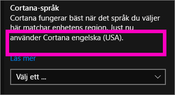
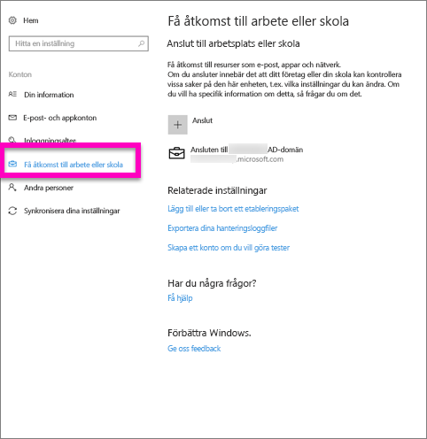
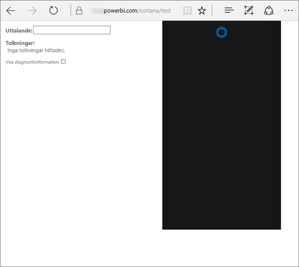
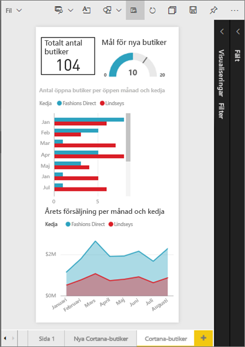
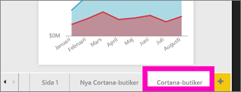
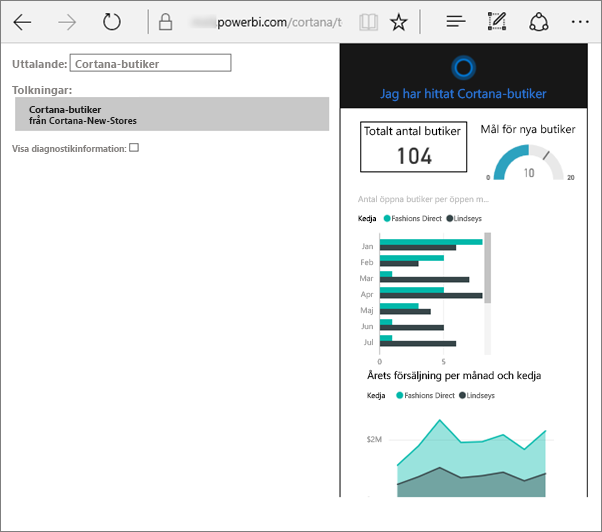
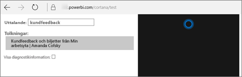

# Felsöka Cortana för Power BI
Den här artikeln ingår i en serie. Om du inte redan har gjort det rekommenderar vi att du läser följande tre artiklar.

**Artikel 1**: [Förstå hur Cortana och Power BI samverkar för att söka efter Power BI-instrumentpaneler och rapporter](service-cortana-intro.md)

**Artikel 2**: [Söka i rapporter: Aktivera Cortana – Power BI – Windows-integrering](service-cortana-enable.md)

**Artikel 3**: [Söka i rapporter: Skapa särskilda *Cortana-svarskort*](service-cortana-answer-cards.md)

Om du fortfarande har problem med att få Cortana att integrera med Power BI, har du kommit till rätt plats. Följ stegen nedan för att diagnostisera och åtgärda problemet.

## Varför hittar inte Cortana några svar från mina Power BI-rapporter eller instrumentpaneler?
1. Har du ett Power BI-konto?  Om inte, [registrera dig – det är gratis](service-self-service-signup-for-power-bi.md).
2. Fungerar Cortana?  Ser du Cortana-ikonen i aktivitetsfältet?

    

    Öppnas Cortana när du väljer den med ett fält som du kan skriva i?
3. Använde du minst två ord i sökningen? Cortana måste ha minst två ordfraser för att kunna hitta något i Power BI. Försök att lägga till ”visa” i början av din fråga.
4. Om din instrumentpanel har en rubrik med mer än ett ord, returnerar Cortana endast den instrumentpanelen om sökningen matchar minst två av orden. Om du har en instrumentpanel med namnet ”Försäljning FY16”:

   * ”visa försäljning” kommer *inte* returnera ett Power BI-resultat.   
   * ”visa mig försäljning fy16”, ”försäljning fy16”, ”visa försäljning fy16” och ”visa försäljning f” *kommer* att returnera ett Power BI-resultat.    
   * Om du lägger till ordet ”powerbi” räknas det som ett av de två ord som krävs, så ”powerbi försäljning” *kommer* att returnera ett Power BI-resultat.
5. Har du åtkomst- eller redigeringsbehörighet till några rapporter eller instrumentpaneler? För rapporter måste innehållet som du vill söka i ha ett [svarskort](service-cortana-answer-cards.md).  För instrumentpaneler måste innehållet som du vill söka i finnas i **Delas med mig**, en apparbetsyta eller **Min arbetsyta**. [Använd felsökningsverktyget](#try-the-cortana-troubleshooting-tool) för att få hjälp med att identifiera problemet.
6. Använder du en mobil enhet?  För närvarande stöder Power BI och Cortana bara integration på Windows Mobile-enheter.
7. Är Cortana konfigurerat för engelska?  Den aktuella Cortana/Power BI-integrationen har enbart stöd för engelska. Öppna Cortana och välj kugghjulsikonen för att visa inställningarna. Rulla ned till **Cortana-språk** och kontrollera att den är inställd på något av de engelska alternativen.

   
8. Har du fler än 100 rapporter som har aktiverats för Cortana?  Cortana söker bara i upp till 100 totalt.  För att säkerställa att din rapport ingår i dessa kan du flytta eller kopiera den till **Min arbetsyta**, eftersom Cortana söker där först.
9. Du kanske bara behöver ge det lite tid. Första gången du skriver en fråga är modellen kanske *kall*. Vänta några sekunder så att datan hinner läsas in i minnet och försök sedan igen.
10. Det kan ta upp till 24 timmar innan instrumentpaneler blir tillgängliga för Cortana.    
11. När en ny datauppsättning eller ett anpassat svarskort läggs till i Power BI och aktiveras i Cortana för rapporter, kan det ta upp till 30 minuter innan resultaten visas i Cortana. Om du loggar in och ut på Windows 10 eller startar om Cortana-processen i Windows 10, kan det nya rapportinnehållet visas direkt.  
12. Din Power BI-administratör kan ha gjort en ”avanmälan”. Kontakta administratören för att se om detta är fallet.

## Endast rapporter: Varför hittar inte Cortana några svar från mina Power BI-rapporter?
1. Om du letar efter svar i rapporter måste det finnas rapporter med Cortanas **svarskort**. Svarskort är det enda sättet som Cortana kan hitta svar på i Power BI-rapporterna.  Lär dig hur du skapar ett svarskort genom att läsa [Skapa Cortana-svarskort i Power BI-tjänsten och Power BI Desktop](service-cortana-answer-cards.md).
2. Kör du Windows-version 1511 eller senare?  Ta reda på det genom att öppna Windows-inställningarna och välja **System > Om**. Om inte, bör du uppdatera din version av Windows.
3. Är dina Windows- och Power BI-konton anslutna? Detta kan vara förvirrande. Följ instruktionerna i [Aktivera Cortana för Power BI](service-cortana-enable.md#add-your-power-bi-credentials-to-windows).
4. Har underliggande datauppsättningar aktiverats för Cortana? Kanske har en kollega delat en datauppsättning som redan är aktiverad för Cortana. Men om inte, [lär dig hur du aktiverar datauppsättningar för Cortana själv](service-cortana-enable.md). Det går snabbt och enkelt.

## Endast instrumentpaneler: Varför hittar inte Cortana några svar från mina Power BI-instrumentpaneler?
1. Kontrollera att du är ansluten till ditt arbetskonto. Power BI måste ha den här anslutningen för att kunna autentisera dina åtkomstbehörigheter till datan. Om du vill kontrollera om du är ansluten eller inte och ansluta till ditt arbetskonto, använder du Windows-sökrutan för att navigera till ”Anslut till arbetsplats eller skola”.  

    
2. Har du åtkomst till Cortana? Välj Windows-sökrutan och ge Cortana åtkomstbehörighet till din information.

## Försök med Cortanas felsökningsverktyg
Har du fortfarande problem?  Nu är dags att köra Cortanas felsökningsverktyg och hitta eventuella problem.

### Har du problem med att hämta svar från en rapport?
1. Innan du kör felsökningsverktyget för rapporter bör du ange filtren för **Sidnivå** på Cortana-svarskorten till **Kräver enstaka markering**. Hjälp om du gör detta finns i [Skapa Cortana-svarskort](service-cortana-answer-cards.md).
2. Öppna felsökningsverktyget genom att lägga till ”/cortana/test” i slutet av Power BI-tjänstens URL. Din URL bör se ut ungefär så här:

   app.powerbi.com/cortana/test

   
3. Om du vill felsöka rapporter går du till fältet **Uttryck** och skriver namnet på ett Cortana-svarskort ***exakt som det visas på Power BI-fliken***.

   

    

   
4. Ibland händer ingenting när du skriver något i fältet **Uttryck** första gången. Se det som att du väcker systemet. Du talar om för felsökningsverktyget att det är dags att komma igång. Klipp ut och klistra in eller skriv i fältet **Uttryck** igen. I det här exemplet är namnet på vårt svarskort **Cortana-butiker**. När du klistrar in eller skriver **Cortana-butiker** i verktyget skapas ett enskilt resultat som visas i fältet **Tolkningar**. Klicka för att se svarskortet som visas i Cortana-fönstret – i det här fallet **Cortana-butiker**.

   

   Eftersom vi fick ett resultat vet vi nu att Cortana **är** aktiverat i Power BI. Det begränsar problemet till något på Windows-sidan, i språkinställningen för Cortana, eller om det finns fler än 100 datauppsättningar som aktiverats för Cortana.

### Har du problem med att hämta svar från en instrumentpanel?
Letar du efter en instrumentpanel som har delats med dig?  Öppna Power BI > **Delas med mig** och leta reda på namnet på instrumentpanelen.  Skriv namnet i fältet **Uttryck**.

#### Kända problem med felsökningsverktyget
* Om verktyget inte hämtar resultaten första gången klistrar du i stället in frågan i textrutan Uttryck.
* Frågan måste innehålla minst två ord.  Lägg till ordet ”visa” om frågan är för kort.
* Vissa frågesträngar med prepositioner kanske inte fungerar (till exempel försäljning per artikel). Prova olika söktermer som inte använder prepositioner och är meningsfulla/unika.

Har du fler frågor? [Prova Power BI Community](http://community.powerbi.com/)
