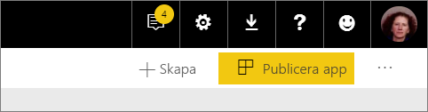
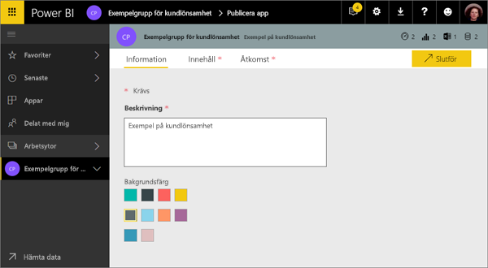
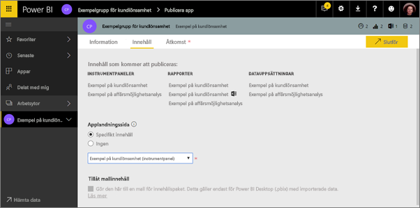
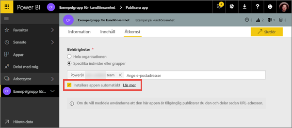
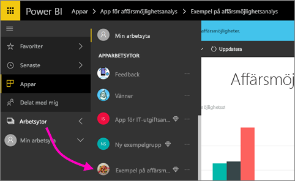
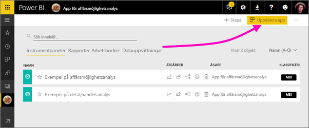
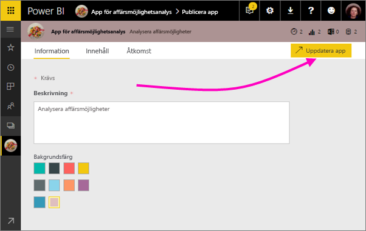

# Publicera appar med instrumentpaneler och rapporter i Power BI

I Power BI kan du publicera *appar* med samlingar av relaterade instrumentpaneler och rapporter. Du skapar appar i *apparbetsytor* där du kan samarbeta på Power BI-innehåll med dina kollegor. Du kan sedan publicera de slutförda apparna till stora grupper i din organisation. Läs mer om att [skapa apparbetsytor](service-create-workspaces.md).

Dina företagsanvändare behöver ofta flera Power BI-instrumentpaneler och -rapporter för att göra sitt jobb. Med Power BI-appar kan du skapa samlingar av instrumentpaneler och rapporter, och publicera dessa appar till hela organisationen eller till vissa personer eller grupper. För dig som skapare eller administratör av rapporter gör apparna det enklare att hantera behörigheter för dessa samlingar.

Företagsanvändarna får dina appar på ett par olika sätt. Om Power BI-administratören ger dig behörighet kan du installera apparna automatiskt på dina medarbetares Power BI-konton. I annat fall kan de installera dina appar från Microsoft AppSource eller så kan du skicka dem en direktlänk. De kan enkelt hitta och gå tillbaka till ditt innehåll eftersom allt finns på samma plats. De kan inte ändra innehållet i appen, men de kan interagera med det i antingen Power BI-tjänsten eller i någon av mobilapparna och kan filtrera, markera och sortera data på egen hand. De får uppdateringar automatiskt och du kan styra hur ofta dina data ska uppdateras. Läs mer om [app-upplevelsen för företagsanvändare](consumer/end-user-apps.md).

**Visste du att?** Power BI har en ny arbetsyta i förhandsversion. Läs [Skapa de nya arbetsytorna (förhandsversion)](service-create-the-new-workspaces.md) för att ta reda på hur arbetsytor kommer att ändras i framtiden. 

## Appar- och organisationsinnehållspaket
Appar är utvecklingen av organisationsinnehållspaket. Innehållspaket är inte tillgängliga i förhandsversionen av den nya arbetsytan. När den nya arbetsytan blir allmänt tillgänglig kan du inte använda innehållspaket i nyligen skapade arbetsytor. Om du inte redan har gjort det bör du börja migrera dina innehållspaket till appar.

## Video: Appar och app-arbetsytor
<iframe width="640" height="360" src="https://www.youtube.com/embed/Ey5pyrr7Lk8?showinfo=0" frameborder="0" allowfullscreen></iframe>

## Licenser för appar
Varje medlem på en apparbetsyta behöver en Power BI Pro-licens. För appanvändare finns det två alternativ.

* Alternativ 1: Alla företagsanvändare behöver **Power BI Pro**-licenser för att kunna visa din app. 
* Alternativ 2: Om din app finns i en Power BI Premium-kapacitet kan kostnadsfria användare i din organisation visa appinnehåll. Läs [Vad är Power BI Premium?](service-premium.md) för mer information.

## Publicera appen
När instrumentpanelerna och rapporterna på din arbetsyta är redo kan du välja vilka instrumentpaneler och rapporter som du vill publicera, och sedan publicerar du dem som en app. Du kan skicka en direktlänk till den bredare målgruppen eller så kan de hitta din app på fliken Appar genom att gå till **Ladda ned och utforska fler appar från AppSource**. 

1. Bestäm vilka instrumentpaneler och rapporter som du vill ska ingå i appen i arbetsytans listvy.

     

     Om du väljer att inte publicera en rapport, visas en varning bredvid rapporten och dess relaterade instrumentpanel. Du kan fortfarande publicera appen, men den relaterade instrumentpanelen kommer att sakna panelerna från rapporten.

     

2. Välj knappen **Publicera app** i det övre högra hörnet för att starta processen med att dela allt innehåll på arbetsytan.
   
     

3. Fyll i en beskrivning under **Information** som hjälper användare att hitta appen. Du kan ange en bakgrundsfärg för att göra den lite personlig.
   
     

4. Under **Innehåll** ser du det innehåll som ska publiceras som en del av appen – allt som du har valt på arbetsytan. Du kan också ange en landningssida för appen – den instrumentpanel eller rapport som först visas när någon använder din app. Du kan välja **Ingen**. Då landar de i en lista över allt innehåll i appen. 
   
     

5. Under **Åtkomst** bestämmer du vem som ska ha åtkomst till appen: antingen alla i din organisation, specifika personer eller Active Directory-säkerhetsgrupper. Om du har behörighet kan du välja att installera appen automatiskt för mottagarna. En Power BI-administratör kan aktivera den här inställningen i Power BI-administratörsportalen. Mer information finns i [Installera en app automatiskt](#how-to-install-an-app-automatically-for-end-users).

    

6. När du väljer **Slutför**, visas ett meddelande som bekräftar att appen är redo för publicering. I dialogrutan som bekräftar slutförandet kan du kopiera URL:en som är en direktlänk till appen och skicka den till dem som du ska dela den med.
   
     

Läs mer om [app-upplevelsen för företagsanvändare](consumer/end-user-apps.md).

## Ändra en publicerad app
När du har publicerat en app kan du vilja ändra eller uppdatera den. Det är enkelt att uppdatera den om du är administratör eller medlem på apparbetsytan eller deltagare på en ny apparbetsyta. 

1. Öppna den app-arbetsyta som motsvarar appen. 
   
     
2. Öppna instrumentpanelen eller rapporten. Du ser att du kan göra alla ändringar som du önskar.
   
     Apparbetsytan är ditt mellanlagringsområde så att ändringarna inte börjar gälla i appen förrän du gör en ny publicering. På så sätt kan du göra ändringar utan att påverka de publicerade apparna.  
 
3. Gå tillbaka till app-arbetsytans lista över innehåll och markera **Uppdatera app**.
   
     

4. Uppdatera **Information**, **Innehåll** och **Åtkomst** om du behöver och välj sedan **Uppdatera app**.
   
     

De personer som du har publicerat appen för ser automatiskt den uppdaterade versionen av appen. 

## Installera appar automatiskt för slutanvändare
Appar levererar data som slutanvändarna behöver i sitt arbete. Om en administratör ger dig behörigheter kan du automatiskt installera appar för slutanvändarna. Det gör det enklare att distribuera rätt appar till rätt personer eller grupper. Din app visas automatiskt i dina slutanvändares appinnehållslista i stället för att de behöver söka efter den i Microsoft AppSource eller använda en installationslänk. Det gör det lättare för dig att distribuera Power BI-standardinnehåll till dina användare.

### Installera en app automatiskt för slutanvändare
När administratören har tilldelat dig behörigheter får du ett nytt alternativ för att **installera appen automatiskt**. När du markerar rutan och väljer **Slutför** (eller **Uppdatera app** för befintliga appar) pushas appen till alla användare och grupper som angetts i avsnittet **Behörigheter** i appen på fliken **Åtkomst**.

### Så får användarna apparna som pushats till dem
När du pushat en app visas den i applistan automatiskt. Du kan bestämma vilka appar som särskilda användare eller jobbroller i organisationen behöver ha åtkomst till.

### Överväganden för att installera appar automatiskt
Här är saker som du bör ha i åtanke när du pushar appar till slutanvändare:

* Det kan ta tid att installera en app automatiskt till användare. De flesta appar installeras omedelbart för användare, men det kan ta tid att pusha appar.  Det beror på antalet objekt i appen och hur många personer som tilldelas åtkomst. Vi rekommenderar att pusha appar efter arbetstid, när det finns gott om tid innan användarna behöver dem. Verifiera med flera användare innan du meddelar många om apparnas tillgänglighet.

* Uppdatera webbläsaren. Innan den pushade appen visas i applistan kan det hända att användarna måste uppdatera, eller stänga och öppna webbläsaren igen.

* Om användarna inte ser appen omedelbart i applistan bör de uppdatera eller stänga och öppna webbläsaren igen.

* Försök att inte överväldiga användarna. Pusha inte för många appar så att användarna uppfattar det som att de förinstallerade apparna är användbara för dem. Det är bäst att kontrollera vem som kan pusha appar till slutanvändarna så att tidsaspekten kan samordnas. Du kan upprätta en kontaktpunkt i organisationen för att hämta appar som pushats till slutanvändarna.

* Appar installeras inte automatiskt för gästanvändare som inte har godkänt en inbjudan.  

## Ta bort en app
Alla medlemmar i en app-arbetsyta kan ta bort appen.

* I en app-arbetsyta väljer du ellipsen (**...** ) i det övre högra hörnet > **Ta bort appen**.
  
     

Den här åtgärden avinstallerar appen för alla som du har publicerat den till och de har inte längre åtkomst till den. Varken app-arbetsytan eller dess innehåll tas bort.

## Nästa steg
* [Skapa en apparbetsyta](service-create-workspaces.md)
* [Installera och använda appar i Power BI](consumer/end-user-apps.md)
* [Power BI-appar för externa tjänster](service-connect-to-services.md)
* [Power BI-administratörsportalen](https://docs.microsoft.com/power-bi/service-admin-portal)
* Har du några frågor? [Fråga Power BI Community](http://community.powerbi.com/)
