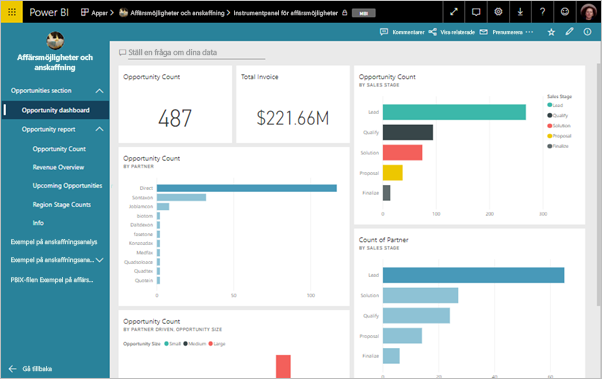
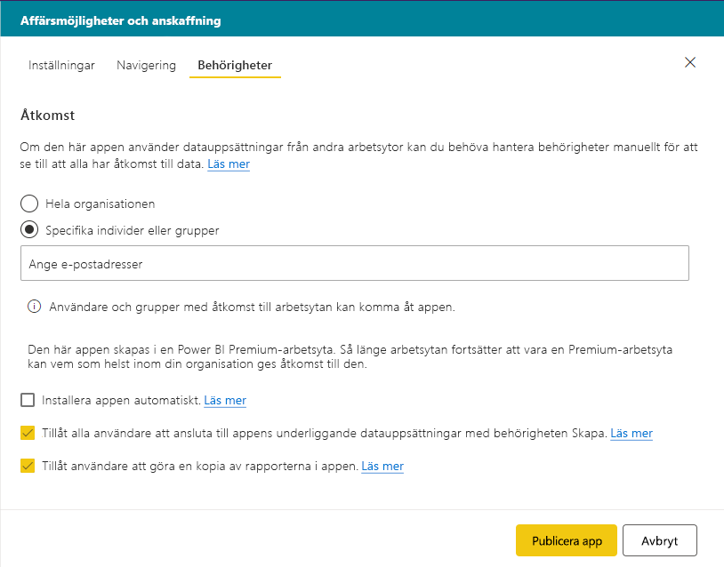
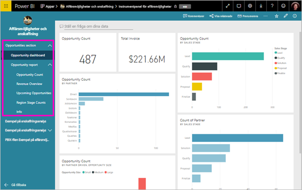

# Publicera en app i Power BI

I Power BI kan du skapa officiellt paketerat innehåll och sedan distribuera det till en bred publik som en *app*. Du skapar appar i *apparbetsytor* där du kan samarbeta på Power BI-innehåll med dina kollegor. Du kan sedan publicera de slutförda apparna till stora grupper i din organisation. 

Dina företagsanvändare behöver ofta flera Power BI-instrumentpaneler och -rapporter för att göra sitt jobb. Med Power BI-appar kan du skapa samlingar av instrumentpaneler och rapporter, och publicera dessa appar till hela organisationen eller till vissa personer eller grupper. För dig som skapare eller administratör av rapporter gör apparna det enklare att hantera behörigheter för dessa samlingar.

Företagsanvändarna får dina appar på ett par olika sätt:

- De kan leta upp och installera appen från Microsoft AppSource
- Du kan skicka dem en direktlänk.
- Du kan installera den automatiskt på dina medarbetares Power BI-konton om din Power BI-administratör ger dig behörighet.

Du kan skapa appen med en egen inbyggd navigering så att användarna enkelt navigerar i ditt innehåll. De kan inte ändra innehållet i appen. De kan interagera med det i antingen Power BI-tjänsten eller i någon av mobilapparna och kan filtrera, markera och sortera data på egen hand. De får uppdateringar automatiskt och du kan styra hur ofta dina data ska uppdateras. Läs mer om [app-upplevelsen för företagsanvändare](consumer/end-user-apps.md).

## Licenser för appar
Du behöver en Power BI Pro-licens för att skapa eller uppdatera en app. För *appkonsumenter* finns det två alternativ.

* Alternativ 1: Alla företagsanvändare behöver **Power BI Pro**-licenser för att kunna visa din app. 
* Alternativ 2: Om din apparbetsyta finns i en Power BI Premium-kapacitet kan användare av den kostnadsfria versionen i din organisation visa appinnehåll. Läs [Vad är Power BI Premium?](service-premium.md) för mer information.

## Publicera appen
När instrumentpanelerna och rapporterna på din arbetsyta är redo kan du välja vilka instrumentpaneler och rapporter som du vill publicera, och sedan publicerar du dem som en app. 

1. I arbetsytans listvy väljer du vilka instrumentpaneler och rapporter som du vill **inkludera i appen**.

     

     Om du väljer att inte inkludera en rapport som har en relaterad instrumentpanel visas en varning intill rapporten. Du kan fortfarande publicera appen, men den relaterade instrumentpanelen får inte panelerna från den rapporten.

     

2. Välj knappen **Publicera app** i det övre högra hörnet för att starta processen med att skapa och publicera en app från arbetsytan.
   
     

3. I **Konfiguration** fyller du i namn och beskrivning som hjälper andra att hitta appen. Du kan ange en temafärg för att göra den lite personlig. Du kan även lägga till en länk till en supportwebbplats.
   
     

4. I **Navigering** väljer du det innehåll som ska publiceras som en del av appen. Därefter lägger du till appnavigering för att ordna innehållet i avsnitt. Mer information finns i [Utforma appens navigeringsfunktion](#design-the-navigation-experience-for-your-app) i den här artikeln.
   
     

5. På **Behörighet** väljer du vilka som har åtkomst till appen och vad de kan göra med den. 
    - I [klassiska arbetsytor](service-create-workspaces.md): alla i din organisation, specifika personer eller Azure Active Directory-säkerhetsgrupper (AAD).
    - I [arbetsytor med ny funktion](service-create-the-new-workspaces.md): specifika personer, AAD-säkerhetsgrupper och distributionslistor samt Office 365-grupper.

6. Du kan installera appen automatiskt för mottagarna om Power BI-administratören har aktiverat den här inställningen för dig i Power BI-administratörsportalen. Läs mer om [automatisk installation av en app](#automatically-install-apps-for-end-users) i den här artikeln.

     

7. När du väljer **Publicera app** visas ett meddelande som bekräftar att appen är redo för publicering. I dialogrutan **Dela den här appen** kan du kopiera den URL som är en direktlänk till den här appen.
   
     

Du kan skicka direktlänken till de personer som du har delat den med, eller så kan de leta upp din app på fliken Appar genom att gå till **Ladda ned och utforska fler appar från AppSource**. Läs mer om [app-upplevelsen för företagsanvändare](consumer/end-user-apps.md).

## Ändra en publicerad app
När du har publicerat en app kan du vilja ändra eller uppdatera den. Det är enkelt att uppdatera den om du är administratör eller medlem på den nya apparbetsytan. 

1. Öppna den app-arbetsyta som motsvarar appen. 
   
     

2. Gör de ändringar du vill för instrumentpanelerna eller rapporterna.
 
     Apparbetsytan är ditt mellanlagringsområde så att ändringarna inte börjar gälla i appen förrän du gör en ny publicering. På så sätt kan du göra ändringar utan att påverka de publicerade apparna.  
 
    > [!IMPORTANT]
    > Om du tar bort en rapport och uppdaterar appen förlorar dina appkonsumenter alla anpassningar såsom bokmärken, kommentarer och så vidare även om du lägger till rapporten i appen igen.  
 
3. Gå tillbaka till apparbetsytans lista över innehåll och välj **Uppdatera app** i det övre högra hörnet.
   
1. Uppdatera **Konfiguration**, **Navigering** och **Behörigheter** om det behövs, och välj sedan **Uppdatera app**.
   
De personer som du har publicerat appen för ser automatiskt den uppdaterade versionen av appen. 

## Utforma appens navigeringsfunktion
Med alternativet **Nytt navigeringsverktyg** kan du skapa en anpassad navigering för din app. Den anpassade navigeringen gör det enklare för användarna att hitta och använda innehåll i appen. I befintliga appar är det här alternativet inaktiverat, och i nya appar är alternativet aktiverat som standard.

När alternativet är inaktiverat kan du välja att **applandningssidan** ska vara **Specifikt innehåll**, till exempel en instrumentpanel eller rapport, eller välja **Inget** för att visa en grundläggande lista över innehåll för användaren.

När du aktiverar **Nytt navigeringsverktyg** kan du utforma en anpassad navigering. Som standard visas alla rapporter, instrumentpaneler och Excel-arbetsböcker som du inkluderade i appen som en platt lista. 

Du kan anpassa appnavigering ytterligare genom att göra följande:
* Ändra ordningen på elementen med hjälp av uppåt-/nedåtpilen. 
* Byta namn på objekt i **Rapportinformation**, **Instrumentpanelsinformation** och **Arbetsboksinformation**.
* Dölja vissa objekt från navigeringen.
* Använda alternativet **Nytt** för att lägga till **Avsnitt** i grupprelaterat innehåll.
* Använda alternativet **Nytt** för att lägga till en **länk** till en extern resurs i det vänstra navigeringsfältet. 

När du lägger till en **länk** kan du i **Länkinformation** välja var länken öppnas. Som standard öppnas länkar på den **aktuella fliken**, men du kan välja **Ny flik** eller **Innehållsområdet**. 

### Att tänka på vid användning av alternativet för nytt navigeringsverktyg
Här följer allmänna saker att tänka på vid användning av det nya navigeringsverktyget:
* Rapportsidor visas i appnavigeringsområdet som ett expanderbart avsnitt
* Om du stänger av det nya navigeringsverktyget och sedan publicerar eller uppdaterar appen förlorar du de anpassningar som du har gjort. Till exempel förloras avsnitt, organisering, länkar och anpassade namn för navigeringsobjekt.

När du lägger till länkar till appnavigeringen och väljer alternativet för innehållsområde:
* Se till att länken kan bäddas in. Vissa tjänster blockerar inbäddning av sitt innehåll i tredjepartswebbplatser som Power BI.
* Inbäddning av innehåll från Power BI-tjänsten såsom rapporter och instrumentpaneler på andra arbetsytor stöds inte. 
* Bädda in Power BI-rapportserverinnehåll via dess inbyggda inbäddning av URL-innehåll från en lokal distribution. Följ stegen i [skapa URL för Power BI-rapportserver](https://docs.microsoft.com/power-bi/report-server/quickstart-embed#creating-the-power-bi-report-server-report-url) för att hämta URL:en. Tänk på att vanliga autentiseringsregler gäller. Därför kräver visning av innehållet en VPN-anslutning till den lokala servern. 
* En säkerhetsvarning visas överst i det inbäddade innehållet för att ange att innehållet inte finns i Power BI.

## Installera appar automatiskt för slutanvändare
Om en administratör ger dig behörighet kan du installera appar automatiskt och *push-överföra* dem till slutanvändare. Den här push-funktionen gör det enklare att distribuera rätt appar till rätt personer eller grupper. Appen visas automatiskt i slutanvändarnas innehållslista för appar. De behöver inte leta upp den i Microsoft AppSource eller följa en installationslänk. Se artikeln om hur administratörer möjliggör [push-överföring av appar till slutanvändare](service-admin-portal.md#push-apps-to-end-users) i Power BI-administratörsportalen.

### Så push-överför du automatiskt en app till slutanvändare
När administratören har tilldelat dig behörigheter får du ett nytt alternativ för att **installera appen automatiskt**. När du markerar rutan och väljer **Publicera app** (eller **Uppdatera app**) push-överförs appen till alla användare och grupper som angetts i avsnittet **Behörigheter** i appen på fliken **Åtkomst**.

### Så får användarna de appar som du push-överför till dem
När du har push-överfört en app visas den i deras applista automatiskt. På det här sättet kan du bestämma vilka appar som särskilda användare eller jobbroller i organisationen behöver ha åtkomst till.

### Överväganden för att installera appar automatiskt
Här är saker som du bör ha i åtanke när du pushar appar till slutanvändare:

* Det kan ta tid att installera en app automatiskt till användare. De flesta appar installeras omedelbart för användare, men det kan ta tid att push-överföra appar.  Det beror på antalet objekt i appen och hur många personer som tilldelas åtkomst. Vi rekommenderar att pusha appar efter arbetstid, när det finns gott om tid innan användarna behöver dem. Verifiera med flera användare innan du meddelar många om apparnas tillgänglighet.

* Uppdatera webbläsaren. Innan den pushade appen visas i applistan kan det hända att användarna måste uppdatera, eller stänga och öppna webbläsaren igen.

* Om användarna inte ser appen omedelbart i applistan bör de uppdatera eller stänga och öppna webbläsaren igen.

* Försök att inte överväldiga användarna. Pusha inte för många appar så att användarna uppfattar det som att de förinstallerade apparna är användbara för dem. Det är bäst att kontrollera vem som kan pusha appar till slutanvändarna så att tidsaspekten kan samordnas. Upprätta en kontaktpunkt i för att push-överföra appar i din organisation till slutanvändarna.

* Appar installeras inte automatiskt för gästanvändare som inte har godkänt en inbjudan.  

## Ta bort en app
Alla medlemmar i en app-arbetsyta kan ta bort appen.

>[!IMPORTANT]
>När du ta bort en app, förlorar app-användare sina anpassningar. De förlorar alla personliga bokmärken, kommentarer eller prenumerationer som associeras med innehållet i appen. Ta endast bort en app om du behöver ta bort den.
> 
> 

* I en app-arbetsyta väljer du ellipsen ( **...** ) i det övre högra hörnet > **Ta bort appen**.
  
     

Den här åtgärden avinstallerar appen för alla som du har publicerat den till och de har inte längre åtkomst till den. Varken app-arbetsytan eller dess innehåll tas bort.

## Visa din publicerade app

När dina appkonsumenter öppnar appen ser de den navigering som du skapade i stället för det standardmässiga vänstra navigeringsfältet i Power BI. Appnavigeringen visar en lista över rapporter och instrumentpaneler i de avsnitt som du har definierat. Dessutom visas de enskilda sidorna i varje rapport i stället för bara rapportnamnet.

## Nästa steg
* [Skapa en apparbetsyta](service-create-workspaces.md)
* [Installera och använda appar i Power BI](consumer/end-user-apps.md)
* [Power BI-appar för externa tjänster](service-connect-to-services.md)
* [Power BI-administratörsportalen](https://docs.microsoft.com/power-bi/service-admin-portal)
* Har du några frågor? [Fråga Power BI Community](http://community.powerbi.com/)
