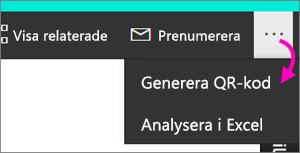

# Skapa en QR-kod för en rapport i Power BI som ska användas i mobilapparna
Med QR-koderna i Power BI kan du ansluta vad som helst i verkligheten direkt till relaterad BI-information &#151; Ingen navigering eller sökning behövs.

Du kan skapa en QR-kod i Power BI-tjänsten för alla rapporter, även för en rapport som du inte kan redigera. Placera sedan QR-koden på en lämplig plats. Du kan till exempel klistra in den i ett e-postmeddelande eller skriva ut och klistra in den på en specifik plats. 

Kolleger som du har delat rapporten med kan skanna QR-koden för att få åtkomst till rapporten, direkt från [sina mobila enheter](consumer/mobile/mobile-apps-qr-code.md). De kan använda QR-kodsskannern finns i Power BI-appen eller någon annan QR-skanner som är installerad på enheten. De kan också [skanna en QR-kod för en rapport med appen Power BI for Mixed Reality](consumer/mobile/mobile-mixed-reality-app.md#scan-a-report-qr-code-in-holographic-view).

## Skapa en QR-kod för en rapport
1. Öppna rapporten i Power BI-tjänsten.
2. Välj ellipserna (...) i det övre högra hörnet av panelen och välj **Generera QR-kod**. 
   
    
3. En dialogruta med QR-koden visas. 
   
    
4. Härifrån kan du skanna QR-koden eller ladda ned och spara den så att du kan: 
   
   * Lägga till den i ett e-postmeddelande eller ett annat dokument, eller 
   * Skriva ut den och placera den på en specifik plats. 

## Skriva ut QR-koden
Power BI genererar QR-koden som en JPG-fil som kan skrivas ut. 

1. Välj **Ladda ned** och öppna sedan JPG-filen på en dator som är ansluten till en skrivare.  
   
   JPG-filen har samma namn som panelen. Till exempel, ”Exempel på försäljning och marknadsföring.jpg”.
   
1. Skriv ut filen i 100 % eller ”verklig storlek”.  
2. Klipp ut QR-koden längs med kanten och fäst den på en plats som är relevant för panelen. 

## Nästa steg
* [Ansluta till Power BI-data från verkligheten](consumer/mobile/mobile-apps-data-in-real-world-context.md) med mobilapparna
* [Skanna en QR-kod i Power BI från din mobila enhet](consumer/mobile/mobile-apps-qr-code.md)
* [Skapa en QR-kod för en panel](service-create-qr-code-for-tile.md)
* Har du några frågor? [Fråga Power BI Community](http://community.powerbi.com/)

