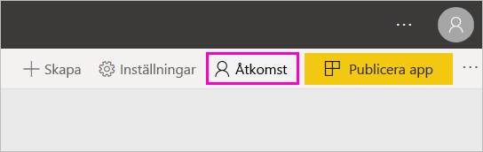

# Skapa de nya arbetsytorna i Power BI

Power BI introducerar en ny miljö för arbetsytor. Arbetsytor är fortfarande platser för samarbete med kollegor för att skapa samlingar med instrumentpaneler, rapporter och sidnumrerade rapporter. Du kan sedan paketera samlingarna i *appar* och distribuera dem till hela organisationen eller till vissa personer eller grupper. 

Detta har ändrats. Med de nya arbetsytorna kan du:

- Tilldela arbetsyteroller till användargrupper: säkerhetsgrupper, distributionslistor, Office 365-grupper och enskilda användare.
- Skapa en arbetsyta i Power BI utan att skapa en Office 365-grupp.
- Använda mer detaljerade arbetsyteroller för mer flexibel hantering av behörigheter på en arbetsyta.

> [!NOTE]
> Om du vill inför säkerhet på radnivå (RLS) för Power BI Pro-användare som bläddrar i innehållet i en arbetsyta, kan du tilldela användarna läsarrollen.

Mer bakgrundsinformation finns i artikeln om [nya arbetsytor](service-new-workspaces.md).

## Skapa en av de nya arbetsytorna

1. Börja med att skapa arbetsytan. Välj **Arbetsytor** > **Skapa arbetsyta**.
   
     

2. Du skapar en uppgraderad arbetsyta automatiskt om du inte väljer att **återgå till klassiskt**.
   
     
     
     Om du väljer **återgå till klassiskt**skapar du en [arbetsyta som baseras på en Office 365-grupp](service-create-workspaces.md). 

2. Ge arbetsytan ett namn. Om namnet inte är tillgängligt kan du redigera det för att få fram ett unikt namn.
   
     Appen för arbetsytan kommer att ha samma namn och ikon som arbetsytan.
   
1. Här följer några valfria objekt som du kan ställa in för din arbetsyta:

    Överför en **arbetsytebild**. Filerna kan vara i .png- eller .jpg-format. Filstorleken måste vara mindre än 45 KB.
    
    [Lägg till en **Kontaktlista**](#workspace-contact-list). Som standard är arbetsytans administratörer kontakter. 
    
    [Ange en **OneDrive för arbetsytan**](#workspace-onedrive) genom att endast skriva namnet på en befintlig Office 365-grupp, inte URL:en. Nu kan den här arbetsytan använda Office 365-gruppens fillagringsplats. 

    

    Om du vill tilldela arbetsytan till en **Dedikerad kapacitet** går du till fliken **Premium** och väljer **Dedikerad kapacitet**.
     
    

1. Välj **Spara**.

    Power BI skapar arbetsytan och öppnar den. Den visas i listan med arbetsytor som du är medlem i. 

## Arbetsytans kontaktlista

Du kan ange vilka användare som ska informeras om problem som uppstår i arbetsytan. Som standard informeras alla användare och grupper som angetts som arbetsyteadministratör, men du kan anpassa listan genom att lägga till dem i *kontaktlista*. Användare eller grupper som finns med i kontaktlistan visas i användargränssnittet för att hjälpa användarna att få hjälp med arbetsytan.

1. Få åtkomst till den nya inställningen **Kontaktlista** på ett av två sätt:

    I fönstret **Skapa en arbetsyta** första gången du skapar den.

    I det vänstra navigeringsfönstret väljer du pilen intill **Arbetsytor**, välj ellipsen (…) intill namnet på din arbetsyta > **Inställningar för arbetsytan**. Fönstret **Inställningar** öppnas.

    

2. Godkänn **standardadministratörer för arbetsytan** eller lägg till en egen lista över **specifika användare eller grupper** i **Avancerat** > **Kontaktlista**. 

    

3. Välj **Spara**.

## Arbetsytans OneDrive

Med arbetsytans OneDrive-funktion kan du konfigurera en Office 365-grupp vars fillagring för SharePoint-dokumentbiblioteket är tillgänglig för arbetsyteanvändarna. Du skapar gruppen först utanför Power BI. 

Power BI synkroniserar inte behörigheter för användare eller grupper, som är konfigurerade med arbetsyteåtkomst, med Office 365-gruppmedlemskapet. Det bästa sättet är att ge den Office 365-grupp vars fillagring du konfigurerar i den här inställningen [åtkomst till arbetsytan](#give-access-to-your-workspace). Hantera sedan åtkomst till arbetsytan genom att hantera medlemskap i Office 365-gruppen. 

1. Öppna den nya **OneDrive**-inställningen för arbetsytan på något av följande två sätt:

    I fönstret **Skapa en arbetsyta** första gången du skapar den.

    I det vänstra navigeringsfönstret väljer du pilen intill **Arbetsytor**, välj ellipsen (…) intill namnet på din arbetsyta > **Inställningar för arbetsytan**. Fönstret **Inställningar** öppnas.

    

2. Under **Avancerat** > **OneDrive för arbetsytan** anger du namnet på den Office 365-grupp som du skapade tidigare. Power BI hämtar automatiskt OneDrive för gruppen.

    

3. Välj **Spara**.

### Åtkomst till arbetsytans OneDrive-plats

När du har konfigurerat OneDrive-platsen kommer du till den på samma sätt som du kommer till andra datakällor i Power BI-tjänsten.

1. I det vänstra navigeringsfönstret väljer du **Hämta data** och därefter väljer du **Hämta** i rutan **Filer**.

    

1.  Posten **OneDrive – företag** är din egen OneDrive för företag. Det andra OneDrive är den som du lade till.

    

### Anslut till tjänster från tredje part i nya arbetsytor

I de nya arbetsytorna gör vi en ändring för att fokusera på *appar*. Appar för tjänster från tredje part gör det enkelt för användare att hämta data från de tjänster som de använder, till exempel Microsoft Dynamics CRM, Salesforce eller Google Analytics.

Med de nya arbetsytorna kan du inte skapa eller använda innehållspaket för organisationen. Du kan i stället använda de appar som tillhandahålls för att ansluta till tjänster från tredje part eller be att dina egna team tillhandahåller appar för eventuella innehållspaket som du använder. 

## Ge åtkomst till din arbetsyta

1. Eftersom du är administratör ser du en ny åtgärd, **åtkomst**, på arbetsytans innehållslista.

    

1. Lägg till säkerhetsgrupper, distributionslistor, Office 365-grupper eller enskilda användare i dessa arbetsytor som medlemmar, deltagare eller administratörer. En förklaring av de olika rollerna finns i [Roller i de nya arbetsytorna](service-new-workspaces.md#roles-in-the-new-workspaces).

    

9. Välj **Lägg till** > **Stäng**.

## Distribuera en app

Om du vill distribuera officiellt innehåll till en stor målgrupp i din organisation kan du publicera en app från din arbetsyta.  När innehållet är färdigt kan du välja vilka instrumentpaneler och rapporter som du vill publicera och sedan publicera det som en *app*. Du kan skapa en app från varje arbetsyta.

Läs om att [publicera en app från de nya arbetsytorna](service-create-distribute-apps.md)

## Nästa steg
* Läs om att [organisera arbete i de nya arbetsytorna i Power BI](service-new-workspaces.md)
* [Skapa klassiska arbetsytor](service-create-workspaces.md)
* [Publicera en app från de nya arbetsytorna i Power BI](service-create-distribute-apps.md)
* Har du några frågor? [Fråga Power BI Community](http://community.powerbi.com/)
