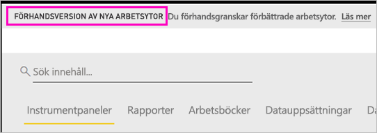
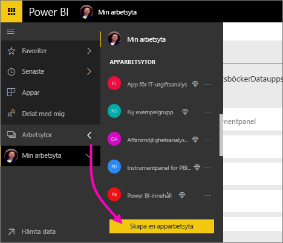
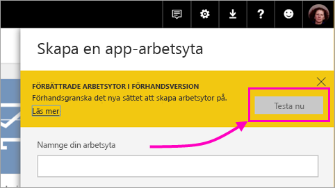
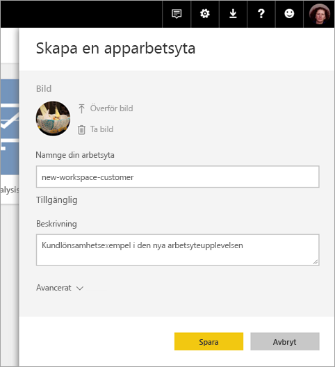
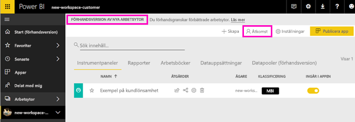
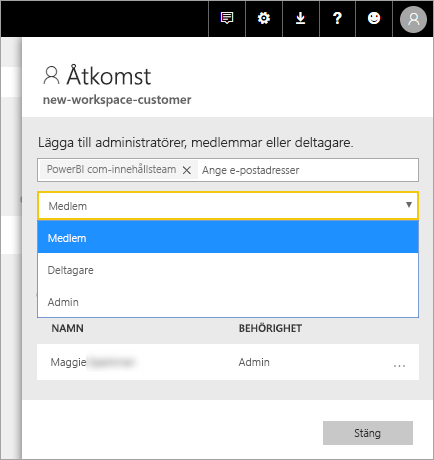

# Skapa de nya arbetsytorna (förhandsversion) i Power BI

Power BI introducerar en ny arbetsyta som en förhandsversion. Arbetsytor är fortfarande platser där du kan samarbeta med kollegor för att skapa samlingar av instrumentpaneler och rapporter, som du kan samla till *appar* och distribuera till hela organisationen eller till specifika personer eller grupper. 

Med förhandsversion av de nya arbetsytorna kan du nu:

- Tilldela arbetsyteroller till användargrupper: säkerhetsgrupper, distributionslistor, Office 365-grupper och enskilda användare.
- Skapa en arbetsyta i Power BI utan att skapa en Office 365-grupp.
- Använda mer detaljerade arbetsyteroller för mer flexibel hantering av behörigheter på en arbetsyta.

Mer bakgrund finns i artikeln om [nya arbetsytor (förhandsversion)](service-new-workspaces.md).

## Skapa en av de nya apparbetsytorna

1. Börja med att skapa apparbetsytan. Välj **Arbetsytor** > **Skapa apparbetsyta**.
   
     

2. I **Förbättrade arbetsytor i förhandsversion** väljer du **Prova nu**.
   
     

2. Ge arbetsytan ett namn. Om namnet inte är tillgängligt kan du redigera det för att få fram ett unikt ID.
   
     Appen får samma namn som arbetsytan.
   
1. Lägg till en bild om du vill. Filstorleken måste vara mindre än 45 KB.
 
    

1. Välj **Spara**.

    Här på **välkomstskärmen** för den nya arbetsytan kan du lägga till data. 

    

1. Välj exempelvis **Exempel** > **Kundlönsamhetsexempel**.

    I innehållslistan för arbetsytan visas nu **Förhandsgranskning av nya arbetsytor**. Eftersom du är administratör ser du även en ny åtgärd: **Åtkomst**.

    

1. Välj **Åtkomst**.

1. Lägg till säkerhetsgrupper, distributionslistor, Office 365-grupper eller enskilda användare i dessa arbetsytor som medlemmar, deltagare eller administratörer. En förklaring av de olika rollerna finns i [Roller i de nya arbetsytorna](#roles-in-the-new-workspaces) senare i den här artikeln.

    

9. Välj **Lägg till** > **Stäng**.

1. Power BI skapar arbetsytan och öppnar den. Den visas i listan med arbetsytor som du är medlem i. Eftersom du är administratör kan du välja ellipsen (...) för att gå tillbaka och göra ändringar i inställningarna för arbetsytan, lägga till nya medlemmar eller ändra deras behörigheter.

     

## Lägga till innehåll i din apparbetsyta

När du har skapat en apparbetsyta med det nya formatet är det dags att lägga till innehåll. Att lägga till nytt innehåll sker på ett liknande sätt i arbetsytorna med det nya och det gamla formatet, med ett undantag. När du befinner dig på endera apparbetsyta kan du ladda upp eller ansluta till filer, precis som på Min arbetsyta. I de nya arbetsytorna kan du inte ansluta till organisationsinnehållspaket eller innehållspaket från tredje part såsom Microsoft Dynamics CRM, Salesforce eller Google Analytics. I de aktuella arbetsytorna kan du ansluta till innehållspaket.

När du visar innehåll i innehållslistan på en apparbetsyta visas apparbetsytans namn som ägare.

### Ansluta till tjänster från tredje part i nya arbetsytor (förhandsversion)

I de nya arbetsytorna gör vi en ändring för att fokusera på *appar*. Appar för tjänster från tredje part gör det enkelt för användare att hämta data från de tjänster som de använder, till exempel Microsoft Dynamics CRM, Salesforce eller Google Analytics.
Organisationsappar ger användarna de interna data de behöver. Vi planerar att lägga till funktioner i organisationsappar så att användare kan anpassa det innehåll de hittar i apparna. Den funktionen tar bort behovet av innehållspaket. 

Med förhandsversionen av de nya arbetsytorna kan du inte skapa eller använda innehållspaket för organisationen. Du kan i stället använda de appar som tillhandahålls för att ansluta till tjänster från tredje part eller be att dina egna team tillhandahåller appar för eventuella innehållspaket som du använder. 

## Distribuera en app

När innehållet är färdigt kan du välja vilka instrumentpaneler och rapporter som du vill publicera, och sedan publicerar du det som en *app*. Du kan skapa en app från varje arbetsyta. Dina medarbetare kan få appen på ett par olika sätt. Du kan installera den automatiskt på dina medarbetares Power BI-konton om din Power BI-administratör ger dig behörighet. I annat fall kan de hitta och installera din app från Microsoft AppSource, eller så kan du skicka dem en direktlänk. De får uppdateringar automatiskt och du kan styra hur ofta dina data ska uppdateras. Information finns i [Publicera appar med instrumentpaneler och rapporter i Power BI](service-create-distribute-apps.md).

## Konvertera gamla apparbetsytor till nya apparbetsytor

Under förhandsversionsperioden kan du inte automatiskt konvertera dina gamla apparbetsytor till nya. Du kan dock skapa en ny apparbetsyta och publicera ditt innehåll till den nya platsen. 

När de nya arbetsytorna blir allmänt tillgängliga (GA, generally available) kan du välja att gå med för att migrera gamla automatiskt. Någon gång efter GA måste du migrera dem.

## Nästa steg
* Läs om att [organisera arbete i de nya arbetsytorna (förhandsversion) i Power BI](service-new-workspaces.md)
* [Skapa de aktuella arbetsytorna](service-create-workspaces.md)
* [Installera och använda appar i Power BI](service-create-distribute-apps.md)
* Har du några frågor? [Fråga Power BI Community](http://community.powerbi.com/)
