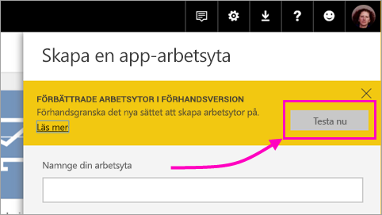
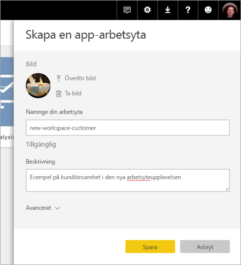
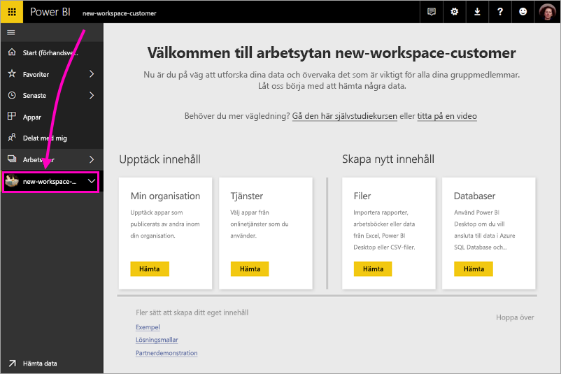
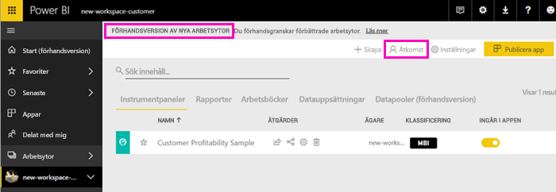
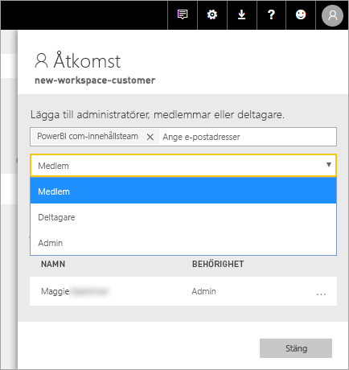
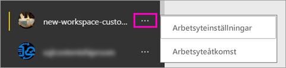

# Skapa de nya arbetsytorna (förhandsversion) i Power BI

Power BI introducerar en ny arbetsyta som en förhandsversion. Arbetsytor är fortfarande platser där du kan samarbeta med kollegor för att skapa samlingar av instrumentpaneler och rapporter, som du kan samla till *appar* och distribuera till hela organisationen eller till specifika personer eller grupper. 

Med förhandsversion av de nya arbetsytorna kan du nu:

- Tilldela arbetsyteroller till användargrupper: säkerhetsgrupper, distributionslistor, Office 365-grupper och enskilda användare.
- Skapa en arbetsyta i Power BI utan att skapa en Office 365-grupp.
- Använda mer detaljerade arbetsyteroller för mer flexibel hantering av behörigheter på en arbetsyta.
 
När du skapar en av de nya arbetsytorna skapar du inte en underliggande, associerad Office 365-grupp. All administration för arbetsytor sker i Power BI, inte i Office 365. Du kan fortfarande lägga till en Office 365-grupp till arbetsytan för att fortsätta hantera användaråtkomst till innehållet via Office 365-grupper. Du kan dock även använda säkerhetsgrupper och distributionslistor samt lägga till enskilda användare direkt i Power BI, vilket ger dig ett flexibelt sätt att hantera åtkomst till arbetsytor. Eftersom administration av arbetsytor nu finns i Power BI, är det Power BI-administratörerna som bestämmer vilka i en organisation som kan skapa arbetsytor. Se [avsnittet om arbetsytor i artikeln om Power BI-adminportalen](service-admin-portal.md#workspace-settings) för mer information. 

Du kan lägga till användargrupper eller enskilda personer till de nya arbetsytorna som medlemmar, deltagare eller administratörer. Alla i en användargrupp får den roll som du har definierat. Om en person finns i flera användargrupper får personen den högsta behörighetsnivån som ges av rollen.  En förklaring av de olika rollerna finns i [Roller i de nya arbetsytorna](#roles-in-the-new-workspaces) senare i den här artikeln.

Alla som du lägger till i en apparbetsyta behöver en Power BI Pro-licens. På arbetsytan kan användarna samarbeta kring instrumentpaneler och rapporter som du planerar att publicera till en bredare publik eller hela organisationen. Om du vill distribuera innehåll till andra i organisationen kan du tilldela Power BI Pro-licenser till de användarna eller placera arbetsytan i en Power BI Premium-kapacitet.

Vi gör om vissa funktioner i och med de nya arbetsytorna. Se [Apparbetsytefunktioner som fungerar annorlunda](#app-workspace-features-that-work-differently) senare i den här artikeln för en förklaring av de ändringar som du kan räkna med blir permanenta tillsammans med förhandsversionen. Eftersom detta är en förhandsfunktion finns det vissa begränsningar som du bör känna till. Se [Kända problem](#known-issues) senare i den här artikeln för en förklaring av de aktuella begränsningarna. 

## Lansera nya apparbetsytor

Under förhandsversionsperioden kan gamla och nya arbetsytor finnas sida vid sida, och du kan skapa endera. När förhandsversionen för de nya arbetsytorna tar slut och de blir tillgängliga allmänt kan gamla arbetsytor finns kvar under en tid. Du kommer inte kunna skapa dem, och du måste förbereda att migrera dina arbetsytor till den nya infrastrukturen för arbetsytor. Oroa dig inte – du har flera månader på dig att slutföra migreringen.

## Skapa en av de nya apparbetsytorna

1. Börja med att skapa apparbetsytan. Välj **Arbetsytor** > **Skapa apparbetsyta**.
   
     

2. I **Förbättrade arbetsytor i förhandsversion** väljer du **Prova nu**.
   
     

2. Ge arbetsytan ett namn. Om namnet inte är tillgängligt kan du redigera det för att få fram ett unikt ID.
   
     Appen får samma namn som arbetsytan.
   
1. Lägg till en bild om du vill. Filstorleken måste vara mindre än 45 KB.
 
    

1. Välj **Spara**.

    Här på **välkomstskärmen** för den nya arbetsytan kan du lägga till data. 

    

1. Välj exempelvis **Exempel** > **Kundlönsamhetsexempel**.

    I innehållslistan för arbetsytan visas nu **Förhandsgranskning av nya arbetsytor**. Eftersom du är administratör ser du även en ny åtgärd: **Åtkomst**.

    

1. Välj **Åtkomst**.

1. Lägg till säkerhetsgrupper, distributionslistor, Office 365-grupper eller enskilda användare i dessa arbetsytor som medlemmar, deltagare eller administratörer. En förklaring av de olika rollerna finns i [Roller i de nya arbetsytorna](#roles-in-the-new-workspaces) senare i den här artikeln.

    

9. Välj **Lägg till** > **Stäng**.

1. Power BI skapar arbetsytan och öppnar den. Den visas i listan med arbetsytor som du är medlem i. Eftersom du är administratör kan du välja ellipsen (...) för att gå tillbaka och göra ändringar i inställningarna för arbetsytan, lägga till nya medlemmar eller ändra deras behörigheter.

     

## Lägga till innehåll i din apparbetsyta

När du har skapat en apparbetsyta med det nya formatet är det dags att lägga till innehåll. Att lägga till nytt innehåll sker på ett liknande sätt i arbetsytorna med det nya och det gamla formatet, med ett undantag. När du befinner dig på endera apparbetsyta kan du ladda upp eller ansluta till filer, precis som på Min arbetsyta. I de nya arbetsytorna kan du inte ansluta till organisationsinnehållspaket eller innehållspaket från tredje part såsom Microsoft Dynamics CRM, Salesforce eller Google Analytics. I de aktuella arbetsytorna kan du ansluta till innehållspaket.

När du visar innehåll i innehållslistan på en apparbetsyta visas apparbetsytans namn som ägare.

### Ansluta till tjänster från tredje part i nya arbetsytor (förhandsversion)

I de nya arbetsytorna gör vi en ändring för att fokusera på appar. Appar för tjänster från tredje part gör det enkelt för användare att hämta data från de tjänster som de använder, till exempel Microsoft Dynamics CRM, Salesforce eller Google Analytics.
Organisationsappar ger användarna de interna data de behöver. Vi planerar att lägga till funktioner i organisationsappar så att användare kan anpassa det innehåll de hittar i apparna. Tack vare det kommer innehållspaket inte att behövas. 

Med förhandsversionen av de nya arbetsytorna kan du inte skapa eller använda innehållspaket för organisationen. Du kan i stället använda de appar som tillhandahålls för att ansluta till tjänster från tredje part eller be att dina egna team tillhandahåller appar för eventuella innehållspaket som du använder. 

## Roller i de nya arbetsytorna

Med roller kan du hantera vem som kan göra vad i en arbetsyta, så att teamen kan samarbeta. De nya arbetsytorna gör att du kan tilldela roller till enskilda användare och användargrupper: säkerhetsgrupper, Office 365-grupper och distributionslistor. 

När du tilldelar roller till en användargrupp får personer i gruppen åtkomst till innehåll. Om du kapslar användargrupper får alla berörda användare behörighet. En användare som finns i flera användargrupper med olika roller får den högsta behörighetsnivån som de har tilldelats. 

De nya arbetsytorna erbjuder tre roller: administratörer, medlemmar och deltagare.

**Administratörer kan:**

- Uppdatera och ta bort arbetsytan. 
- Lägga till/ta bort personer, inklusive andra administratörer.
- Göra allt som medlemmar kan göra.

**Medlemmar kan:** 

- Lägga till medlemmar eller andra med lägre behörighet.
- Publicera och uppdatera en app.
- Dela ett objekt eller dela en app.
- Tillåta att andra delar objekt igen.
- Göra allt som deltagare kan göra.

**Deltagare kan:** 

- Skapa, redigera och ta bort innehåll på arbetsytan. 
- Publicera rapporter till arbetsytan och ta bort innehåll.
- Inte ge nya personer åtkomst till innehåll och inte dela nytt innehåll, men kan dela med någon som arbetsytan, objektet eller appen redan delas med. 
- Kan inte ändra medlemmarna i gruppen.
 
Vi skapar arbetsflöden för åtkomstbegäran på olika ställen i tjänsten så att användare som inte har åtkomst kan begära det. Arbetsflöden för åtkomstbegäran finns för tillfället för instrumentpaneler, rapporter och appar.

## Distribuera en app

När innehållet är färdigt kan du välja vilka instrumentpaneler och rapporter som du vill publicera, och sedan publicerar du det som en *app*. Du kan skapa en app från varje arbetsyta. Dina medarbetare kan få appen på ett par olika sätt. Du kan installera den automatiskt på dina medarbetares Power BI-konton om din Power BI-administratör ger dig behörighet. I annat fall kan de hitta och installera din app från Microsoft AppSource, eller så kan du skicka dem en direktlänk. De får uppdateringar automatiskt och du kan styra hur ofta dina data ska uppdateras. Information finns i [Publicera appar med instrumentpaneler och rapporter i Power BI](consumer/end-user-create-apps.md).

## Konvertera gamla apparbetsytor till nya apparbetsytor

Under förhandsversionsperioden kan du inte automatiskt konvertera dina gamla apparbetsytor till nya. Du kan dock skapa en ny apparbetsyta och publicera ditt innehåll till den nya platsen. 

När de nya arbetsytorna blir allmänt tillgängliga (GA, generally available) kan du välja att gå med för att migrera gamla automatiskt. Någon gång efter GA måste du migrera dem.

## Vanliga frågor och svar om Power BI-appar

### Hur skiljer sig de nya apparbetsytorna åt från aktuella apparbetsytor?
* Att skapa apparbetsytor kommer inte att skapa motsvarande entiteter i Office 365 på det sätt som aktuella apparbetsytor gör. (Du kan fortfarande lägga till en Office 365-grupp till din arbetsyta genom att tilldela den en roll). 
* På aktuella apparbetsytor kan du bara lägga till enskilda personer till medlems- och administratörslistor. I de nya apparbetsytorna kan du lägga till flera AD-säkerhetsgrupper, distributionslistor eller Office 365-grupper till de här listorna för enklare användarhantering. 
- Du kan skapa ett innehållspaket för organisationen från en aktuell apparbetsyta. Du kan inte skapa sådana från de nya apparbetsytorna.
- Du kan använda ett innehållspaket för organisationen från en aktuell apparbetsyta. Du kan inte använda sådana från de nya apparbetsytorna.
- Under förhandsversionen är vissa funktioner för nya apparbetsytorna inte aktiverade ännu. Mer information finns i nästa avsnitt, som handlar om [andra planerade nya funktioner för arbetsytor](service-create-the-new-workspaces.md#other-planned-new-app-workspace-preview-features).

## Planerade funktioner för förhandsversionen av de nya apparbetsytorna

Vissa andra funktioner för förhandsversionen av de nya apparbetsytorna håller fortfarande på att utvecklas, men är inte tillgängliga ännu när vi lanserar förhandsversionen:

- Det finns ingen knapp för att **lämna arbetsytan**.
- Användningsstatistik stöds inte ännu.
- Så fungerar Premium: Du kan tilldela och skapa arbetsytor i en Premium-kapacitet, men för att flytta en arbetsyta mellan kapaciteter går du till inställningarna för arbetsytan.
- Inbäddning för SharePoint-webbdel stöds inte ännu.
- Det finns ingen **OneDrive**-knapp för Office 365-grupper i Hämta data/filer.

## Apparbetsytefunktioner som fungerar annorlunda

Vissa funktioner fungerar annorlunda i de nya apparbetsytorna jämfört med de aktuella appsarbetsytorna. De här skillnaderna är avsiktliga och baseras på feedback som vi har fått från kunder. De kommer att möjliggöra en mer flexibel metod för samarbete med arbetsytor:

- Medlemmar kan eller kan inte dela igen: ersätts med rollen Deltagare
- Skrivskyddade arbetsytor: i stället för att bevilja användare skrivskyddad åtkomst till en arbetsyta tilldelar du användare till en kommande läsarroll som ger liknande skrivskyddad åtkomst till innehållet i en arbetsyta.

## Kända problem

Följande problem är kända och korrigeringar är under utveckling:

- Kostnadsfria användare eller användargrupper som har lagts till som mottagare för prenumerationer på e-postmeddelanden får kanske inte e-postmeddelandena, även om de borde få dem. Problemet uppstår när den nya arbetsytan är i en Premium-kapacitet men Min arbetsyta för den användare som skapar prenumerationen inte finns i en Premium-kapacitet. Om Min arbetsyta är i en Premium-kapacitet får de kostnadsfria användarna och användargrupperna e-postmeddelanden.
- När en arbetsyta flyttas från en Premium-kapacitet till delad kapacitet fortsätter i vissa fall kostnadsfria användare och användargrupper att få e-postmeddelanden, även om de inte borde få dem. Problemet uppstår när Min arbetsyta för den användare som skapade prenumerationen är i en Premium-kapacitet.

## Nästa steg

- [Skapa de aktuella arbetsytorna](service-create-workspaces.md)
* [Installera och använda appar i Power BI](consumer/end-user-apps.md)
* Har du några frågor? [Fråga Power BI Community](http://community.powerbi.com/)
