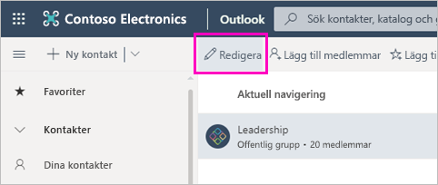

# Skapa klassiska arbetsytor i Power BI

I Power BI kan du skapa *arbetsytor*, platser där du kan samarbeta med kollegor för att skapa och förfina samlingar av instrumentpaneler, rapporter och sidnumrerade rapporter. Sedan kan du paketera ihop samlingen till *appar* som du kan distribuera till hela organisationen eller till specifika personer eller grupper. 

**Visste du att?** Power BI erbjuder en ny arbetsyteupplevelse som nu är standard. Läs [Organisera arbete i de nya arbetsytorna](service-new-workspaces.md) för att få information om de nya arbetsytorna. 

När du skapar en klassisk arbetsyta skapar du en underliggande, associerad Office 365-grupp. All administration för arbetsytor sker i Office 365. Du kan lägga till kollegor till dessa arbetsytor som medlemmar eller administratörer. På arbetsytan kan ni samarbeta kring instrumentpaneler, rapporter och annat innehåll som du planerar att distribuera till en bredare publik. Alla som du lägger till i en arbetsyta behöver en Power BI Pro-licens. 

## Video: Appar och arbetsytor
<iframe width="640" height="360" src="https://www.youtube.com/embed/Ey5pyrr7Lk8?showinfo=0" frameborder="0" allowfullscreen></iframe>

## Skapa en klassisk arbetsyta baserat på en Office 365-grupp

När du skapar en arbetsyta byggs den på en Office 365-grupp.

[!INCLUDE [powerbi-service-create-app-workspace](./includes/powerbi-service-create-app-workspace.md)]

När du först skapar arbetsytan kan du behöva vänta i ungefär en timme för att den ska spridas till Office 365. 

### Lägga till en bild i din Office 365-arbetsyta (valfritt)
Som standard skapar Power BI en liten färgad cirkel för din app med appens initialer. Men du kan också anpassa den med en bild. Om du vill lägga till en bild måste du ha en Exchange Online-licens.

1. Välj **Arbetsytor**, välj **Fler alternativ** (...) bredvid namnet på arbetsytan och sedan **Medlemmar**. 
   
     
   
    Office 365 Outlook-kontot för arbetsytan öppnas i ett nytt webbläsarfönster.
2. Välj **redigeringspennan**.
   
     
3. Välj kamerabilden och leta reda på den bild som du vill använda.
   
     

     Bilder kan vara .png-, .jpg- eller .bmp-filer. Deras filstorlek kan vara stor, upp till 3 MB. 

4. Välj **OK** och sedan **Spara**.
   
    Bilden ersätter den färgade cirkeln i Outlook-fönstret i Office 365. 
   
     
   
    Om några minuter visas den även i appen i Power BI.

## Lägga till innehåll i din arbetsyta

När du har skapat en arbetsyta är det dags att lägga till innehåll. Det går till precis som att lägga till innehåll på Min arbetsyta, förutom att även andra på arbetsytan kan se och arbeta med det. En stor skillnad är att när du är klar, kan du publicera innehållet som en app. När du visar innehåll i innehållslistan på en arbetsyta visas arbetsytans namn som ägare.

### Ansluta till tjänster från tredje part på arbetsytor

Appar tillhandahålls för alla tredjepartstjänster som Power BI stödjer, vilket gör det enkelt att hämta data från de tjänster du använder, till exempel Microsoft Dynamics CRM, Salesforce eller Google Analytics. Du kan publicera organisationsappar för att ge användarna de data de behöver.

I de aktuella arbetsytorna kan du även ansluta med hjälp av organisationsinnehållspaket och innehållspaket från tredje part såsom Microsoft Dynamics CRM, Salesforce eller Google Analytics. Överväg att migrera organisationens innehållspaket till appar.

## Distribuera en app

Om du vill distribuera officiellt innehåll till en stor målgrupp i din organisation kan du publicera en app från din arbetsyta.  När innehållet är färdigt kan du välja vilka instrumentpaneler och rapporter som du vill publicera och sedan publicera det som en *app*. Du kan skapa en app från varje arbetsyta.

I listan Appar i navigeringsfönstret visas alla appar som du har installerat. Dina medarbetare kan få appen på ett par olika sätt. 
- De kan leta upp och installera appen från Microsoft AppSource
- Du kan skicka dem en direktlänk. 
- Du kan installera den automatiskt på dina medarbetares Power BI-konton om din Power BI-administratör ger dig behörighet. 

Användare ser uppdaterat appinnehåll automatiskt när du har publicerat en uppdatering från din arbetsyta. Du kan kontrollera hur ofta data uppdateras genom att ange uppdateringsschemat i de datamängder som används av appinnehållet på din arbetsyta. Mer information finns i [Publicera en app från de nya arbetsytorna i Power BI](service-create-distribute-apps.md).

## Vanliga frågor och svar om klassiska appar i Power BI

### Hur skiljer sig appar åt från organisationsinnehållspaket?
Appar är utvecklingen av organisationsinnehållspaket. Om du redan har organisationsinnehållspaket, fortsätter de att fungera sida vid sida med appar. Det finns några viktiga skillnader mellan appar och innehållspaket. 

* När företagsanvändare har installerat ett innehållspaket, förlorar det sin grupperade identitet: det är bara en lista över instrumentpaneler och rapporter bland andra instrumentpaneler och rapporter. Appar, å andra sidan, bevarar sin gruppering och identitet även efter installationen. Den här grupperingen gör det lätt för företagsanvändare att fortsätta att gå tillbaka till dem över tid.
* Du kan skapa flera innehållspaket från en arbetsyta, men en app har ett 1:1-förhållande med sin arbetsyta. 
* Med tiden planerar vi att avveckla användningen av organisationsinnehållspaket, så vi rekommenderar att du skapar appar hädanefter.  
* Med den nya arbetsyteupplevelsen tar vi de första stegen mot att avveckla innehållspaket för organisationer. Du kan inte använda eller skapa dem i de nya arbetsytorna.

Du kan jämföra de två i [Hur skiljer sig de nya arbetsytorna åt från befintliga arbetsytor](service-new-workspaces.md#how-the-new-workspaces-are-different). 

## Nästa steg
* [Installera och använda appar i Power BI](service-create-distribute-apps.md)
- [Skapa de nya arbetsytorna](service-create-the-new-workspaces.md)
* Har du några frågor? [Fråga Power BI Community](https://community.powerbi.com/)
