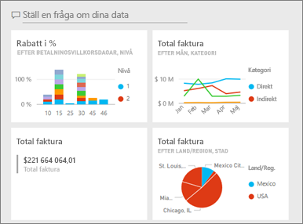
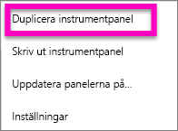
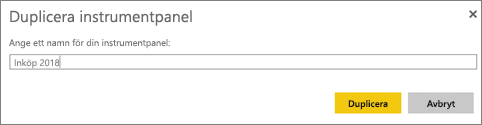
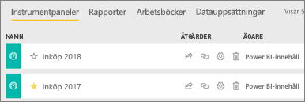

# Skapa en kopia av en instrumentpanel i Power BI-tjänsten

 Det finns många olika skäl att göra en kopia av en instrumentpanel. Du kanske vill göra ändringar och testa dess prestanda mot den ursprungliga. Eller skapa något annorlunda versioner för att distribuera efter kollega, region eller team. En kollega kanske beundrar din instrumentpanelsdesign och vill använda den för att rapportera till sina chefer. En annan orsak kan vara om du har en ny databas med samma datastruktur och datatyper och vill återanvända instrumentpanelen som du redan har skapat. Det kan du också göra, men det kräver lite arbete i Power BI Desktop. 

Instrumentpaneler skapas (och kopieras) med hjälp av Power BI-tjänsten och kan visas i Power BI Mobile och Power BI Embedded.  Instrumentpaneler finns inte tillgängliga i Power BI Desktop. 

Om du vill göra en kopia av en instrumentpanel måste du vara instrumentpanelens *skapare*. Instrumentpaneler som har delats med dig som en app, kan inte dupliceras.

1. Öppna instrumentpanelen.
2. Välj ellipserna (...) i övre högra hörnet och välj **duplicera instrumentpanelen**.
   
   
3. Ge instrumentpanelen ett namn och välj **duplicera**. 
   
   
4. Den nya instrumentpanelen sparas i samma arbetsyta som originalet. 
   
   

5.    Öppna den nya instrumentpanelen och redigera efter behov. Här följer några saker som du kanske vill göra härnäst:    
    a. [Flytta, byta namn på, ändra storlek på eller ta bort paneler](service-dashboard-edit-tile.md).  
    b. Redigera panelinformation och hyperlänkar genom att välja panelellipserna (...) och välja **Redigera information**.  
    c. [Lägg till nya paneler från instrumentpanelens menyrad](service-dashboard-add-widget.md) (**Lägg panel**)  
    d. Fäst nya paneler [från frågor och svar](service-dashboard-pin-tile-from-q-and-a.md) eller [från rapporter](service-dashboard-pin-tile-from-report.md).  
    e. Byt namn på instrumentpanelen, aktivera och inaktivera frågor och svar och ställ in panelflödet från instrumentpanelens inställningsfönster.  (välj listmenyn från instrumentpanelens ellips (...) och välj **Inställningar**)  
    f. Dela din instrumentpanel direkt med kollegor eller som en del av en Power BI-app. 

## Nästa steg
* [Tips för att designa en bra instrumentpanel](service-dashboards-design-tips.md) 

Har du fler frågor? [Prova Power BI Community](http://community.powerbi.com/)

