# Skapa en Power BI-instrumentpanel från en rapport
Du har läst [introduktionen till instrumentpaneler i Power BI](service-dashboards.md) och nu är det dags att du skapar en egen. Det finns många olika sätt att skapa en instrumentpanel. Du kan till exempel skapa en instrumentpanel från en rapport (från början), från en datauppsättning eller genom att duplicera en befintlig instrumentpanel.  

Vi börjar med att skapa en snabb och enkel instrumentpanel som fäster visuella objekt från en rapport som redan har skapats. 

När du har slutfört den här snabbstarten har du fått en god förståelse för:
- Relationen mellan instrumentpaneler och rapporter
- Hur du öppnar redigeringsvyn i rapportredigeraren
- Hur du fäster paneler 
- Hur du navigerar mellan en instrumentpanel och en rapport 
 

> [!NOTE] 
> Instrumentpaneler är en funktion i Power BI-tjänsten, inte i Power BI Desktop. Även om du inte skapar instrumentpaneler i Power BI-mobilappar men du kan [visa och dela](consumer/mobile/mobile-apps-view-dashboard.md) dem.
>
> 

## Video: Skapa en instrumentpanel genom att fästa visuella objekt och bilder från en rapport
Titta på när Amanda skapar en ny instrumentpanel genom att fästa visualiseringar från en rapport. Följ därefter stegen i nästa avsnitt [Importera en datauppsättning med en rapport](#import-a-dataset-with-a-report) för att prova själv med hjälp av anskaffningsanalysexemplet.
    

<iframe width="560" height="315" src="https://www.youtube.com/embed/lJKgWnvl6bQ" frameborder="0" allowfullscreen></iframe>

## Importera en datauppsättning med en rapport
I den här stegvisa guiden ska vi importera ett av Power BI:s exempel på datauppsättningar och använda det för att skapa vår nya instrumentpanel. Exemplet vi ska använda är en Excel-arbetsbok med två PowerView-blad. När Power BI importerar arbetsboken, läggs en datauppsättning och en rapport till på din arbetsyta. Rapporten skapas automatiskt från PowerView-bladen.

1. Ladda ned Excel-filen [Anskaffningsanalysexempel](https://go.microsoft.com/fwlink/?LinkId=529784). Vi rekommenderar att du sparar den i din OneDrive för företag.
2. Öppna Power BI-tjänsten i din webbläsare (app.powerbi.com).
3. Välj **Min arbetsyta** i navigeringsfönstret och välj sedan **Hämta data**.

    
5. Under **Filer** väljer du **Hämta**.

   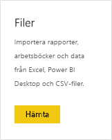
6. Gå till den plats där du sparade Excel-filen Exempel på anskaffningsanalys. Markera den och välj **Anslut**.

   
7. För den här övningen väljer vi **Importera**.

    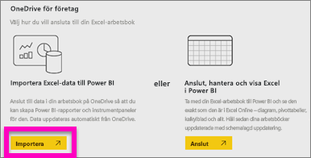
8. När meddelandet om slutförd import visas, väljer du **x** för att stänga det.

   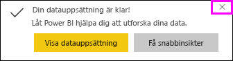

> [!TIP]
> Visste du att? Du kan minska navigeringsfönstret genom att välja ikonen med tre rader i det översta . Det ger dig mer utrymme för själva rapporten.

### Öppna rapporten och fästa paneler på din instrumentpanel
1. I samma arbetsyta väljer du fliken **Rapporter** och sedan**Exempel på anskaffningsanalys** för att öppna rapporten.

    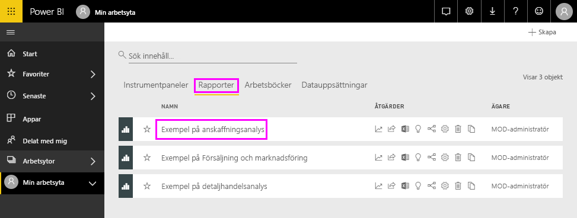 Rapporten öppnas i läsvyn. Observera att den har två flikar till vänster: **Rabattanalys** och **Utgiftsöversikt**. Varje flik representerar en sida i rapporten.

2. Välj **Fler alternativ (...)**  > **Redigera rapport** för att öppna rapporten i redigeringsvyn.

    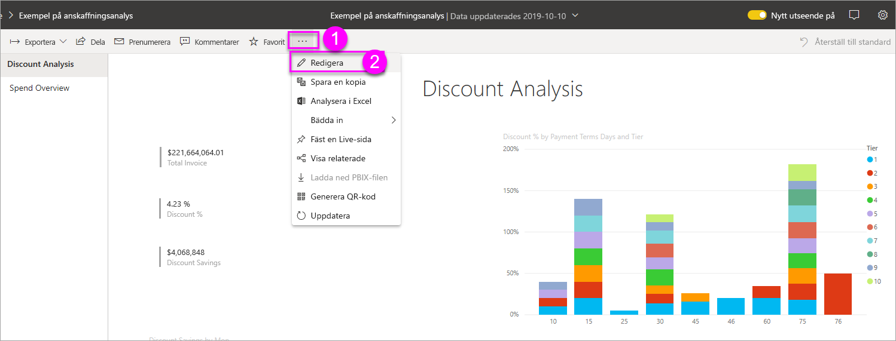
3. Hovra över en visualisering för att visa de tillgängliga alternativen. Välj fästikonen för att lägga till en visualisering på en instrumentpanel .

    
4. Eftersom vi skapar en ny instrumentpanel, markerar du alternativet **Ny instrumentpanel** och ger den ett namn.

    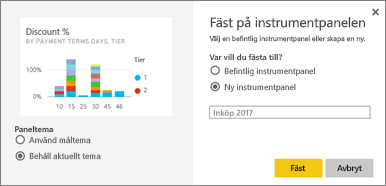
5. När du väljer **Fäst**, skapar Power BI den nya instrumentpanelen på den aktuella arbetsytan. När meddelandet **Fäst på instrumentpanelen** visas, väljer du **Gå till instrumentpanelen**. Om du uppmanas att spara rapporten väljer du **Spara**.

    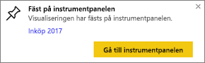

    Den nya instrumentpanelen öppnas. Den har en panel: den visualisering som du precis fäste.

   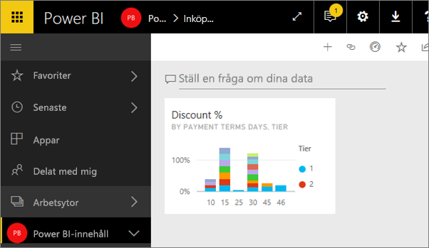
7. Välj panelen för att återgå till rapporten. Fäst några fler paneler på den nya instrumentpanelen. När fönstret **Fäst på instrumentpanelen** visas, väljer du **Befintlig instrumentpanel**.  

   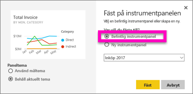

## Fästa en hel rapportsida på instrumentpanelen
I stället för att fästa en visualisering i taget kan du [fästa en hel rapportsida som en *levande panel*](service-dashboard-pin-live-tile-from-report.md). Låt oss göra det.

1. I rapportredigeraren väljer du fliken **Utgiftsöversikt** så öppnas den andra sidan i rapporten.

   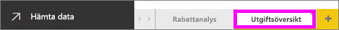

2. Vi vill ha alla visuella objekt i rapporten på instrumentpanelen. I det övre högra hörnet av menyraden väljer du **Fästa live-sida**. På en instrumentpanel uppdateras paneler med live-sidor varje gång sidan uppdateras.

   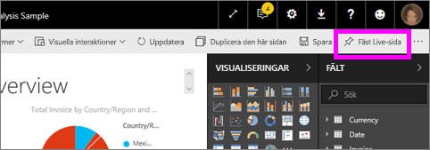

3. När fönstret **Fäst på instrumentpanelen** visas, väljer du **Befintlig instrumentpanel**.

   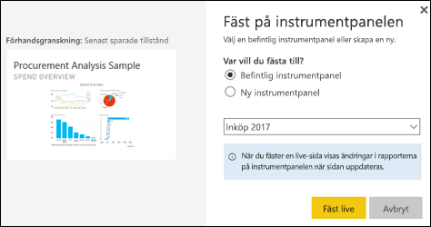

4. När det visas ett meddelande om att det lyckats, väljer du **Gå till instrumentpanel**. Där ser du de paneler som du har fäst från rapporten. I exemplet nedan har vi fäst två paneler från sida ett i rapporten och en levande panel som är sida två i rapporten.

   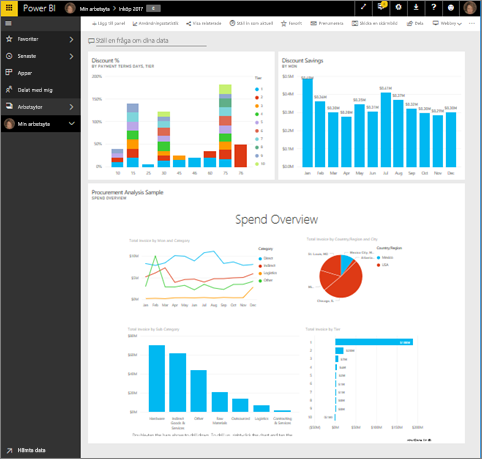

## Nästa steg
Grattis – du har skapat din första instrumentpanel! Nu när du har en instrumentpanel finns det så mycket mer du kan göra. Följ någon av de föreslagna artiklarna nedan eller börja utforska på egen hand: 

* [Redigera och flytta paneler](service-dashboard-edit-tile.md)
* [Allt om panelerna på instrumentpanelen](service-dashboard-tiles.md)
* [Dela din instrumentpanel genom att skapa en app](service-create-workspaces.md)
* [Power BI – grundläggande begrepp](service-basic-concepts.md)
* [Tips för att designa en bra instrumentpanel](service-dashboards-design-tips.md)

Har du fler frågor? [Testa Power BI Community](https://community.powerbi.com/).
