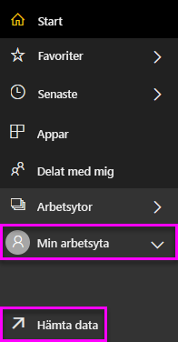

# Skapa en Power BI-instrumentpanel från en rapport
Du har läst [Instrumentpaneler i Power BI](service-dashboards.md) och nu är det dags att du skapar en egen. Det finns många olika sätt för att skapa en instrumentpanel – från en rapport, från början, från en datauppsättning, genom att duplicera en befintlig instrumentpanel, med mera.  

Det kan verka överväldigande när du först kommer igång, så vi börjar med att skapa en snabb och enkel instrumentpanel genom att fästa visualiseringar från en rapport som redan har skapats. När du har slutfört den här snabbstarten har du en god förståelse för relationen mellan instrumentpaneler och rapporter, av att öppna redigeringsvyn i rapportredigeraren, fästa paneler och navigera mellan en instrumentpanel och en rapport. Använd länkarna i innehållsförteckningen till vänster eller **nästa steg** längst ned för att gå vidare till mer avancerade avsnitt.

## Vem kan skapa en instrumentpanel?
Skapa en instrumentpanel är en **skapar**funktion och kräver behörighet att redigera i rapporten. Behörigheter att redigera är tillgängliga för rapportskapare av och de medarbetare skaparen beviljar åtkomst till. Om David till exempel skapar en rapport i workspaceABC och sedan lägger till dig som medlem i den arbetsytan kommer både du och David att ha behörighet att redigera. Å andra sidan, om en rapport har delats med dig direkt eller som en del av en [Power BI-app](service-install-use-apps.md) (du **konsumerar** rapporten), kommer du inte att kunna fästa paneler på en instrumentpanel.

> **OBS**: Instrumentpaneler är en funktion i Power BI-tjänsten, inte i Power BI Desktop. Instrumentpaneler kan inte skapas i Power BI Mobile, men de kan [visas och delas](mobile-apps-view-dashboard.md).
>
> 

## Video: Skapa en instrumentpanel genom att fästa visuella objekt och bilder från en rapport.
Titta på när Amanda skapar en ny instrumentpanel genom att fästa visualiseringar från en rapport. Följ sedan stegen under videon för att prova själv med hjälp av Exempel på anskaffningsanalys.

<iframe width="560" height="315" src="https://www.youtube.com/embed/lJKgWnvl6bQ" frameborder="0" allowfullscreen></iframe>

### Förutsättningar
För att följa med behöver du ladda ner Exel-arbetsboken med exemplet ”Inköpsanalys” och öppna den i Power BI-tjänsten (app.powerbi.com).

## Importera en datauppsättning med en rapport
Vi ska importera ett av Power BI:s exempel på datauppsättningar och använda det för att skapa vår nya instrumentpanel. Exemplet vi ska använda är en Excel-arbetsbok med två PowerView-blad. När Power BI importerar arbetsboken, läggs en datauppsättning och en rapport till på din arbetsyta.  Rapporten skapas automatiskt från PowerView-bladen.

1. [Välj den här länken](http://go.microsoft.com/fwlink/?LinkId=529784) för att hämta och spara Excel-filen Exempel på anskaffningsanalys. Vi rekommenderar att du sparar den i din OneDrive för företag.
2. Öppna Power BI-tjänsten i din webbläsare (app.powerbi.com).
3. Välj **Min arbetsyta**.
4. Välj **Hämta data** i det vänstra navigeringsfältet.

    
5. Välj **Filer**.

   
6. Gå till den plats där du sparade Excel-filen Exempel på anskaffningsanalys. Markera den och välj **Anslut**.

   
7. För den här övningen väljer vi **Importera**.

    
8. När meddelandet om slutförd import visas, väljer du **x** för att stänga det.

   

### Öppna rapporten och fästa några paneler på en instrumentpanel
1. Stanna kvar på samma arbetsyta och välj fliken **Rapporter**. Den nyligen importerade rapporten visas med en gul asterisk. Välj rapportens namn för att öppna den.

    
2. Öppna rapporten i [Läsvy](service-reading-view-and-editing-view.md). Observera att den har två flikar längst ned: Rabattanalys och Utgiftsöversikt. Varje flik representerar en sida i rapporten.
    Välj **Redigera rapport** för att öppna rapporten i redigeringsvyn.

    
3. Hovra över en visualisering för att visa de tillgängliga alternativen. Välj stiftikonen  för att lägga till en visualisering på en instrumentpanel.

    
4. Eftersom vi skapar en ny instrumentpanel, markerar du alternativet **Ny instrumentpanel** och ge den ett namn.

   
5. När du väljer **Fäst**, skapar Power BI den nya instrumentpanelen på den aktuella arbetsytan. När meddelandet **Fäst på instrumentpanelen** visas, väljer du **Gå till instrumentpanelen**. Om du uppmanas att spara rapporten väljer du **Spara**.

     
6. Power BI öppnar den nya instrumentpanelen och där visas en panel – den visualisering som du nyss fäste på den.

   
7. Välj panelen för att återgå till rapporten. Fäst några fler paneler på den nya instrumentpanelen. Den här gången när fönstret **Fäst på instrumentpanelen** visas, väljer du **Befintlig instrumentpanel**.  

   

## Fästa en hel rapportsida på instrumentpanelen
I stället för att fästa en visualisering i taget kan du [fästa en hel rapportsida som en *levande panel*](service-dashboard-pin-live-tile-from-report.md). Låt oss göra det.

1. I rapportredigeraren väljer du fliken **Utgiftsöversikt** så öppnas sidan 2 i rapporten.

   

2. Du vill ha alla dessa visualiseringar på instrumentpanelen.  I det övre högra hörnet av menyraden väljer du **Fästa live-sida**. På en instrumentpanel uppdateras paneler med live-sidor varje gång sidan uppdateras.

   

3. När fönstret **Fäst på instrumentpanelen** visas, väljer du **Befintlig instrumentpanel**.

   

4. När det visas ett meddelande om att det lyckats, väljer du **Gå till instrumentpanel**. Där ser du de paneler som du har fäst från rapporten. I exemplet nedan har vi fäst 2 paneler från sidan 1 i rapporten och en live-panel som är sidan 2 i rapporten.

   

Grattis – du har skapat din första instrumentpanel! Nu när du har en instrumentpanel finns det så mycket mer du kan göra.  Försök med något av de föreslagna **nästa stegen** nedan, eller börja leka lite och utforska på egen hand.   

## Nästa steg
* [Redigera och flytta paneler](service-dashboard-edit-tile.md)
* [Allt om panelerna på instrumentpanelen](service-dashboard-tiles.md)
* [Dela din instrumentpanel genom att skapa en app](service-create-distribute-apps.md)
* [Power BI – grundläggande begrepp](service-basic-concepts.md)
* [Tips för att designa en bra instrumentpanel](service-dashboards-design-tips.md)

Har du fler frågor? [Prova Power BI Community](http://community.powerbi.com/)
