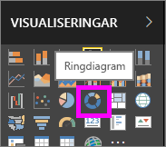
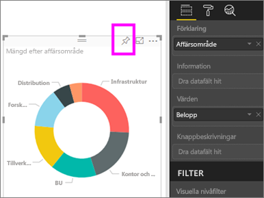
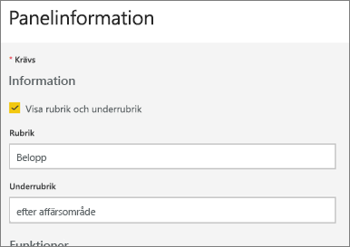
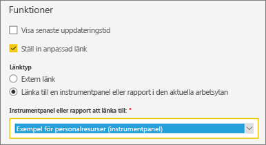
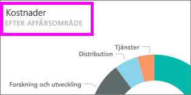
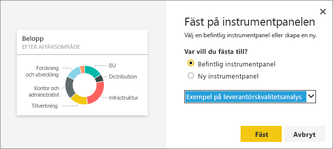

# Redigera eller ta bort en panel på instrumentpanelen

## Instrumentpanelens *ägare* jämfört med instrumentpanelens *konsumenter*
När du skapar eller äger en instrumentpanel, har du flera alternativ för att ändra utseende och standardbeteende för paneler på den instrumentpanelen. Använd inställningarna och strategierna nedan för att utforma instrumentpanelens *konsument*-upplevelse för dina kollegor.  När en panel väljs, ska den underliggande rapporten, en anpassad URL eller en annan instrumentpanel öppnas? Du kanske vill [lägga till en panel som visar en video eller strömmande data](service-dashboard-add-widget.md)? Du kanske till och med vill [skapa en panel som har interaktiva utsnitt](service-dashboard-pin-live-tile-from-report.md). Som en *skapare* har du många alternativ. 

<iframe width="560" height="315" src="https://www.youtube.com/embed/lJKgWnvl6bQ" frameborder="0" allowfullscreen></iframe>

Den här artikeln beskriver hur du kan göra följande.

* [Skapa en visualisering och fäst den på en instrumentpanel](#create)
* [Flytta en panel](#move)
* [Byta storlek på en panel](#resize)
* [Byta namn på en panel](#rename)
* [Lägga till en hyperlänk till en panel](#hyperlink)
* [Fästa en panel på en annan instrumentpanel](#different)
* [Ta bort en panel](#delete)
  
  > [!TIP]
  > För att ändra den visualisering som visas på själva panelen tar du bort panelen och lägger till en ny [panel på instrumentpanelen](consumer/end-user-tiles.md).

  
## Förutsättningar
Om du vill följa med, öppnar du Power BI-tjänsten (inte Power BI Desktop) och [hämtar exemplet med IT-utgiftsanalys](sample-it-spend.md). När det visas ett meddelande om att det lyckats, väljer du **Gå till instrumentpanel**

- - -

## Skapa en visualisering och fäst den på instrumentpanelen
1. Från instrumentpanelen för IT-utgiftsanalysen väljer du panelen Belopp för att öppna rapporten.

    

2. Öppna rapporten i Redigeringsvyn genom att välja **Redigera rapport** från den översta menyraden.

3. Lägg till en ny rapportsida genom att välja plus-tecknet (+) längst ned på rapporten.

    

4. Från Fält-fönstret, väljer du **Fakta > Belopp** och **Affärsområde > Affärsområde**.
 
5. Från fönstret Visualiseringar, väljer du Ringdiagramikonen för att konvertera visualiseringen till ett ringdiagram.

    

5. Välj fäst-ikonen och fäst ringdiagrammet till instrumentpanelen med exemplet på IT-utgiftsanalys.

   

6. När det visas ett meddelande om att det lyckats, väljer du **Gå till instrumentpanel**. Du uppmanas att spara dina ändringar. Välj **Spara**.

- - -

## Flytta panelen
Leta upp den nya ikonen på instrumentpanelen. Markera och håll panelen för att dra den till en ny plats på instrumentpanelens arbetsyta.

- - -

## Ändra storlek på panelen
Du kan göra paneler i många olika storlekar – från enheter på 1 x 1 upp till 5 x 5. Markera och dra i handtaget (i det nedre högra hörnet) för att ändra storlek på panelen.

- - -
## Ellipsmenyn (...)

1. Välj ellipsen (...) i det övre högre hörnet av panelen. 
   
   

2. Hovra över Konto-panelen och välj ellipserna för att visa alternativen. De tillgängliga alternativen varierar efter paneltyp.  Alternativen som finns tillgängliga för en live-panel skiljer sig till exempel från de som finns för en standardvisualiseringspanel. Om en instrumentpanel har delats med dig (du är inte ägaren), kommer du att ha färre alternativ.

   

3. Välj **Redigera information** för att öppna fönstret Panelinformation. 

    Ändra rubriken och standardbeteendet för panelen.  Du kan till exempel bestämma att när en *konsument* markerar en panel, ska en ny instrumentpanel visas istället för att öppna rapporten som användes för att skapa den panelen.  
   

### Byt namn på panelen
Längst upp i fönstret Panelinformation, ändrar du **Rubrik** till **Betalt belopp**.

### Ändra standardhyperlänken
Om du väljer en panel skickas du som standard till rapporten där panelen skapades eller till frågor och svar (om panelen skapades i frågor och svar). Om du vill länka till en webbsida, en annan instrumentpanel eller en rapport (på samma arbetsyta), en SSRS-rapport eller annat onlineinnehåll – lägg till en anpassad länk.

1. Under rubriken Funktioner, lägger du till **Ange anpassad länk**.

2. Välj **Länka till en instrumentpanel eller rapport i den aktuella arbetsytan** och välj sedan från listmenyn.  I det här exemplet har jag valt instrumentpanelen personalfrågeexempel. Om du inte redan har det här exemplet på arbetsytan, kan du lägga till det och komma tillbaka till det här steget, eller så kan du välja en annan instrumentpanel. 

    

3. Välj **Tillämpa**.

4. Den nya rubriken visas på panelen.  När du väljer panelen, öppnar Power BI också instrumentpanelen Personalfrågor. 

    

### Fäst panelen på en annan instrumentpanel
1. Från ellipsens listmeny väljer du **Fäst panelen** .
2. Välj om du ska fästa en dublett av den här panelen på en befintlig eller ny instrumentpanel. 
   
   
3. Välj **fäst**.

### Ta bort panelen
1. Om du vill ta bort en panel permanent från en instrumentpanel väljer du **Ta bort panelen**  från ellips-listmenyn. 

2. Om du tar bort en panel så tas inte den underliggande visualiseringen bort. Öppna den underliggande rapporten genom att välja Belopp-panelen. Öppna den sista sidan i rapporten för att se att den ursprungliga visualiseringen inte har tagits bort från rapporten. 

- - -
## Nästa steg
[Paneler på instrumentpanelen i Power BI](consumer/end-user-tiles.md)

[Instrumentpaneler i Power BI](consumer/end-user-dashboards.md)

[Power BI – grundläggande begrepp](consumer/end-user-basic-concepts.md)

Har du fler frågor? [Prova Power BI Community](http://community.powerbi.com/)

