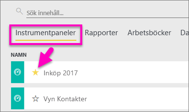
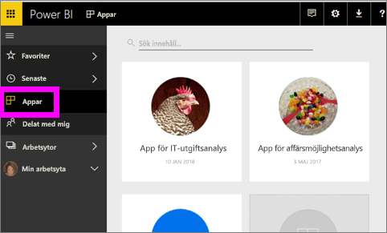
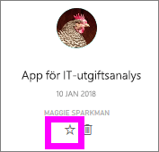
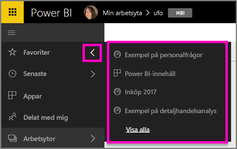
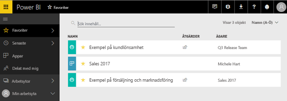
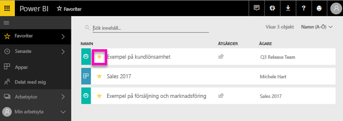

# Favoritmarkera instrumentpaneler, rapporter och appar i Power BI-tjänsten
När du skapat en *favorit* av innehåll kan du komma åt den från alla dina arbetsytor.  Favoriter är vanligtvis det innehåll som du besöker oftast.

> [!NOTE]
> Det här avsnittet gäller för Power BI-tjänsten och inte för Power BI Desktop.
> 
> 

Du kan också välja en enskild instrumentpanel som en [aktuell instrumentpanel](service-dashboard-featured.md) i Power BI-tjänsten.

## Lägg till en instrumentpanel eller en rapport som en *favorit*
Se hur Amanda lägger till favoriter till sin arbetsyta och följ sedan de stegvisa anvisningarna under videon för att försöka själv.

<iframe width="560" height="315" src="https://www.youtube.com/embed/G26dr2PsEpk" frameborder="0" allowfullscreen></iframe>

1. Öppna en instrumentpanel eller en rapport som du använder ofta. Även innehåll som har delats med dig kan göras till en *favorit*.
2. I det övre högra hörnet i Power BI-tjänsten väljer du **favoritmarkera** eller stjärnikonen .
   
   
   
   Du kan också favoritmarkera en instrumentpanel eller en rapport från din arbetsytas innehållsvyflik för **Instrumentpaneler** eller **Rapporter**.
   
   

## Lägg till en app som *favorit*

1. Välj **Appar** i det vänstra navigeringsfältet.

   

2. Hovra över en app för att visa mer information.  Välj stjärnikonen   för att ange som favorit.
   
   

## Arbeta med *favoriter*
1. Om du vill få åtkomst till dina favoriter från valfri arbetsyta, väljer du den utfällbara pilen till höger om **Favoriter**.  Härifrån kan du välja en favorit och öppna den. Endast fem favoriter visas (i alfabetisk ordning). Om du har fler än fem väljer du **Visa alla** för att öppna skärmen med favoriter (se nr 2 nedan). 
   
   
2. Om du vill se **allt** innehåll som du har lagt till som favoriter i det vänstra navigeringsfönstret väljer du **Favoriter** eller favoritikonen .  
   
    
   
   Härifrån kan du vidta åtgärder: öppna, identifiera ägare och även dela med dina kollegor.

## Ta bort innehåll som favorit
Använder du inte längre en rapport så ofta som du brukade?  Du kan bort den från favoriter. När du tar bort innehåll från listan över favoriter så tas den bort från listan men inte från Power BI.

1. I det vänstra navigeringsfönstret, väljer du **favoriter** för att öppna skärmen **favoriter**.
   
   
2. Välj den gula stjärnan bredvid innehållet för ta bort innehållet som favorit.

> **Obs**: Du kan även ta bort en instrumentpanel, rapport eller app. Du behöver bara öppna och avmarkera den gula ikonen.   
> 
> 

## Nästa steg
[Kom igång med Power BI](service-get-started.md)

[Power BI – grundläggande begrepp](service-basic-concepts.md)

Har du fler frågor? [Prova Power BI Community](http://community.powerbi.com/)

