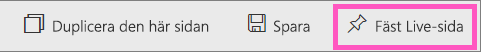
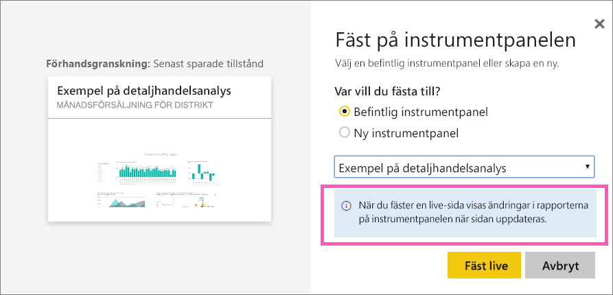
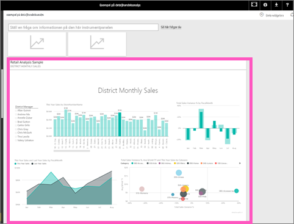

# Fästa en hel rapportsida, som en levande panel, på en Power BI-instrumentpanel
Ett annat sätt att lägga till en ny [instrumentpanelspanel](consumer/end-user-tiles.md) är genom att fästa en rapportsida. Detta är ett enkelt sätt att fästa flera visualiseringar åt gången.  När du fäster en hel sida är panelerna dessutom *live*. Du kan interagera med dem direkt på instrumentpanelen. Ändringar du gör i någon av visualiseringarna i rapportredigeraren, om du till exempel lägger till ett filter eller ändrar fälten som används i diagrammet, visas då även på instrumentpanelen.  

Att fästa levande brickor från rapporter till instrumentpaneler är endast tillgänglig i Power BI-tjänsten (app.powerbi.com).

> [!NOTE]
> Du kan fästa paneler från rapporter som delas med dig.
> 
> 

## Fäst en rapportsida
Se hur Amanda fäster en liverapportsida på en instrumentpanel och följ sedan de stegvisa anvisningarna under videon och prova själv.

<iframe width="560" height="315" src="https://www.youtube.com/embed/EzhfBpPboPA" frameborder="0" allowfullscreen></iframe>

1. Öppna en rapport i [redigeringsvyn](service-interact-with-a-report-in-editing-view.md).
2. Välj **Fäst Live-sida** på menyraden när inga visualiseringar har markerats.
   
    
3. Fäst panelen på en befintlig eller ny instrumentpanel. Lägg märke till den markerade texten: *Fäst Live-sida möjliggör att ändringar som görs i rapporterna visas på instrumentpanelen när sidan uppdateras.*
   
   * Befintlig instrumentpanel: välj instrumentpanelens namn i listrutan. Instrumentpaneler som har delats med dig visas inte i listrutan.
   * Ny instrumentpanel: skriv instrumentpanelens namn.
     
     
4. Välj **Fäst live**. Genom ett meddelande (nära det övre högra hörnet) får du reda på att sidan har lagts till, som ett fönster, på instrumentpanelen.

## Öppna instrumentpanelen om du vill se den fästa levande panelen
1. Välj instrumentpanelen med den nya levande panelen i navigeringsfönstret. Där kan du göra sådant som att [byta namn på, ändra storlek på, länka och flytta](service-dashboard-edit-tile.md) den fästa rapportsidan.  
2. Interagera med den levande panelen.  I skärmbilden nedan har en stapel i kolumndiagrammet markerats, varvid de övriga visualiseringarna på panelen har korsfiltrerats och korsmarkerats.
   
    

## Nästa steg
[Instrumentpaneler i Power BI](consumer/end-user-dashboards.md)

Fler frågor? [Prova Power BI Community](https://community.powerbi.com/)

