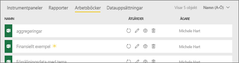
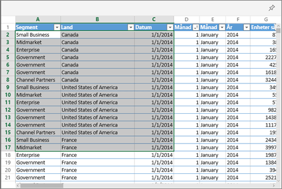
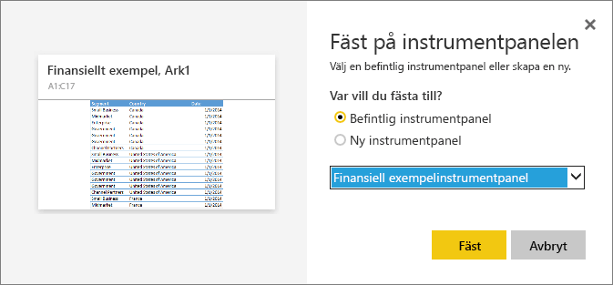

# Fästa en panel på en Power BI-instrumentpanel från Excel
Innan du kan fästa en panel från Excel-arbetsboken, ansluter du arbetsboken till Power BI-tjänsten (app.powerbi.com). Att ansluta en arbetsbok innebär i stort sett att använda en länkad skrivskyddad version av arbetsboken i Power BI-tjänsten för att du ska kunna fästa intervall på instrumentpaneler. Du kan även fästa ett helt kalkylblad på en instrumentpanel.  
Om en arbetsbok har delats med dig kan du visa panelerna som ägaren fäst, men du kan inte skapa några instrumentpaneler själv. 

Detaljerad information om hur Excel och Power BI fungerar tillsammans finns i [Hämta data från Excel-arbetsböcker](http://go.microsoft.com/fwlink/?LinkID=521962).

Se när Will visar flera olika sätt att importera data från och ansluta till Excel-arbetsböcker.

<iframe width="560" height="315" src="https://www.youtube.com/embed/l8JoB7w0zJA" frameborder="0" allowfullscreen></iframe>

## Anslut din Excel-arbetsbok från OneDrive för företag till Power BI
När du väljer **Anslut** visas arbetsboken i Power BI precis som den skulle ha gjort i Excel Online. Men till skillnad från i Excel Online har du några bra funktioner som hjälper dig fästa element från kalkylbladen direkt på instrumentpanelerna.

Du kan inte redigera din arbetsbok i Power BI. Men om du behöver göra ändringar kan du välja pennikonen på fliken **Arbetsböcker** i arbetsytan och sedan välja att redigera din arbetsbok i Excel Online eller öppna den i Excel på datorn. Alla ändringar du gör sparas i arbetsboken på OneDrive.

1. Ladda upp din arbetsbok till ditt OneDrive för företag.

2. Från Power BI [anslut till arbetsboken](service-excel-workbook-files.md) genom att välja **Hämta Data > Filer > OneDrive – Business** och gå till den plats där du sparade Excel-filen. Markera filen och välj **Anslut > Anslut**.

    

3. Arbetsboken läggs till på fliken **Arbetsböcker** på arbetsytan i Power BI.  Ikonen  visar att det är en Excel-arbetsbok och en gul asterisk visar att den är ny.
    
    
4. Öppna arbetsboken i Power BI genom att välja arbetsbokens namn.

    Ändringar som du gör i arbetsboken i Power BI sparas inte och påverkar inte den ursprungliga arbetsboken på OneDrive för företag. Om du sorterar, filtrerar eller ändrar värden i Power BI kommer ändringarna inte att sparas eller fästas. Om du behöver göra ändringar som ska sparas, väljer du **Redigera** från det övre högra hörnet för att öppna den för redigering i Excel Online eller Excel. Med ändringar som gjorts på det här sättet kan det ta några minuter att uppdatera paneler på instrumentpanelen.
   
    

## Fästa ett cellområde på en instrumentpanel
Ett sätt att lägga till en ny [instrumentpanel](consumer/end-user-tiles.md) är från en Excel-arbetsbok i Power BI. Områden kan fästas från Excel-arbetsböcker som har sparats i OneDrive för företag eller andra gruppdelade dokumentbibliotek. Områdena kan innehålla data, diagram, tabeller, pivottabeller, pivotdiagram och andra delar av Excel.

1. Markera de celler som du vill fästa på en instrumentpanel.
   
    
2. Välj fästikonen  . 
3. Fäst panelen på en befintlig eller ny instrumentpanel. 
   
   * Befintlig instrumentpanel: välj instrumentpanelens namn i listrutan.
   * Ny instrumentpanel: skriv instrumentpanelens namn.
   
     
4. Välj **fäst**. Genom ett meddelande (nära det övre högra hörnet) får du reda på att området har lagts till som en panel på instrumentpanelen. 
   
    
5. Välj **Gå till instrumentpanelen**. Härifrån kan du [byta namn, ändra storlek, länka och flytta](service-dashboard-edit-tile.md) den fastsatta visualiseringen. Som standard öppnar den fastsatta panelen arbetsboken i Power BI.

## Fästa en hel tabell eller pivottabell på en instrumentpanel
Följ stegen ovan, men i stället för att markera ett cellområde väljer du en hel tabell eller pivottabell.

Markera hela intervallet för tabellen för att fästa en tabell och inkludera rubrikerna.  När du ska fästa en pivottabell är det viktigt att du tar med alla synliga delar i pivottabellen, inklusive filter om de används.

 

En panel som skapats från en tabell eller pivottabell visar hela tabellen.  Om du lägger till/tar bort/filtrerar rader eller kolumner i den ursprungliga arbetsboken, kommer de också att läggas till/tas bort/filtreras i panelen.

## Visa arbetsboken som är länkad till panelen
Om du väljer en panel i arbetsboken öppnas den länkade arbetsboken i Power BI. Eftersom arbetsboksfilen finns på ägarens OneDrive för företag, måste du ha läsbehörighet för arbetsboken för att kunna se den. Om du inte har behörighet visas ett felmeddelande.  

 

## Överväganden och felsökning
Funktioner som inte stöds: Power BI använder Excel Services till att hämta arbetsbokens paneler. Eftersom vissa funktioner från Excel inte stöds i Excel Services REST API, kan de därför inte visas på panelerna i Power BI. Till exempel: Miniatyrdiagram, ikonen Ange villkorsstyrd formatering och tidsutsnitt. En fullständig lista med funktioner som inte stöds finns i [Funktioner som inte stöds i Excel Services REST API](http://msdn.microsoft.com/library/office/ff394477.aspx)

## Nästa steg
[Dela en instrumentpanel med länkar till en Excel-arbetsbok](service-share-dashboard-that-links-to-excel-onedrive.md)

[Hämta data från Excel-arbetsböcker](service-excel-workbook-files.md)

Har du fler frågor? [Prova Power BI Community](http://community.powerbi.com/)

