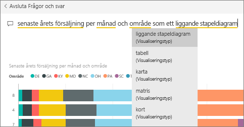
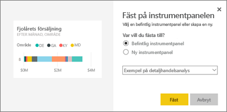
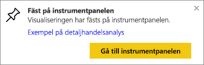
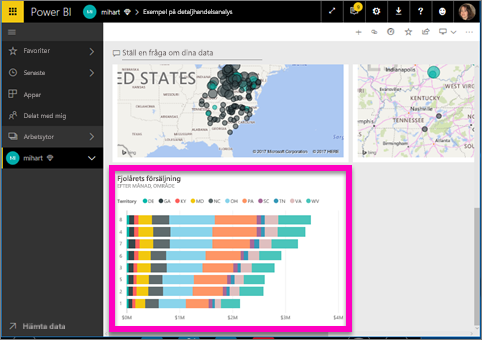

# Fäst en panel till en instrumentpanel från frågor och svar
## Så här fäster du en panel från frågor och svar
Frågor och svar är Power BI:s verktyg för ad hoc-rapportering. Behöver du hitta en viss insikt? Ställ en fråga om dina data och ta emot ett svar i form av en visualisering.

I den här anvisningen, använder vi oss av Power BI-tjänsten (app.powerbi.com) för att öppna en instrumentpanel, ställa en fråga med naturligt språk för att skapa en visualisering och sedan fästa den visualiseringen på en instrumentpanel. Instrumentpaneler finns inte tillgängliga i Power BI Desktop. Information om hur du använder frågor och svar med andra Power BI-verktyg och innehåll, finns i [Översikt över Power BI frågor och svar](power-bi-q-and-a.md). 

Om du vill följa med, kan du öppna instrumentpanelen [Exempel på detaljhandelsanalys](sample-retail-analysis.md).

1. Öppna en [instrumentpanel](service-dashboards.md) som har minst en panel fäst från en rapport. När du skriver en fråga, letar Power BI efter svaret i alla datauppsättningar som har en panel fäst på den instrumentpanelen.  Läs mer i [hämta data](service-get-data.md).
2. Börja skriva vad du vill veta om dina data i frågerutan överst på instrumentpanelen.  
   
3. När du till exempel skriver senaste årets försäljning per månad och område...  
   

   ger frågerutan dig förslag.
4. Om du vill lägga till diagrammet till din instrumentpanel, väljer du fäst  längst upp till höger i arbetsytan. Om instrumentpanelen inte har delats med dig, kommer du inte kunna fästa några visualiseringar.

5. Fäst panelen på en befintlig eller ny instrumentpanel.

   

   * Befintlig instrumentpanel: välj instrumentpanelens namn i listrutan. Dina val begränsas till instrumentpanelerna inom den aktuella arbetsytan.
   * Ny instrumentpanel: ange namnet på den nya instrumentpanelen så läggs den till din aktuella arbetsyta.

6. Välj **fäst**.

   Genom ett meddelande (nära det övre högra hörnet) får du reda på att visualiseringen har lagts till, som en panel, på instrumentpanelen.  

   
7. Välj **gå till instrumentpanel** för att se den nya panelen. Där kan du [byta namn, ändra storlek, lägga till en hyperlänk och flytta panelen och mer](service-dashboard-edit-tile.md) på din instrumentpanel.

   

## Överväganden och felsökning
* När du börjar skriva en fråga, börjar frågor och svar genast att söka efter det bästa svaret från alla datauppsättningar som är associerade med den aktuella instrumentpanelen.  Den aktuella instrumentpanelen är den instrumentpanel som listas i det övre navigeringsfältet. Den här frågan ställs till exempel i instrumentpanelen **exemplet detaljshandelsanalys** som är en del av **mihart**-apparbetsytan.

  
* **Hur vet frågor och svar vilka datauppsättningar som ska användas**?  Frågor och svar har åtkomst till alla datauppsättningar som har minst en visualisering fäst på den instrumentpanelen.

* **Ser du inte frågerutan**? Kontrollera med din Power BI-administratör. Administratören har möjlighet att inaktivera frågor och svar.

## Nästa steg
[Byt namn på, ändra storlek, lägg till en hyperlänk, flytta panelen och mer](service-dashboard-edit-tile.md)    
[Visa din panel i instrumentpanelen i fokusläge](service-focus-mode.md)     
[Gå tillbaka till frågor och svar i Power BI](power-bi-q-and-a.md)  
Har du fler frågor? [Prova Power BI Community](http://community.powerbi.com/)
