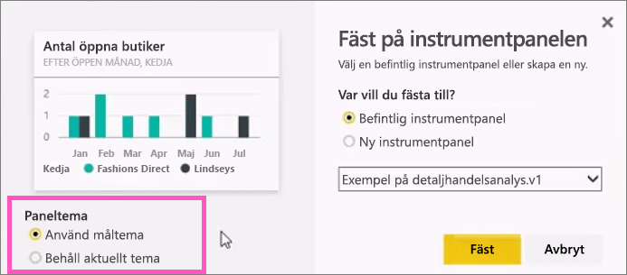
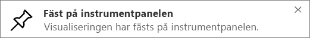

# Fäst en panel på en Power BI-instrumentpanel från en rapport

Ett sätt att lägga till en [instrumentpanel](consumer/end-user-tiles.md) är från en [Power BI-rapport](consumer/end-user-reports.md). När du väljer någon av dessa paneler öppnas den i rapporten.

Du kan fästa en hel rapportsida på en instrumentpanel, vilket kallas att fästa en *levande* panel. Den kallas för en levande panel eftersom du kan interagera med panelen på instrumentpanelen. Till skillnad från enskilda visualiseringspaneler synkroniseras ändringar som görs i rapporten automatiskt med instrumentpanelen. Mer information finns i [Fästa en hel rapportsida](#pin-an-entire-report-page).

Du kan inte fästa paneler från rapporter som har delats med dig eller från Power BI Desktop. 

> [!TIP]
> Eftersom vissa visualiseringar använder bakgrundsbilder kanske det inte går att fästa panelen om bakgrundsbilden är för stor. Försök att minska bildstorleken eller använd bildkomprimering.  
> 
> 

## Fäst en panel från en rapport
Titta när Amanda skapar en instrumentpanel genom att fästa visuella objekt och bilder från en Power BI-rapport.
    

<iframe width="560" height="315" src="https://www.youtube.com/embed/lJKgWnvl6bQ" frameborder="0" allowfullscreen></iframe>

Nu kan du skapa en egen instrumentpanel med någon av Power BI-exempelrapporterna.

1. I rapporten hovrar du över den visualisering som du vill fästa. Välj sedan fästikonen. . Power BI öppnar skärmen **fäst på instrumentpanelen**.
   
     
2. Välj om du ska fästa panelen på en befintlig instrumentpanel eller en ny.
   
   * **Befintlig instrumentpanel**: Välj instrumentpanelens namn i listrutan. Instrumentpaneler som har delats med dig visas inte i listrutan.
   * **Ny instrumentpanel**: Skriv namnet på den nya instrumentpanelen.
3. I vissa fall kan objektet du vill fästa ha ett *tema*. Visuella objekt som fästs från en Excel-arbetsbok till exempel. I så fall, väljer du vilket tema som ska tillämpas på panelen.
4. Välj **fäst**.
   
   Ett meddelande visas (nära det övre högra hörnet) för att informera dig om att visualiseringen har lagts till som en panel på instrumentpanelen.
   
   
5. Från navigeringsfönstret, väljer du instrumentpanelen med den nya panelen. [Redigera panelvisningen och beteendet](service-dashboard-edit-tile.md) eller välj panelen för att återgå till rapporten.

## Fäst en hel rapportsida
Ett annat alternativ är att fästa en hel rapportsida på en instrumentpanel, vilket är ett enkelt sätt att fästa mer än en visualisering i taget. När du fäster en hel sida är panelerna *levande*. Det vill säga du kan interagera dem på instrumentpanelen. Ändringar du gör i någon av visualiseringarna i rapportredigeraren (till exempel om du lägger till ett filter eller ändrar fälten som används i diagrammet) visas då även på instrumentpanelen.  

Mer information finns i [Fästa en hel rapportsida](service-dashboard-pin-live-tile-from-report.md).

## Nästa steg
- [Instrumentpaneler för de som använder Power BI-tjänsten](consumer/end-user-dashboards.md)
- [Paneler på instrumentpanelen i Power BI](consumer/end-user-tiles.md)
- [Rapporter i Power BI](consumer/end-user-reports.md)
- [Datauppdatering i Power BI](refresh-data.md)
- [Grundläggande begrepp för designers i Power BI-tjänsten](service-basic-concepts.md)

Har du fler frågor? [Prova Power BI Community](http://community.powerbi.com/)

