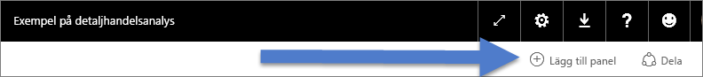
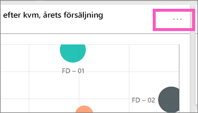
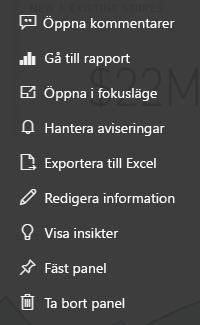

# Paneler på instrumentpanelen i Power BI
Instrumentpaneler och paneler på instrumentpanelen är en funktion i Power BI-tjänsten, inte Power BI Desktop. Paneler på instrumentpanelen kan inte skapas eller fästas i Power BI Mobile, [men de kan visas och delas](mobile-tiles-in-the-mobile-apps.md). Och i Power BI Mobile, kan du [lägga till bilder till din instrumentpanel med iPhone-appen](mobile-iphone-app-get-started.md).

## Paneler på instrumentpanelen

En panel är en ögonblicksbild av dina data, fäst på instrumentpanelen. En panel kan skapas från en rapport, datauppsättning eller instrumentpanel, från rutan Frågor och svar, Excel, och från SQL Server Reporting Services (SSRS), med mera.  Den här skärmbilden visar många olika paneler fästa på en instrumentpanel.

Förutom att fästa, kan fristående paneler skapas direkt på en instrumentpanel med hjälp av [Lägg till panel](service-dashboard-add-widget.md). Fristående paneler innehåller: textrutor, bilder, videor, strömmande data och webbinnehåll.

Behöver du hjälp att förstå de olika byggstenarna i Power BI?  Mer information finns i [Power BI – grundläggande begrepp](service-basic-concepts.md).

> [!NOTE]
> Om den ursprungliga visualiseringen som användes för att skapa panelen ändras, ändras inte panelen.  Om du till exempel har fäst ett linjediagram från en rapport och sedan ändrar linjediagrammet till ett stapeldiagram, fortsätter panelen på instrumentpanelen att visa ett linjediagram. Data uppdateras, men visualiseringstypen gör det inte.
> 
> 

## Fästa en panel från ...
Det finns många olika sätt att lägga till (fästa) en panel till en instrumentpanel. Paneler kan fästas från:

* [Power BI frågor och svar](service-dashboard-pin-tile-from-q-and-a.md)
* [en rapport](service-dashboard-pin-tile-from-report.md)
* [en annan instrumentpanel](service-pin-tile-to-another-dashboard.md)
* [Excel-arbetsbok på OneDrive för företag](service-dashboard-pin-tile-from-excel.md)
* [Power BI Publisher för Excel](publisher-for-excel.md)
* [Quick Insights](service-insights.md)
* [SSRS](https://msdn.microsoft.com/library/mt604784.aspx)

Fristående paneler för bilder, textrutor, videor, strömning av data och webbinnehåll kan skapas direkt på en instrumentpanel med hjälp av [Lägg till panel](service-dashboard-add-widget.md).

  

## Interaktion med paneler på en instrumentpanel
### Flytta och ändra storlek på en panel
Hämta en panel och [flytta runt den på instrumentpanelen](service-dashboard-edit-tile.md). Hovra och välj referens  för att ändra storlek på panelen.

### Hovra över en panel för att ändra utseendet och beteendet
1. Hovra över panelen för att visa ellipserna.
   
    
2. Välj ellipserna för att öppna åtgärdsmenyn i panelen.
   
    
   
    Här kan göra du följande:
   
   * [Öppna rapporten som användes för att skapa den här panelen ](service-reports.md)   
   
   * [Öppna kalkylbladet som användes för att skapa den här panelen ](service-reports.md)   
     
     * [Visa i fokusläge ](service-focus-mode.md)   
     * [Exportera data som användes i panelen](power-bi-visualization-export-data.md) 
     * [Redigera rubrik och underrubrik, lägg till en hyperlänk, visa senaste uppdateringstid](service-dashboard-edit-tile.md) 
     * [Köra insikter ](service-insights.md) 
     * [Fästa panelen till en annan instrumentpanel ](service-pin-tile-to-another-dashboard.md)
       
     * [Ta bort panelen](service-dashboard-edit-tile.md)
     
3. Om du vill stänga åtgärdsmenyn, välj ett tomt område på arbetsytan.

### Välj (klicka på) en panel
När du väljer en panel beror händelseförloppet på hur panelen skapades och om den har en [anpassad länk](service-dashboard-edit-tile.md). Om den har en anpassad länk kommer du till denna länk om du väljer panelen. I annat fall kommer du, om du väljer panelen, till rapporten, arbetsboken i Excel Online, den lokala SSRS-rapporten eller frågor och svar som användes för att skapa panelen.

> [!NOTE]
> Undantag för detta är videopaneler som skapats direkt på en instrumentpanel med hjälp av **Lägg till panel**. Att välja en videopanel (som har skapats på detta sätt) gör så att videon spelas upp direkt på instrumentpanelen.   
> 
> 

## Överväganden och felsökning
* Om den rapport som användes för att skapa visualiseringen inte sparades kommer inget att hända om du väljer panelen.
* Om panelen har skapats från en arbetsbok i Excel Online och du inte har minst läsbehörighet för arbetsboken, kommer arbetsboken i Excel Online inte att öppnas om du väljer panelen.
* För paneler som skapats direkt på en instrumentpanel med hjälp av **Lägg till panel**, kan du, om en anpassad hyperlänk har ställts in, markera rubriken, underrubriken och eller en panel för att öppna URL:en.  I annat fall händer som standard ingenting om du väljer en av dessa paneler som skapats direkt på instrumentpanelen för en bild, webbkod eller textruta.
* Om du inte har behörighet för rapporten i SSRS, kommer val av en panel som skapats från SSRS att generera en sida som anger att du inte har åtkomst (rsAccessDenied).
* Om du inte har åtkomst till nätverket där SSRS-servern finns, kommer val av en panel som skapats från SSRS generera en sida som anger att det inte går att hitta servern (HTTP 404). Enheten måste ha nätverksåtkomst till rapportservern för att visa rapporten.
* Om den ursprungliga visualiseringen som användes för att skapa panelen ändras, ändras inte panelen.  Om du till exempel har fäst ett linjediagram från en rapport och sedan ändrar linjediagrammet till ett stapeldiagram, fortsätter panelen på instrumentpanelen att visa ett linjediagram. Data uppdateras, men visualiseringstypen gör det inte.

## Nästa steg
[Skapa ett kort (stor sifferpanel) för din instrumentpanel](power-bi-visualization-card.md)

[Instrumentpaneler i Power BI](service-dashboards.md)  

[Datauppdatering](refresh-data.md)

[Power BI – grundläggande begrepp](service-basic-concepts.md)

[Exportera en panel till Power Point](http://blogs.msdn.com/b/powerbidev/archive/2015/09/28/integrating-power-bi-tiles-into-office-documents.aspx)

[Fäst Reporting Services-objekt till Power BI-instrumentpaneler](https://msdn.microsoft.com/library/mt604784.aspx)

Har du fler frågor? [Prova Power BI Community](http://community.powerbi.com/)

