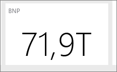

# Tips för att utforma en bra Power BI-instrumentpanel
Nu när du har skapat en instrumentpanel och lagt till några paneler, kan du börja fundera på hur du kan vidareutveckla instrumentpanelen från att vara snygg till att också vara funktionell. I allmänhet innebär det att få den viktigaste informationen att stå ut och att göra den ren och prydlig.

> [!TIP]
> Gillar du den här instrumentpanelen? Du kan ladda ned den samt relaterade rapporter från AppSource. Gå till **Hämta data** > **Tjänster**. Sök efter **Microsoft-exempel – Försäljning och marknadsföring** > **Hämta nu**.

Här följer några tips för instrumentpaneler.

## Video om bästa praxis för instrumentpanelsdesign

Titta på den här videon om [bästa praxis för instrumentpanelsdesign i Power BI](https://www.youtube.com/watch?v=-tdkUYrzrio) för att få designtips från Marco Russo från SQLBI.com.

## Ta hänsyn till din målgrupp
Vilka är de viktigaste måtten som kommer hjälpa dem att fatta beslut? Hur ska instrumentpanelen användas? Vilka inlärda eller kulturella antaganden kan påverka utformningsvalen? Vilken information behöver din målgrupp för att lyckas?

Kom ihåg att instrumentpanelen är en översikt, en enskild plats där dina datas aktuella tillstånd kan övervakas. Instrumentpanelen baseras på underliggande rapporter och datamängder, och dessa innehåller ofta massor av information. Dina läsare kan gå in på detaljer i rapporterna med instrumentpanelen som utgångspunkt. Placera därför inte detaljerad information på instrumentpanelen, om det inte är vad läsarna behöver övervaka.

Var ska instrumentpanelen visas? Om den visas på en stor skärm kan du placera mer innehåll på den. Men om läsarna visar den på sina surfplattor är en instrumentpanel med färre paneler lättare att läsa.

## Berätta en historia på en skärm
Eftersom avsikten med instrumentpaneler är ge översikt över viktig information på ett ögonblick, är det bäst att ha alla paneler på en skärm. Går det att undvika rullningslister på instrumentpanelen?

Är instrumentpanelen för plottrig?  Ta bort allt förutom viktig information som enkelt kan läsas och tolkas.

## Använd dig av helskärmsläge
När du presenterar en instrumentpanel kan du visa den i [helskärmsläge](consumer/end-user-focus.md) utan distraktioner.

## Betona den viktigaste informationen
Om texten och visualiseringarna på instrumentpanelen har samma storlek, får läsaren svårt att fokusera på vad som är viktigt. Till exempel är kortvisualiseringar ett bra sätt att visa upp ett viktigt tal på en framträdande plats:  

Men kom ihåg att tillhandahålla kontexten.  

Läs mer om att [skapa en panel med bara ett tal](visuals/power-bi-visualization-card.md).

## Placera den viktigaste informationen
De flesta läser uppifrån och ned. Placera därför mer allmän information i det övre vänstra hörnet, och visa fler detaljer i den riktning som målgruppen läser (från vänster till höger eller uppifrån och ned).

## Använda rätt visualisering för data
Undvik att variera visualiseringarna bara för sakens skull.  Visualiseringar ska skapa en översiktsbild och vara enkla att ”läsa” och tolka.  För vissa data och visualiseringar räcker det med en enkel grafisk visualisering. Men andra data kan kräva en mer komplex visualisering – var noga med att använda rubriker och etiketter och andra anpassningar för att hjälpa läsaren.  

* Var försiktig med visuella objekt som ser fina ut men som är svåra att läsa, till exempel 3D-diagram. 
* Det kan kännas snopet att cirkeldiagram, ringdiagram, måttdiagram och andra cirkulära diagramtyper inte utgör bästa praxis för datavisualiseringar. Cirkeldiagram fungerar som bäst med mindre än åtta kategorier. Eftersom människor inte kan jämföra värden sida vid sida är det svårare att jämföra värden i ett cirkeldiagram än i ett stapel- eller kolumndiagram. Cirkeldiagram är bättre för att visa förhållanden mellan en del och helheten, än för att jämföra delarna med varandra. Och måttdiagram är bra för att visa aktuell status i kontexten för ett mål.
* Var konsekvent när du väljer skalor för diagram, bestämmer hur diagram ska dimensioneras och väljer färger för att beteckna värden i diagram.
* Var noga med att koda kvantitativa data på ett snyggt sätt. Använd inte fler än tre eller fyra siffror när tal visas. Visa mått med en eller två siffror till vänster om decimaltecknet och skala för tusen eller miljoner. Skriv alltså 3,4 miljoner och inte 3 400 000.
* Blanda inte olika precisions- och tidsnivåer. Kontrollera att tidsramarna är lätta att förstå. Placera inte ett diagram från förra månaden bredvid filtrerade diagram från en specifik månad det året.
* Blanda inte stora och små mått på samma skala, till exempel i ett linje- eller stapeldiagram. Som exempel kan ett mått vara i miljontal och det andra måttet i tusental. Med en så stor skala är det svårt att se skillnaderna mellan måtten i tusental. Om du behöver blanda ska du välja en visualisering som tillåter användning av en andra axel.
* Fyll inte diagrammen med dataetiketter som inte behövs. Värdena i stapeldiagram är vanligtvis lätta att förstå utan att man behöver visa det faktiska talet.
* Var uppmärksam på hur [diagram sorteras](consumer/end-user-change-sort.md). Om du vill uppmärksamma det högsta eller lägsta talet kan du sortera efter mått. Om du vill att användare snabbt ska hitta en viss kategori bland många kategorier kan du sortera efter axeln.  

Mer visualiseringsspecifika anvisningar finns i [Visualiseringstyper i Power BI](visuals/power-bi-visualization-types-for-reports-and-q-and-a.md).  

## Läs mer om instrumentpanelsdesign
Överväg att lära dig mer om grundläggande Gestalt-principer för visuell perception och hur du tydligt kan kommunicera åtgärdsinriktad information i en kontext om du vill bli riktigt bra på att utforma instrumentpaneler. Som tur är finns det redan en mängd olika resurser tillgängliga och utströdda bland våra bloggar. Några av våra favoritböcker är:

* *Information Dashboard Design* av Stephen Few  
* *Show Me the Numbers* av Stephen Few  
* *Now You See It* av Stephen Few  
* *Envisioning Information* av Edward Tufte  
* *Advanced Presentations* av Design by Andrew Abela   

## Nästa steg
[Skapa en instrumentpanel från en rapport](service-dashboard-create.md)  
[Grundläggande begrepp för designers i Power BI-tjänsten](service-basic-concepts.md)  
Fler frågor? [Prova Power BI Community](https://community.powerbi.com/)
